# 🍺🍗🍖

### International React Conference

* [conf.reactjs.org](https://conf.reactjs.org/)
* [react-next.com](https://react-next.com/)
* [react.amsterdam](https://react.amsterdam/)

### DEV COMMUNITY

* [dev.to](https://dev.to/)
* [scotch.io](https://scotch.io/)
* [react.rocks](https://react.rocks/)

### CHAT

* [spectrum.chat/react](https://spectrum.chat/react)

### Courses

* [freeCodeCamp.org](https://www.freecodecamp.org/)
  * 
  * [油管视频专辑列表，很多课程](https://www.youtube.com/channel/UC8butISFwT-Wl7EV0hUK0BQ)
* [FrontendMasters](https://frontendmasters.com)
  * [Rethinking Asynchronous JavaScript](https://frontendmasters.com/courses/rethinking-async-js/)
* [SURVIVEJS](https://survivejs.com/)
  * [Blog Posts](https://survivejs.com/blog/)
  * [SURVIVEJS — MAINTENANCE](https://survivejs.com/maintenance/),Streamline JavaScript Workflow
  * [SURVIVEJS — REACT](https://survivejs.com/react/)
  * [SURVIVEJS — WEBPACK](https://survivejs.com/webpack/)
  * [SURVIVEJS — REACT](https://survivejs.com/react/)

### 利用 Redux-Saga 优雅的管理各种复杂的逻辑
<a href="https://redux-saga.js.org/"><a/>

[精读 Redux-Saga 源码测试用例](./docs/redux-saga/tests/)

**runSaga.js**
- [x] test('runSaga')

**middleware.js**
`({getState, dispatch}) => next => action => action`
- [x] test('middleware output')
  * middleware factory must return a function to handle {getState, dispatch}
  * middleware returned function must take exactly 1 argument
  * next handler must return a function to handle action
  * next handler must take exactly 1 argument
  * next handler must return a function to handle action
  * action handler must take exactly 1 argument
- [x] test('middleware's action handler output')
  * action handler must return the result of the next argument
- [x] test('middleware.run')
  * middleware.run must throw an Error when executed before the middleware is connected to a Store
  * middleware.run must return a Task Object
  * middleware must run the Saga and provides it with the given arguments
- [x] test('middleware options')
  * middleware factory must raise an error if `options.onError` is not a function
- [x] test('enhance channel.put with an emitter')
  * saga must be able to take actions emitted by middleware's custom emitter
- [x] test('middleware.run saga arguments validation')
  * saga argument must be a Generator function

**taskToPromise.js**
- [x] test('calling toPromise() of an already completed task')
- [x] test('calling toPromise() before a task completes')
- [x] test('calling toPromise() of an already aborted task')
- [x] test('calling toPromise() before a task aborts')
- [x] test('calling toPromise() of an already cancelled task')
- [x] test('calling toPromise() of before a task gets cancelled')

**channel-recipes.js**
- [x] test('action channel')
  * Sagas must take consecutive actions dispatched synchronously on an action channel even if it performs blocking calls
- [x] test('error check when constructing actionChannels')
- [x] test('action channel generator')
- [x] test('action channel generator with buffers')
- [x] test('channel: watcher + max workers')
  * Saga must dispatch to free workers via channel

**channel.js**
- [x] test('Unbuffered channel')
  * channel should reject undefined messages
  * channel must notify takers
  * channel must discard cancelled takes
  * closing a channel must resolve all takers with END
  * closed channel must resolve new takers with END
  * channel must reject messages after being closed
- [x] test('buffered channel')
  * channel must queue pending takers if there are no buffered messages
  * channel must resolve the oldest pending taker with a new message
  * channel must buffer new messages if there are no takers
  * channel must resolve new takers if there are buffered messages
  * closing an already closed channel should be noop
  * putting on an already closed channel should be noop
  * closed channel must resolve new takers with any buffered message
  * closed channel must resolve new takers with END if there are no buffered message
- [x] test('event channel')
  * eventChannel should throw if subscriber does not return a function to unsubscribe
  * eventChannel must notify takers on a new action
  * eventChannel must notify takers only once
  * eventChannel must notify all pending takers on END
  * eventChannel must notify all new takers if closed
- [x] test('unsubscribe event channel')
  * eventChannel should call unsubscribe when channel is closed
  * eventChannel should call unsubscribe when END event is emitted synchronously
  * eventChannel should call unsubscribe when END event is emitted asynchronously
- [x] test('expanding buffer')
  * expanding buffer should be able to buffer more items than its initial limit

**scheduler.js**
- [x] test('scheduler executes all recursively triggered tasks in order')
- [x] test('scheduler when suspended queues up and executes all tasks on flush')

**monitoring.js**
- [x] test('saga middleware monitoring')
  * sagaMiddleware must notify the saga monitor of Effect creation and resolution
  * sagaMiddleware must notify the saga monitor of dispatched actions
- [x] test('runSaga monitoring')
  * runSaga must notify the saga monitor of Effect creation and resolution
  * runSaga must notify the saga monitor of dispatched actions
- [x] test('saga monitors without all functions')

**interpreter/base.js**
- [x] test('saga iteration')
- [x] test('saga error handling')
- [x] test('saga output handling')
- [x] test('saga yielded falsy values')

**interpreter/call.js**
- [x] test('saga handles call effects and resume with the resolved values')
- [x] test('saga handles call effects and throw the rejected values inside the generator')
- [x] test('saga handles call's synchronous failures and throws in the calling generator (1)')
- [x] test('saga handles call's synchronous failures and throws in the calling generator (2)')
- [x] test('saga handles call's synchronous failures and throws in the calling generator (2)')

**interpreter/cps.js**
- [x] test('saga cps call handling')
  * saga must fulfill cps call effects
- [x] test('saga synchronous cps failures handling')
  * saga should inject call error into generator
- [x] test('saga cps cancellation handling')
  * saga should call cancellation function on callback

**interpreter/put.js**
- [x] test('saga put handling')
  * saga must handle generator puts
- [x] test('saga put in a channel')
  * saga must handle puts on a given channel
- [x] test('saga async put's response handling')
  * saga must handle async responses of generator put effects
- [x] test('saga error put's response handling')
  * saga should bubble thrown errors of generator put effects
- [x] test('saga error putResolve's response handling')
  * saga must bubble thrown errors of generator putResolve effects
- [x] test('saga nested puts handling')
  * saga must order nested puts by executing them after the outer puts complete
- [x] test('puts emitted while dispatching saga need not to cause stack overflow')
  * this saga needs to run without stack overflow
- [x] test('puts emitted directly after creating a task (caused by another put) should not be missed by that task')
- [x] test('END should reach tasks created after it gets dispatched')

**interpreter/take.js**
- [x] test('saga take from default channel')
  * take all actions
  * take only actions of type 'action-1'
  * take either type
  * take if match predicate
  * take if match any from the mixed array
  * take only actions of a Symbol type
- [x] test('saga take from provided channel')
  * saga must fulfill take Effects from a provided channel
- [x] test('saga take from eventChannel')
  * saga must take payloads from the eventChannel, and errors from eventChannel will make the saga jump to the catch block

**interpreter/takeSync.js**
- [x] test('synchronous sequential takes')
  * Sagas must take consecutive actions dispatched synchronously
- [x] test('synchronous concurrent takes')
  * In concurrent takes only the winner must take an action
- [x] test('synchronous parallel takes')
  * Saga must resolve once all parallel actions dispatched
- [x] test('synchronous parallel + concurrent takes')
  * Saga must resolve once all parallel actions dispatched
- [x] test('startup actions')
  * Saga must be able to dispatch startup actions
- [x] test('synchronous takes + puts')
  * Sagas must be able to interleave takes and puts without losing actions
- [x] test('synchronous takes (from a channel) + puts (to the store)')
  * Sagas must be able to interleave takes (from a channel) and puts (to the store) without losing actions
- [x] test('inter-saga put/take handling')
  * Sagas must take actions from each other
- [x] test('inter-saga put/take handling (via buffered channel)')
  * Sagas must take actions from each other (via buffered channel)
- [x] test('inter-saga send/acknowledge handling')
  * Sagas must take actions from each other in the right order
- [x] test('inter-saga send/acknowledge handling (via unbuffered channel)')
  * Sagas must take actions from each other (via unbuffered channel) in the right order
- [x] test('inter-saga send/acknowledge handling (via buffered channel)')
  * Sagas must take actions from each other (via buffered channel) in the right order
- [x] test('inter-saga fork/take back from forked child 1')
  * Sagas must take actions from each forked childs doing Sync puts
- [x] test('deeply nested forks/puts')
  * must schedule deeply nested forks/puts
- [x] test('inter-saga fork/take back from forked child 2')
  * Sagas must take actions from each forked childs doing Sync puts
- [x] test('put causing sync dispatch response in store subscriber')
  * Sagas can't miss actions dispatched by store subscribers during put handling
- [x] test('action dispatched in root saga should get scheduled and taken by a "sibling" take')
- [x] test('action dispatched synchronously in forked task should be taken a following sync take')

**interpreter/fork.js**
- [x] test('should not interpret returned effect. fork(() => effectCreator())')
- [x] test('should not interpret returned effect. yield fork(takeEvery, 'pattern', fn)')
- [x] test('should interpret returned promise. fork(() => promise)')
- [x] test('should handle promise that resolves undefined properly. fork(() => Promise.resolve(undefined))')
- [x] test('should interpret returned iterator. fork(() => iterator)')

**interpreter/forkjoin.js**
- [x] test('saga fork handling: generators')
  * fork result must include the name of the forked generator function
  * fork result must include the promise of the task result
  * fork result must resolve with the return value of the forked task
  * fork must also handle generators defined as instance methods
- [x] test('saga join handling : generators')
  * saga must not block on forked tasks, but block on joined tasks
- [x] test('saga fork/join handling : functions')
  * saga must not block on forked tasks, but block on joined tasks
- [x] test('saga fork wait for attached children')
  * parent task must wait for all forked tasks before terminating
- [x] test('saga auto cancel forks on error')
  * parent task must cancel all forked tasks when it aborts
- [x] test('saga auto cancel forks on main cancelled')
  * parent task must cancel all forked tasks when it's cancelled
- [x] test('saga auto cancel forks if a child aborts')
  * parent task must cancel all forked tasks when it aborts
- [x] test('saga auto cancel parent + forks if a child aborts')
  * parent task must cancel all forked tasks when it aborts
- [x] test('joining multiple tasks')
  * it must be possible to join on multiple tasks

**interpreter/forkJoinErrors.js**
- [x] test('saga sync fork failures: functions')
  * NOTE: we'll be forking a function not a Generator
  * saga should fails the parent if a forked function fails synchronously
- [x] test('saga sync fork failures: functions/error bubbling')
  * NOTE: we'll be forking a function not a Generator
  * saga should propagate errors up to the root of fork tree
- [x] test('saga fork's failures: generators')
  * saga should fails the parent if a forked generator fails synchronously
- [x] test('saga sync fork failures: spawns (detached forks)')
  * saga should not fail a parent with errors from detached forks (using spawn)
- [x] test('saga detached forks failures')
  * saga should not fail a parent with errors from detached fork

### interpreter/race.js
- [x] test('saga race between effects handling')
  * saga must fulfill race between effects
- [x] test('saga race between array of effects handling')
  * saga must fulfill race between array of effects
- [x] test('saga race between effects: handle END')
  * saga must end Race Effect if one of the effects resolve with END
- [x] test('saga race between sync effects')
  * saga must not run effects when already completed
- [x] test('saga race cancelling joined tasks')

**interpreter/select.js**
- [x] test('saga select/getState handling')
  * should resolve getState and select effects

**interpreter/all.js**
- [x] test('saga parallel effects handling')
  * saga must fulfill parallel effects
- [x] test('saga empty array')
  * saga must fulfill empty parallel effects with an empty array
- [x] test('saga parallel effect: handling errors')
  * saga must catch the first error in parallel effects
- [x] test('saga parallel effect: handling END')
  * saga must end Parallel Effect if one of the effects resolve with END
- [x] test('saga parallel effect: named effects')
  * saga must handle parallel named effects

**interpreter/cancellation.js**
- [x] test('saga cancellation: call effect')
  * cancelled call effect must throw exception inside called subroutine
- [x] test('saga cancellation: forked children')
  * cancelled main task must cancel all forked sub-tasks
- [x] test('saga cancellation: take effect')
  * cancelled take effect must stop waiting for action
- [x] test('saga cancellation: join effect (joining from a different task)')
  * cancelled task must cancel foreing joiners
- [x] test('saga cancellation: join effect (join from the same task's parent)')
  * cancelled routine must cancel proper joiners
- [x] test('saga cancellation: parallel effect')
  * cancelled parallel effect must cancel all sub-effects
- [x] test('saga cancellation: race effect')
  * cancelled race effect must cancel all sub-effects
- [x] test('saga cancellation: automatic parallel effect cancellation')
  * saga must cancel parallel sub-effects on rejection
- [x] test('saga cancellation: automatic race competitor cancellation')
  * saga must cancel race competitors except for the winner
- [x] test('saga cancellation:  manual task cancellation')
  * saga must cancel forked tasks
- [x] test('saga cancellation: nested task cancellation')
  * saga must cancel forked task and its nested subtask
- [x] test('saga cancellation: nested forked task cancellation')
  * saga must cancel forked task and its forked nested subtask
- [x] test('cancel should be able to cancel multiple tasks')
  * it must be possible to cancel multiple tasks at once
- [x] test('cancel should support for self cancellation')
  * it must be possible to trigger self cancellation
- [x] test('should bubble an exception thrown during cancellation')
- [x] test('task should end in cancelled state when joining cancelled child')
- [x] test('task should end in cancelled state when parent gets cancelled')

**interpreter/channel.js**
- [x] test('saga create channel for store actions')
  * saga must queue dispatched actions
- [x] test('saga create channel for store actions (with buffer)')
  * saga must queue dispatched actions

**interpreter/flush.js**
- [x] test('saga flush handling')
  * saga must handle generator flushes

**interpreter/context.js**
- [x] test('saga must handle context in dynamic scoping manner')
  * saga must handle context in dynamic scoping manner

**interpreter/effectMiddlewares.js**
- [x] test('effectMiddlewares - single')
  * effectMiddleware must be able to intercept and resolve effect in a custom way
- [x] test('effectMiddlewares - multiple')
  * multiple effectMiddlewares must create a chain
- [x] test('effectMiddlewares - nested task')
  * effectMiddleware must be able to intercept effects from non-root sagas

**interpreter/iterators.js**
- [x] test('saga nested iterator handling')
  * saga must fulfill nested iterator effects

**interpreter/onerror.js**
- [x] test('saga onError is optional (the default is console.error)')
  * saga does not blow up without onError
- [x] test('saga onError is called for uncaught error (thrown Error instance)')
  * saga passes thrown Error instance in onError handler
- [x] test('saga onError is called for uncaught error (thrown primitive)')
  * saga passes thrown primitive in onError handler
- [x] test('saga onError is not called for caught errors')
  * saga must not call onError
  * parent must catch error

**interpreter/promise.js**
- [x] test('saga native promise handling')
  * saga should handle promise resolved/rejected values
- [x] test('saga native promise handling: undefined errors')
  * saga should throw if Promise rejected with an undefined error

**sagaHelpers/debounce.js**
- [x] test('debounce: sync actions')
  * should debounce sync actions and pass the lastest action to a worker
- [x] test('debounce: async actions')
  * should debounce async actions and pass the lastest action to a worker
- [x] test('debounce: cancelled')
  * should not call a worker if cancelled before debounce limit is reached
- [x] test('debounce: channel')
  * should debounce actions from channel and pass the lastest action to a worker
- [x] test('debounce: channel END')
  * should finish debounce task on END
  * should not call function if finished with END
- [x] test('debounce: pattern END')
  * should finish debounce task on END
  * should not call function if finished with END
- [x] test('debounce: pattern END during race')
  * should interrupt race on END
  * should finish debounce task on END

**sagaHelpers/delay.js**
- [x] test('delay')
  * setTimeout(resolve, ms, val)

**sagaHelpers/retry.js**
- [x] test('retry failing')
  * should retry only for the defined number of times
  * should rethrow Error if failed more than the defined number of times
- [x] test('retry without failing')
  * should return a result of called function

**sagaHelpers/takeEvery.js**
- [x] test('takeEvery')
  * takeEvery must fork a worker on each action
- [x] test('takeEvery: pattern END')
  * should finish takeEvery task on END
  * should not call function if finished with END

**sagaHelpers/takeLatest.js**
- [x] test('takeLatest')
  * takeLatest must cancel current task before forking a new task
- [x] test('takeLatest: pattern END')
  * should finish takeLatest task on END
  * should not call function if finished with END

**sagaHelpers/takeLeading.js**
- [x] test('takeLeading')
  * takeLeading must ignore new action and keep running task until the completion
- [x] test('takeLeading: pattern END')
  * should finish takeLeading task on END
  * should not call function if finished with END

**sagaHelpers/throttle.js**
- [x] test('throttle')
  * throttle must ignore incoming actions during throttling interval
- [x] test('throttle: pattern END')
  * should finish throttle task on END
  * should not call function if finished with END

**/packages/testing-utils/__tests__**

**cloneableGenerator.js**
- [x] test('it should allow to "clone" the generator')

**createMockTask.js**
- [x] test('should allow to use createMockTask for testing purposes')

[redux-saga.js.org](https://redux-saga.js.org/)|[redux-saga-in-chinese.js.org](https://redux-saga-in-chinese.js.org)|[little-saga](https://github.com/little-saga/little-saga)(⚡ Universal and embeddable saga run-time.)

* [构建你自己的 redux-saga](https://www.yuque.com/shinima/blog/qtarrq)

* [1.1-快速上手](./redux-saga/1.1-beginner-tutorial.md)
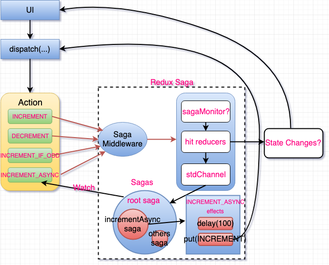

* [1.2-Saga 概念的背景](./redux-saga/1.2-saga-background.md)
  * [Fault-Tolerance and Data Consistency Using Distributed Sagas](https://sookocheff.com/post/architecture/fault-tolerance-and-data-consistency-using-distributed-sagas/)
  * [Distributed Sagas: A Protocol for Coordinating Microservices - Caitie McCaffrey - JOTB17](https://www.youtube.com/watch?v=0UTOLRTwOX0&feature=youtu.be)
  * [Saga Pattern](https://microservices.io/patterns/data/saga.html)
  * Saga Pattern | How to implement business transactions using Microservices
    * [Part I](https://blog.couchbase.com/saga-pattern-implement-business-transactions-using-microservices-part/)
    * [Part II](https://blog.couchbase.com/saga-pattern-implement-business-transactions-using-microservices-part-2/)
  * [SAGA | Microservices Architecture Patterns | Tech Primers](https://www.youtube.com/watch?v=WnZ7IcaN_JA)
  * [Applying the Saga Pattern • Caitie McCaffrey](https://www.youtube.com/watch?v=xDuwrtwYHu8)
    * [go-saga](https://github.com/lysu/go-saga),Implements saga-pattern in Go
  * [Original paper](http://www.cs.cornell.edu/andru/cs711/2002fa/reading/sagas.pdf)
  * [A Saga on Sagas](https://docs.microsoft.com/en-us/previous-versions/msp-n-p/jj591569(v=pandp.10))
  * [André Kovac - Handle All Async Events in Redux-Sagas | React Next 2019](https://www.youtube.com/watch?v=FsC4CF40__I)
  * [Build a Chat Application using React, Redux, Redux-Saga, and Web Sockets - Tutorial](https://www.youtube.com/watch?v=x_fHXt9V3zQ)
  * [Using sagas to maintain data consistency in a microservice architecture by Chris Richardson](https://www.youtube.com/watch?v=YPbGW3Fnmbc)
  * [Modular redux architecture](https://dev.to/jovidecroock/modular-redux-57nl)
  * [Building Modular Redux Applications](https://blog.usejournal.com/making-redux-modular-d21fd069bb33)
  * [Code Splitting for redux and redux-saga](https://manukyan.dev/posts/2019-04-15-code-splitting-for-redux-and-optional-redux-saga/)
  * ...
  
* [2.1-使用 Saga 辅助函数](./redux-saga/2.1-using-saga-helpers.md)
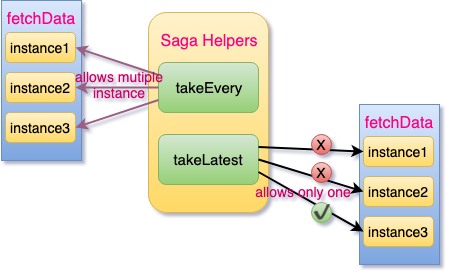

* [2.2-声明式 Effects](./redux-saga/2.2-declarative-effects.md)
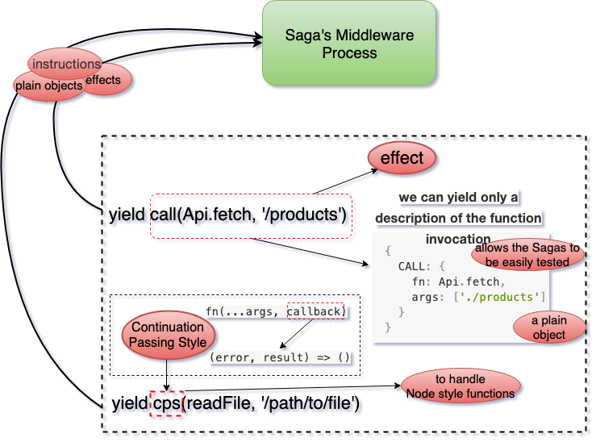

* [2.3-发起 action 到 store](./redux-saga/2.3-dispatching-actions.md)
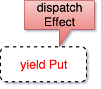

* [2.4-错误处理](./redux-saga/2.4-error-handling.md)


* [2.5-一个常见的抽象概念: Effect](./redux-saga/2.5-a-common-abstraction-effect.md)
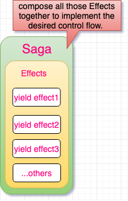

* [7-名词解释](./redux-saga/7-glossary.md)
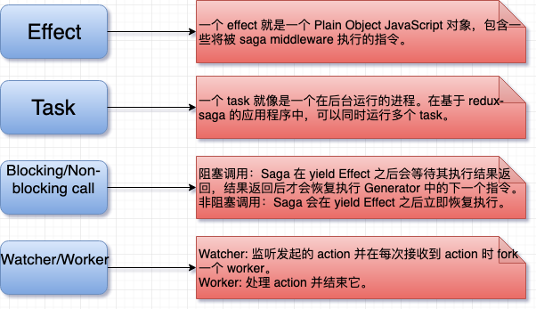

channels-trans-table


-------------------------------------
### React-Admin 相关文档
* [官方文档](https://marmelab.com/react-admin/) | [中文文档](https://react-admin.com) | [Demo](https://o-o.ren/scaling-redux-apps/demo/#/customers)
* [简介](https://react-admin.com/docs/zh-CN/intro.html)
* [十分钟教程](https://react-admin.com/docs/zh-CN/tutorial.html)
* [数据提供程序](https://react-admin.com/docs/zh-CN/data-providers.html)
* [Admin 组件](https://react-admin.com/docs/zh-CN/admin-component.html)
* [Resource 组件](https://react-admin.com/docs/zh-CN/resource-component.html)
* [List 视图组件](https://react-admin.com/docs/zh-CN/list-view-component.html)
* [Show 视图组件](https://react-admin.com/docs/zh-CN/show-view-component.html)
* [Field 组件](https://react-admin.com/docs/zh-CN/field-components.html)
* [Create 和 Edit 视图组件](https://react-admin.com/docs/zh-CN/creat-edit-view-components.html)
* [Input 组件](https://react-admin.com/docs/zh-CN/input-components.html)
* [身份验证](https://react-admin.com/docs/zh-CN/authentication.html)
* [授权](https://react-admin.com/docs/zh-CN/authorization.html)
* [主题](https://react-admin.com/docs/zh-CN/theming.html)
* [编写 Action](https://react-admin.com/docs/zh-CN/actions.html)
* [i18n](https://react-admin.com/docs/zh-CN/translation.html)
* [在其它 App 中包含 Admin](https://react-admin.com/docs/zh-CN/custom-app.html)
* [引用](https://react-admin.com/docs/zh-CN/reference.html)
* [常见问题](https://react-admin.com/docs/zh-CN/faq.html)
* [生态](https://react-admin.com/docs/zh-CN/ecosystem.html)

### 读 React-Admin 项目，感受 React 应用架构的魅力

[react-admin](https://github.com/marmelab/react-admin)
* Powered by [material-ui](https://v1.material-ui.com/), [redux](https://redux.js.org/), [redux-form](https://redux-form.com/7.3.0/), [redux-saga](https://redux-saga.js.org/), [react-router](https://reacttraining.com/react-router/), [recompose](https://github.com/acdlite/recompose), [reselect](https://github.com/reduxjs/reselect) and a few more.
* 对于偏 React 生态应用的项目架构来说，参考性较强
* 举一反三，应用到其它 UI 层架构也是不错

开始：
1. **README**
2. **[十分钟教程上手教程](./react-admin/2-tutorial.md)**
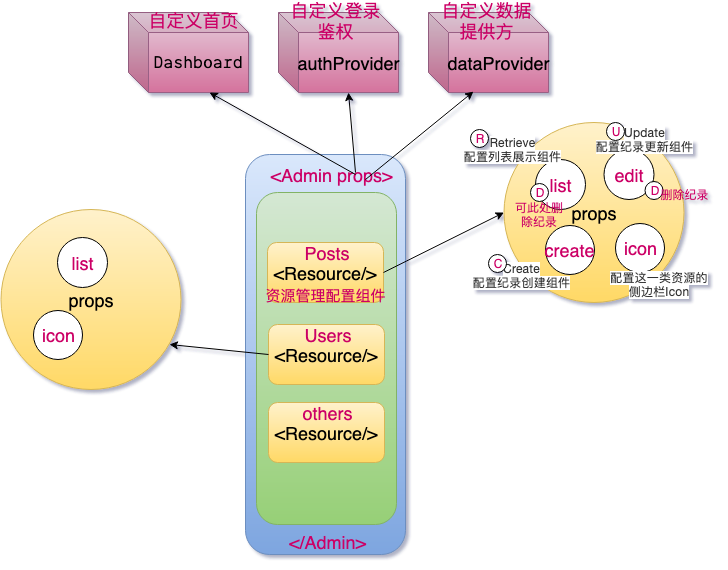

3. **[利用 Data Provider 适配你自己的 API](./react-admin/3-data-providers.md)**
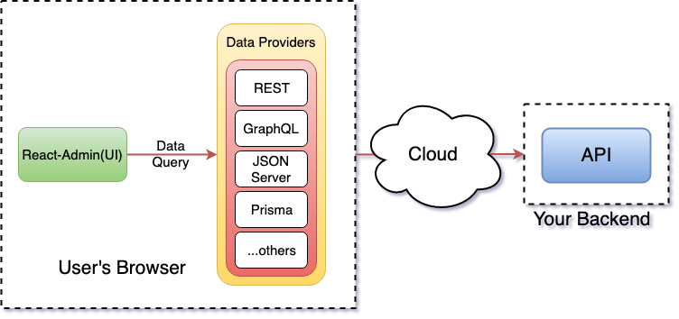

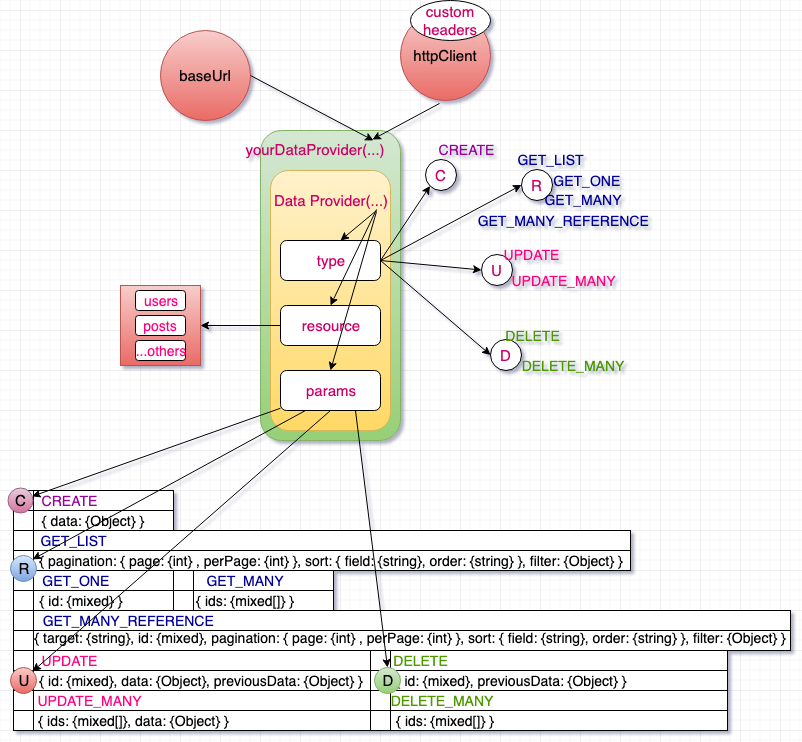

4. **[利用&lt;Admin/&gt;自定义一切](./react-admin/4-admin-component.md)**
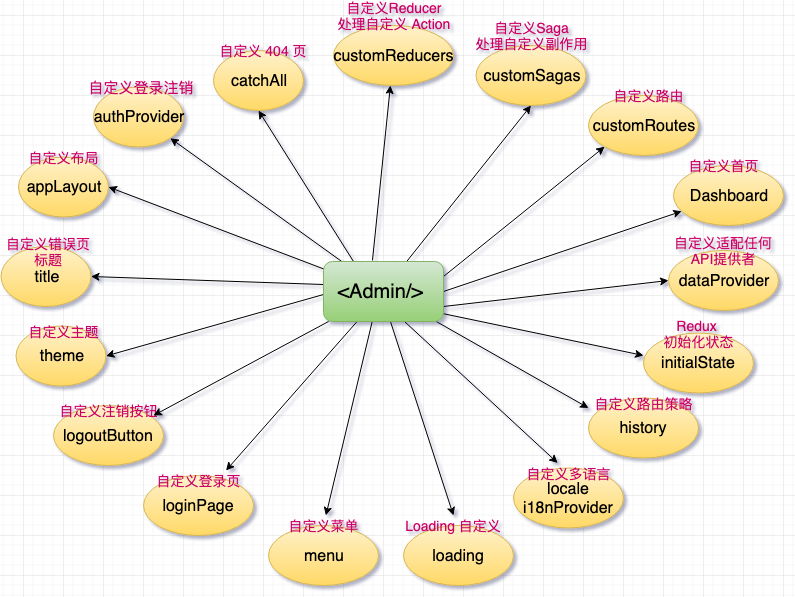


### React-Admin 核心组件及源码分析

扩展安装：[Redux DevTools Extension](https://github.com/zalmoxisus/redux-devtools-extension)

1. [调试 React-Admin 源码，看清框架的本质](./docs/stories/debug-react-admin.md)
2. [`localhost:8080` 背后的动作](./docs/stories/redux-devtools/npm-start.md)
3. [`localhost:8080/#/login` 背后的动作](./docs/stories/redux-devtools/route-login.md)
4. [React-Admin 架构分析：`Admin` 组件源码解析之 `dataProvider` 属性](./docs/stories/core-admin-data-provider.md)
5. [React-Admin 架构分析：Material-UI 定制](./docs/stories/material-ui-customization.md)
    * [React-Admin 架构分析：Material-UI 定制之 `Themes` 文档](./docs/stories/material-ui-customization-themes.md)
    * [React-Admin 架构分析：Material-UI 定制之 `Overrides` 文档](./docs/stories/material-ui-customization-overrides.md)
    * [React-Admin 架构分析：Material-UI 定制之 `CSS in JS` 文档](./docs/stories/material-ui-customization-css-in-js.md)
    * [React-Admin 架构分析：Material-UI 定制之 `Default Theme` 文档](./docs/stories/material-ui-customization-default-theme.md)
6. [React-Admin 架构分析：`Admin` 组件源码解析之 `theme` 属性](./docs/stories/core-admin-app-theme.md)
7. [React-Admin 架构分析：`Admin` 组件源码解析之 `appLayout` 属性](./docs/stories/core-admin-app-layout.md)
8. [react-admin 包分析](./docs/stories/react-admin-package.md)
9. [ra-core 包分析](./docs/stories/ra-core-package.md)
10. [Admin 组件源码解析](./docs/stories/Admin.md)（有干货但有些凌乱，留作纪念）
11. [CoreAdminRouter 组件源码分析](./docs/stories/CoreAdminRouter.md)（有干货但有些凌乱，留作纪念）
12. [最早的想法（留作纪念）](./docs/stories/old-readme.md)
13. [ImageInput 相关问题](https://github.com/Kirk-Wang/react-admin-app/issues/1)
14. [AOP & middleware(1秒懂^_^)](./docs/stories/aop-middleware.md)

### [读 React 16.x 源码](./docs/stories/react/README.md)

### 深入实践 [Redux Dynamic Modules](https://github.com/Microsoft/redux-dynamic-modules), 构建大型可伸缩的 React + Redux App
* 油管上视频：[Redux Dynamic Modules - Navneet Gupta & Alex B](https://www.youtube.com/watch?v=SktRbSZ-4Tk)
* 文字脱敏[Scaling Redux Apps](./docs/stories/scaling-redux-app.md)

脑图备份：
* [React源码大纲](./docs/images/react/react-1.png)
* [浅聊 Virtual DOM](./docs/images/react/virtual_dom.png)
* [ES相关基础](./docs/images/jsms/ES_basic.png)
* [JS-WEB-API](./docs/images/jsms/JS-WEB-API.png)
* [CSS-HTML](./docs/images/jsms/CSS-HTML.png)
* [前端性能](./docs/images/perf/perf_img.png)
* [缓存](./docs/images/perf/perf_cache.png)
* [本地存储](./docs/images/perf/perf_storage.png)
* [CDN](./docs/images/perf/perf_cdn.png)
* [页面渲染](./docs/images/perf/perf_pagerender.png)
* [浏览器运行机制浅析](./docs/images/perf/perf_explorer.png)
* [浅析DOM优化原理](./docs/images/perf/perf_dom.png)
* [Event Loop 与异步更新策略](./docs/images/perf/perf_eventloop.png)
* [回流与重绘](./docs/images/perf/perf_reflow_repaint.png)
* [首屏](./docs/images/perf/perf_homepage.png)
* [防抖与节流](./docs/images/perf/perf_th.png)
* [性能监测](./docs/images/perf/perf.png)
* [react 性能分析](https://react.css88.com/blog/2018/09/10/introducing-the-react-profiler.html#profiling-an-application)
* [前端性能优化清单](https://juejin.im/post/5a966bd16fb9a0635172a50a)
* [creeperyang/blog](https://github.com/creeperyang/blog/issues)
* [把前端监控做到极致](https://juejin.im/post/5a52f138f265da3e5b32a41b)
* [js-leakage-patterns](https://github.com/zhansingsong/js-leakage-patterns)
* [CS-Interview-Knowledge-Map](https://github.com/InterviewMap/CS-Interview-Knowledge-Map)

---

### redux-saga

* [Redux-Sage 中文文档](https://redux-saga-in-chinese.js.org/)
* [Redux-Saga 仓库实例精解](./docs/stories/saga/examples-saga.md) (废弃，没价值，大家自行看源码🤣)
* [坦克大战复刻版](https://zhuanlan.zhihu.com/p/35551654) 
* [SVG 图像入门教程](http://www.ruanyifeng.com/blog/2018/08/svg.html)
* [走进SVG](https://www.imooc.com/learn/143)
* [svg基础知识点](./docs/images/.png)
* [immutable入坑指南](http://www.aliued.com/?p=4175)
* [首屏场景组件 GameTitleScene 的分析](./docs/stories/battle-city/game-title-scene.md)
* [关卡选择场景组件 ChooseStageScene 的分析](./docs/stories/battle-city/choose-stage-scene.md)
* [游戏场景组件 GameScene 的分析](./docs/stories/battle-city/game-scene.md)
* [Iterator 和 for...of 循环](http://es6.ruanyifeng.com/#docs/iterator)
* [深入浅出 ES6（二）：迭代器和 for-of 循环](http://www.infoq.com/cn/articles/es6-in-depth-iterators-and-the-for-of-loop)
* [深入浅出 ES6（三）：生成器 Generators](http://www.infoq.com/cn/articles/es6-in-depth-generators)
* [redux-saga 实践总结](https://zhuanlan.zhihu.com/p/23012870)
* [浅析redux-saga实现原理](https://zhuanlan.zhihu.com/p/30098155)
* [从 Pub/Sub 浅聊 reudx-saga](./docs/stories/saga/pub-sub-saga.md)
* [Redux-Saga 漫谈](https://www.yuque.com/lovesueee/blog/redux-saga)
* [little-saga](https://github.com/little-saga/little-saga)
* [构建你自己的 redux-saga](https://github.com/little-saga/little-saga/blob/master/docs/building-your-own-redux-saga.md)一文：
* [构建你自己的 redux-saga 总结](./docs/stories/saga/build-saga.md)
* [Git 配置](./docs/images/mac/git/gitconfig.png)
* [CSSINJS](http://cssinjs.org)
* [漫谈 CSS in JS](https://zhuanlan.zhihu.com/p/31622439)

---

### webpack(脑图)

* [webpack可以做什么](./docs/images/webpack/1.png)
* [webpack基础配置](./docs/images/webpack/2.png)
* [webpack打包文件分析](./docs/images/webpack/3.png)
* [webpack之转化ES高级语法](./docs/images/webpack/4.png)
* [webpack处理js语法及校验](./docs/images/webpack/5.png)
* [webpack暴露全局变量](./docs/images/webpack/6.png)
* [webpack之Html插件](./docs/images/webpack/7.png)
* [webpack之样式处理](./docs/images/webpack/8.png)
* [webpack详细配置](./docs/images/webpack/9.png)
* [webpack优化](./docs/images/webpack/10.png)
    * tree-shaking 
    * scope hosting
    * splitChunks
    * noParse
    * webpack.IgnorePlugin
    * 懒加载
    * dllPlugin
    * happypack
    * 热更新
    * ...
* [Tapable](./docs/images/webpack/11.png)
* [实现一个简易的webpack](./docs/images/webpack/12.png)
* [写一个loader](./docs/images/webpack/13.png)
* [写一个plugin](./docs/images/webpack/14.png)

---

### NodeJS

<details>
  <summary>
    <b>NodeJs 是什么？</b>
  </summary>
  <ul>
    <li>Node.js is a `JavaScript runtime` built on Chrome's V8</li>
    <li>Node.js uses an event-driven, `non-blocking I/O` model</li>
  </ul>
</details>

<details>
  <summary>
    <b>非阻塞I/O</b>
  </summary>
  <ul>
    <li>阻塞：I/O 时进程休眠等待 I/O 完成后进行下一步</li>
    <li>非阻塞：I/O 时函数立即返回，进程不等待 I/O 完成</li>
    <li>I/O 操作非常慢</li>
  </ul>
</details>

<details>
  <summary>
    <b>事件驱动</b>
  </summary>
  <ul>
    <li>I/O 等异步操作结束后的通知</li>
    <li>观察者模式</li>
  </ul>
</details>

<details>
  <summary>
    <b>为什么偏爱 NodeJS</b>
  </summary>
  <ul>
    <li>前端职责范围变大，统一开发体验</li>
    <li>在处理高并发，I/O密集场景性能优势明显</li>
  </ul>
</details>

<details>
  <summary>
    <b>CPU 密集 VS I/O 密集</b>
  </summary>
  <ul>
    <li>CPU 密集：压缩，解压，加密，解密</li>
    <li>I/O 密集：文件操作，网络操作，数据库</li>
  </ul>
</details>

<details>
  <summary>
    <b>web 常见场景</b>
  </summary>
  <ul>
    <li>静态资源的读取</li>
    <li>数据库操作</li>
    <li>渲染页面</li>
  </ul>
</details>

<details>
  <summary>
    <b>高并发应对之道</b>
  </summary>
  <ul>
    <li>增加机器数(堆机器并不合算)</li>
    <li>增加每台机器的 CPU 数----多核</li>
  </ul>
</details>

<details>
  <summary>
    <b>进程</b>
  </summary>
  <ul>
    <li>进程（执行中的程序）：是计算机中的程序关于某数据集合上的一次运行活动，是系统进行资源分配和调度的基本单位</li>
    <li>多进程：启动多个进程，多个进程可以一块执行多个任务(CPU 调度算法快速的切换)</li>
  </ul>
</details>

<details>
  <summary>
    <b>NodeJS 工作模型</b>
  </summary>
  <ul>
    <li>Client --> EventLoop(single thred) --> Non-blocking Worker(internal C++ threadpool)</li>
    <li>一个 NodeJS 进程只开一个线程</li>
  </ul>
</details>

<details>
  <summary>
    <b>线程</b>
  </summary>
  <ul>
    <li>线程：进程内一个相对独立的，可调度的执行单元，与同属于一个进程的线程共享进程的资源</li>
    <li>多线程：启动一个进程，在一个进程内启动多个线程，这样，多个线程也可以一块执行多个任务（靠调度算法来做）</li>
  </ul>
</details>

<details>
  <summary>
    <b>NodeJS 的单线程</b>
  </summary>
  <ul>
    <li>单线程只是针对主进程，与I/O 操作系统底层多线程调度没啥关系</li>
    <li>单线程并不是单进程（用 cluster 模块，CPU 有几个核儿，我们就启几个进程）</li>
  </ul>
</details>

<details>
  <summary>
    <b>常用场景</b>
  </summary>
  <ul>
    <li>Web Server</li>
    <li>本地代码构建(性能不是最好，但对前端友好)</li>
    <li>实用工具开发(性能不是最好，但对前端友好)</li>
  </ul>
</details>

<details>
  <summary>
    <b>快速 Demo 演示</b>
  </summary>
  <ul>
    <li>VSCode + Code Runner</li>
  </ul>
</details>

#### CommonJS

包裹函数，不用自己写，NodeJS 帮我们弄好了

```js
(function(exports, require, module, __filename, __dirname){
    console.log('test.');
});
```

<details>
  <summary>
    <b>CommonJS 特性</b>
  </summary>
  <ul>
    <li>每个文件是一个模块，有自己的作用域</li>
    <li>在模块内部 module 变量代表模块本身</li>
    <li>module.exports 属性代表模块对外接口</li>
  </ul>
</details>

<details>
  <summary>
    <b>require 规则</b>
  </summary>
  <ul>
    <li>`/` 表示绝对路径，`./` 表示相对于当前文件的</li>
    <li>支持 js、json、node 拓展名，不写依次尝试</li>
    <li>不写路径则认为是 build-in 模块或者各级 node_modules 内的第三方模块</li>
  </ul>
</details>

<details>
  <summary>
    <b>require 特性</b>
  </summary>
  <ul>
    <li>module 被加载的时候执行，加载后缓存</li>
    <li>一旦出现某个模块被循环加载，就只输出已经执行的部分，还未执行的部分不会输出</li>
  </ul>
</details>

<details>
  <summary>
    <b>npm 常用命令</b>
  </summary>
  <ul>
    <li>npm root -g</li>
  </ul>
</details>

<details>
  <summary>
    <b>module.exports 与 exports 的区别</b>
  </summary>
  <ul>
    <li>exports 是 module.exports 的快捷方式</li>
  </ul>
</details>

<details>
  <summary>
    <b>global</b>
  </summary>
  <ul>
    <li>CommonJS</li>
    <li>Buffer、process、console</li>
    <li>timer</li>
  </ul>
</details>

<details>
  <summary>
    <b>process 模块常用 API </b>
  </summary>
  <ul>
    <li><a href="https://nodejs.org/dist/latest-v10.x/docs/api/process.html">文档</a></li>
    <li>process.argv</li>
    <li>process.argv0</li>
    <li>process.execArgv</li>
    <li>process.execPath</li>
    <li>process.env</li>
    <li>process.cwd()</li>
    <li>process.nextTick(()=>{})</li>
  </ul>
</details>

#### nextTick VS setTimeout VS setImmediate

```js
setImmediate(() => console.log('setImmediate'));
setTimeout(() => console.log('timeout'), 0);
process.nextTick(() => {
    console.log('nextTick1')
    process.nextTick(() => console.log('nextTick2'))
});
// nextTick1
// nextTick2
// timeout
// setImmediate
// nextTick 是放在当前事件队列的最后，主意这个不能出现递归，不然其它异步都会异常
// setTimeout 放在 nextTick 和 setImmediate 中间
// setImmediate 是放在下一个事件队列队首
```

<details>
  <summary>
    <b>Debugger</b>
  </summary>
  <ul>
    <li><a href="https://nodejs.org/dist/latest-v10.x/docs/api/debugger.html">文档</a></li>
    <li><a href="https://github.com/Microsoft/vscode-recipes">vscode-recipes</a></li>
    <li>条件调试</li>
  </ul>
</details>

<details>
  <summary>
    <b>path 模块常用 API </b>
  </summary>
  <ul>
    <li><a href="http://nodejs.cn/api/path.html">文档</a></li>
    <li>__dirname, __filename 总是返回文件的绝对路径</li>
    <li>process.cwd() 总是返回执行 node 命令所在的文件夹</li>
    <li>`./` 在 require 方法中总是相对当前文件所在文件夹</li>
    <li>`./` 在其它地方 (path.resolve('./')) 就和 process.cwd() 一样，相对 node 启动文件夹</li>
    <li>path.normalize</li>
    <li>path.join</li>
    <li>path.resolve</li>
    <li>path.basename</li>
    <li>path.dirname</li>
    <li>path.extname</li>
    <li>path.parse</li>
    <li>path.format</li>
    <li>path.sep</li>
    <li>path.delimiter</li>
    <li>path.win32</li>
    <li>path.posix</li>
  </ul>
</details>

<details>
  <summary>
    <b>Buffer 模块常用 API </b>
  </summary>
  <ul>
    <li><a href="http://nodejs.cn/api/buffer.html">文档</a></li>
    <li>Buffer 用于处理二进制数据流</li>
    <li>实现类似整数数组，大小固定</li>
    <li>C++ 代码在 V8 堆外分配物理内存</li>
    <li>Buffer.alloc</li>
    <li>Buffer.from</li>
    <li>Buffer.byteLength</li>
    <li>Buffer.isBuffer</li>
    <li>Buffer.concat</li>
    <li>buf.length</li>
    <li>buf.toString</li>
    <li>buf.fill</li>
    <li>buf.equals</li>
    <li>buf.indexOf</li>
    <li>buf.copy</li>
  </ul>
</details>

#### 中文乱码问题
```js
const { StringDecoder } = require('string_decoder')
const decoder = new StringDecoder('utf8')
const buf = Buffer.from('中文字符串')

for(let i = 0; i < buf.length; i+=5) {
  const b = Buffer.allocUnsafe(5)
  buf.copy(b, 0, i)
  console.log(b.toString());
  console.log(decoder.write(b))
}
```

<details>
  <summary>
    <b>events 模块</b>
  </summary>
  <ul>
    <li><a href="http://nodejs.cn/api/events.html">文档</a></li>
    <li>继承 EventEmitter</li>
    <li>ce.on</li>
    <li>ce.emit</li>
    <li>ce.onece</li>
    <li>ce.removeListener</li>
    <li>ce.removeAllListeners</li>
  </ul>
</details>

<details>
  <summary>
    <b>fs 模块</b>
  </summary>
  <ul>
    <li><a href="http://nodejs.cn/api/fs.html">文档</a></li>
    <li>fs.readFile</li>
    <li>fs.readFileSync</li>
    <li>fs.writeFile</li>
     <li>fs.stat</li>
     <li>fs.unlink</li>
     <li>fs.readdir</li>
     <li>fs.mkdir</li>
     <li>fs.rmdir</li>
     <li>fs.watch</li>
     <li>fs.readstream</li>
     <li>fs.writestream</li>
  </ul>
</details>

#### promisify & async

```js
const fs = require("fs");
const path = require("path");
const promisify = require("util").promisify;
const read = promisify(fs.readFile);
// read(path.join(__dirname,'./promisify.js'))
// .then( data => {
//   console.log(data.toString());
// })
// .catch(ex => {
//   console.log(ex)
// })
async function test() {
  try {
    const content = await read(path.join(__dirname, "./promisify.js"));
    console.log(content.toString());
  } catch (ex) {
    console.log(ex);
  }
}
test();
```

<details>
  <summary>
    <b>.gitignore</b>
  </summary>
  <ul>
    <li><a href="https://git-scm.com/docs/gitignore">文档</a></li>
    <li>匹配模式前 / 代表项目根目录</li>
    <li>匹配模式最后加 / 代表目录</li>
    <li>匹配模式前加 ! 代表取反</li>
    <li>* 代表任意个字符</li>
    <li>？匹配任意一个字符</li>
    <li>** 匹配多级目录</li>
  </ul>
</details>

<details>
  <summary>
    <b>.npmignore</b>
  </summary>
  <ul>
    <li><a href="https://docs.npmjs.com/misc/developers">文档</a></li>
    <li>src(npm 包忽略)</li>
    <li>test(npm 包忽略)</li>
  </ul>
</details>

<details>
  <summary>
    <b>EditorConfig</b>
  </summary>
  <ul>
    <li><a href="https://editorconfig.org/">文档</a></li>
  </ul>
</details>

<details>
  <summary>
    <b>ESLint</b>
  </summary>
  <ul>
    <li><a href="http://eslint.cn/">文档</a></li>
  </ul>
</details>

<details>
  <summary>
    <b>Benchmark.js</b>
  </summary>
  <ul>
    <li><a href="https://benchmarkjs.com/docs/">文档</a></li>
  </ul>
</details>

<details>
  <summary>
    <b>EventLoop</b>
  </summary>
  <ul>
    <li><a href="https://github.com/jin5354/404forest/issues/61">深入探究 eventloop 与浏览器渲染的时序问题</a></li>
  </ul>
</details>

---

### 一些基础

  * CSS 盒模型
  * 页面布局
  * DOM 事件
  * HTTP 协议
  * 原型链类
  * 面向对象
  * 通信
  * 前端安全
  * 前端算法
  * 渲染机制
  * JS 运行机制
  * 页面性能
  * 错误监控
  * 业务
  * 团队协作
  * ...

---

### Jest

* [使用Jest进行React单元测试](https://juejin.im/post/5b6c39bde51d45195c079d62#heading-34)
* [Jest & enzyme 进行react单元测试](https://juejin.im/post/5c417aa4f265da616a47eb4d)
* [postMessage do not trigger message event listener](https://github.com/facebook/jest/issues/6765)
* [window.postMessage doesn't work ](https://github.com/jsdom/jsdom/issues/2245)

---

### nice repos~

* [javascript-datastructures-algorithms](https://github.com/loiane/javascript-datastructures-algorithms)
* [ory-editor](https://github.com/aeneasr/ory-editor)
* [typescript-library-starter](https://github.com/alexjoverm/typescript-library-starter)
* [wretch](https://github.com/elbywan/wretch)
* [umbrella](https://github.com/thi-ng/umbrella)
* [postmate](https://github.com/dollarshaveclub/postmate)
* [penpal](https://github.com/Aaronius/penpal)
* [final-form](https://github.com/final-form/final-form)
* [tsdx](https://github.com/palmerhq/tsdx)
* [little-saga](https://github.com/little-saga)
* [amis](https://github.com/baidu/amis)
* [H5Skills](https://github.com/o2team/H5Skills)


### monorepos ~~~

* [有赞开源项目最佳实践](https://juejin.im/post/5b03871df265da0ba6102022)
* [Node.js项目拆包工程化](https://mp.weixin.qq.com/s/euyclYm8Use3UpFTeJ1WlA)
* [Vue CLI 3结合Lerna进行UI框架设计](https://juejin.im/post/5cb12844e51d456e7a303b64)

### 优秀的 blog
墙内：
* [Preact 源码解析](https://sinkmind.github.io/preact-analysis/)
* [React.js 小书](https://github.com/huzidaha/react-naive-book)
* [Jony的博客，记录学习工作的点点滴滴](https://github.com/forthealllight/blog)
* [冴羽的博客](https://github.com/mqyqingfeng/Blog)
* [node-interview](https://github.com/ElemeFE/node-interview/tree/master/sections/zh-cn)
* [大话WEB开发](https://github.com/SFLAQiu/web-develop)
* [梁少峰的个人博客](https://github.com/youngwind/blog)
* [JavaScript内存泄露和CSS优化](https://github.com/zhansingsong/js-leakage-patterns)
* [每周重点攻克一个前端面试重难点](https://github.com/yygmind/blog)
* [前端精读周刊](https://github.com/dt-fe/weekly)
* [天猪部落阁](https://github.com/atian25/blog)
* [Nodejs-Roadmap](https://github.com/Q-Angelo/Nodejs-Roadmap)
* [amandakelake/blog](https://github.com/amandakelake/blog)
* [blog.atulr.com](https://blog.atulr.com/)
* [React 源码解析](https://react.jokcy.me/)
墙外：
* [Mihailizing](https://mihail-gaberov.eu/)

### 监控
* [让前端监控数据采集更高效](https://mp.weixin.qq.com/s/JB5LE0USD7EFpfc2F5IndA)

### JavaScript SDK Design
* [JavaScript SDK Design](https://github.com/hueitan/javascript-sdk-design)
* [Code-splitting for libraries—bundling for npm with Rollup 1.0](https://levelup.gitconnected.com/code-splitting-for-libraries-bundling-for-npm-with-rollup-1-0-2522c7437697)

### 杂项
* [解决chrome提示"您的连接不是私密连接"问题](https://github.com/mrdulin/blog/issues/32)
```sh
openssl req -newkey rsa:2048 -x509 -nodes -keyout server.pem -new -out server.crt -subj /CN=dev.xx.com -reqexts SAN -extensions SAN -config <(cat /System/Library/OpenSSL/openssl.cnf <(printf '[SAN]\nsubjectAltName=DNS:dev.xx.com')) -sha256 -days 3650
```
* [Docker--Error message 'sudo: unable to resolve host <USER>'](https://askubuntu.com/questions/59458/error-message-sudo-unable-to-resolve-host-user)
* [如何绕过chrome的弹窗拦截机制](https://my.oschina.net/jsan/blog/1545859)
* 80
```sh
sudo lsof -n -P | grep :80
```
* [在GIT中创建一个空分支](https://segmentfault.com/a/1190000004931751)
* [Android7.0以上使用Charles抓包Https](https://juejin.im/post/5c611302f265da2ddc3c5622)
* [JB的测试之旅-听说安卓微信7.0不能抓https?](https://juejin.im/post/5c38d6e95188252584692f99)
* [Android 7.0+ 抓包https的一种方案(支持微信7.0)](https://www.jianshu.com/p/a818a0d0aa9f)

--------------------------------

### 深入理解 [redux-saga](https://github.com/redux-saga/redux-saga) 之 [little-saga](https://github.com/little-saga/little-saga) 全面解析

[构建你自己的 redux-saga](https://github.com/little-saga/little-saga/blob/v0.5.4/docs/building-your-own-redux-saga.md) 总结：（脑图）

目录：
* [0.2 名词解释](#02-名词解释)
* [1.1 生成器函数](#11-生成器函数)
* [1.2 使用 while-true 来消费迭代器](#12-使用-while-true-来消费迭代器)
* [1.3 使用递归函数来消费迭代器](#13-使用递归函数来消费迭代器)
* [1.4 双向通信](#14-双向通信)
* [1.5 effect 的类型与含义](#15-effect-的类型与含义)
* [1.6 result-first callback style](#16-result-first-callback-style)
* [1.7 cancellation](#17-cancellation)
* [1.8 effect 状态](#18-effect-状态)


#### 0.2 名词解释

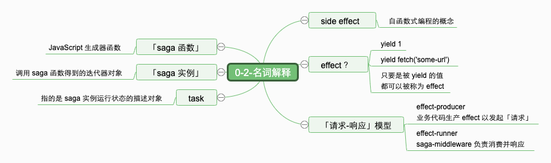

#### 1.1 生成器函数

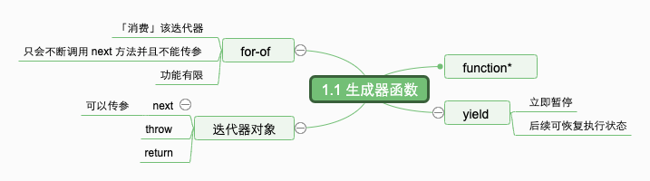

#### 1.2 使用 while-true 来消费迭代器

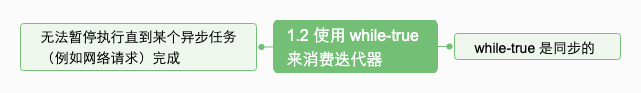

#### 1.3 使用递归函数来消费迭代器

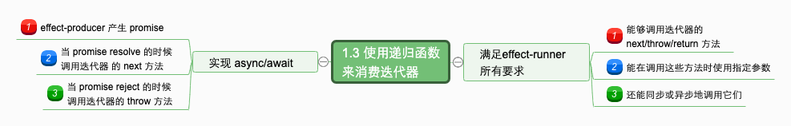


#### 1.4 双向通信

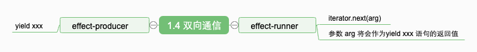

#### 1.5 effect 的类型与含义

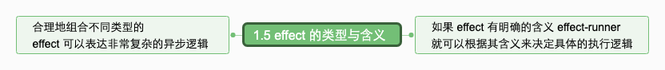

#### 1.6 result-first callback style

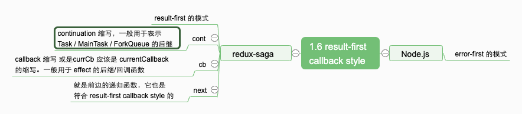

#### 1.7 cancellation

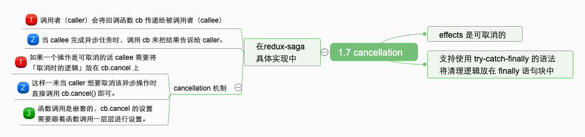

#### 1.8 effect 状态

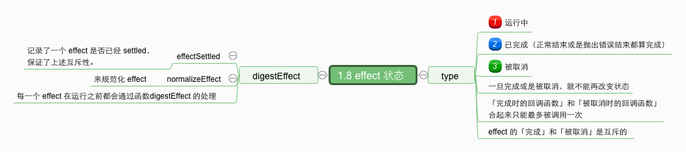
