# React-Admin-App

## 文档

[官方文档](https://marmelab.com/react-admin/) | [中文文档](https://react-admin.com)

## 核心组件及源码分析
1. [调试 React-Admin 源码，看清框架的本质](./docs/components/debug-react-admin.md)

2. 用好 `React-Admin`，其实就是用好它暴露出来的 `Admin` 组件。它的实现可以说就是整个 `react-admin` 项目架构的实现。接下来会逐一讲解它的每一个属性，以及 `Admin` 组件用它们做了什么❓
    * [React-Admin 架构分析：`Admin` 组件源码解析之 `dataProvider` 属性](./docs/components/core-admin-data-provider.md)
    * [React-Admin 架构分析：Material-UI 定制](./docs/components/material-ui-customization.md)
        * [React-Admin 架构分析：Material-UI 定制之 `Themes` 文档](./docs/components/material-ui-customization-themes.md)
        * [React-Admin 架构分析：Material-UI 定制之 `Overrides` 文档](./docs/components/material-ui-customization-overrides.md)
        * [React-Admin 架构分析：Material-UI 定制之 `CSS in JS` 文档](./docs/components/material-ui-customization-css-in-js.md)
        * [React-Admin 架构分析：Material-UI 定制之 `Default Theme` 文档](./docs/components/material-ui-customization-default-theme.md)
    * [React-Admin 架构分析：`Admin` 组件源码解析之 `theme` 属性](./docs/components/core-admin-app-theme.md)

3. [Admin 组件源码解析](./docs/components/Admin.md)（有些旧）
4. [CoreAdminRouter 组件源码分析](./docs/components/CoreAdminRouter.md)（有些旧）

## 小插曲

## 使用 React-Admin 实战中后台应用

### 官方项目和Demo
[React-Admin](https://github.com/marmelab/react-admin)--[Demo](https://marmelab.com/react-admin-demo/)

### 本次实战Demo（Typescirpt + 中文支持）
[演示程序](https://o-o.ren/react-admin-app/demo/)
---
[GitHub](https://github.com/Kirk-Wang/react-admin-app)

### 初始化项目（create-react-app，这里采用 TS)

```sh
npm install -g create-react-app

create-react-app my-app --scripts-version=react-scripts-ts
cd my-app/
npm start
```

### Git commit 日志标准

这里直接接入 [git-commit-style-guide](https://github.com/feflow/git-commit-style-guide)


**所有的 type 类型如下：**

> type代表某次提交的类型，比如是修复一个bug还是增加一个新的feature。

* feat： 新增 feature
* fix: 修复 bug
* docs: 仅仅修改了文档，比如 README, CHANGELOG, CONTRIBUTE等等
* style: 仅仅修改了空格、格式缩进、逗号等等，不改变代码逻辑
* refactor: 代码重构，没有加新功能或者修复 bug
* perf: 优化相关，比如提升性能、体验
* test: 测试用例，包括单元测试、集成测试等
* chore: 改变构建流程、或者增加依赖库、工具等
* revert: 回滚到上一个版本

### tslint
采用 [@blueprintjs/tslint-config](https://www.npmjs.com/package/@blueprintjs/tslint-config) 规则


### React-Admin demo 分析

#### React-Admin 相关基本概念
* React-Admin：一个前端框架，主要用来构建 Admin App（中后台应用程序）。他采用 React 生态系统中最优秀的库（[material-ui](https://material-ui.com/), [redux](https://redux.js.org/), [redux-form](https://redux-form.com/7.3.0/), [redux-saga](https://redux-saga.js.org/), [react-router](https://reacttraining.com/react-router/), [recompose](https://github.com/acdlite/recompose), [reselect](https://github.com/reduxjs/reselect)）构建而成。这些库基本都在 1w+ 以上。React-Admin 真正糅合了它们，并且它拥有完善的测试用例，仓库基本每天都更新。

#### 数据服务器伪造
[fetch-mock](https://github.com/wheresrhys/fetch-mock)：当使用 fetch 时，模拟返回一个 http request 的 response。

[FakeRest](https://github.com/marmelab/FakeRest)：拦截一个 AJAX 调用到一个基于 JSON 数据伪造的 REST 服务器。在 Sinon.js（针对 XMLHTTPRequest）或 fetch-mock（针对 fetch）之上使用它来测试浏览器端的 JavaScript REST 客户端（例如单页应用程序），而无需服务器。

Fake Rest Server 示例代码（[demo](https://o-o.ren/react-admin-app/examples/fetch.html) | [demo source](./docs/examples/fetch.html)）

```js
// 初始化一个伪造的 Rest Server
var restServer = new FakeRest.FetchServer('http://fakeapi');
// 为 Rest Server 提供数据
restServer.init({
    'authors': [
        { id: 0, first_name: 'Leo', last_name: 'Tolstoi' },
        { id: 1, first_name: 'Jane', last_name: 'Austen' }
    ],
    'books': [
        { id: 0, author_id: 0, title: 'Anna Karenina' },
        { id: 1, author_id: 0, title: 'War and Peace' },
        { id: 2, author_id: 1, title: 'Pride and Prejudice' },
        { id: 3, author_id: 1, title: 'Sense and Sensibility' }
    ]
});
// 打印 fetch 日志，它默认是关闭的
restServer.toggleLogging();

// 使用 restServer 作为 fetch mock
fetchMock.mock(/^http\:\/\/fakeapi/, restServer.getHandler())

// 现在查询这个伪造的 REST server
fetch('http://fakeapi/authors?range=%5B0,1%5D')
    .then(res => res.text())
    .then(res => document.getElementById('req1').value = res);

fetch('http://fakeapi/books/3')
    .then(res => res.text())
    .then(res => document.getElementById('req2').value = res);

fetch('http://fakeapi/books', {
        method: 'POST',
        body: JSON.stringify({ author_id: 1, title: 'Emma' })
    })
    .then(res => res.text())
    .then(res => document.getElementById('req3').value = res);

// 恢复原生 fetch 功能
fetchMock.restore();
```

#### demo 数据生成

我这里直接将 [data-generator](https://github.com/marmelab/react-admin/tree/master/examples/data-generator) 改造成一个 typescript 版本。放到 src 下。

#### demo 前端数据 E-R 图
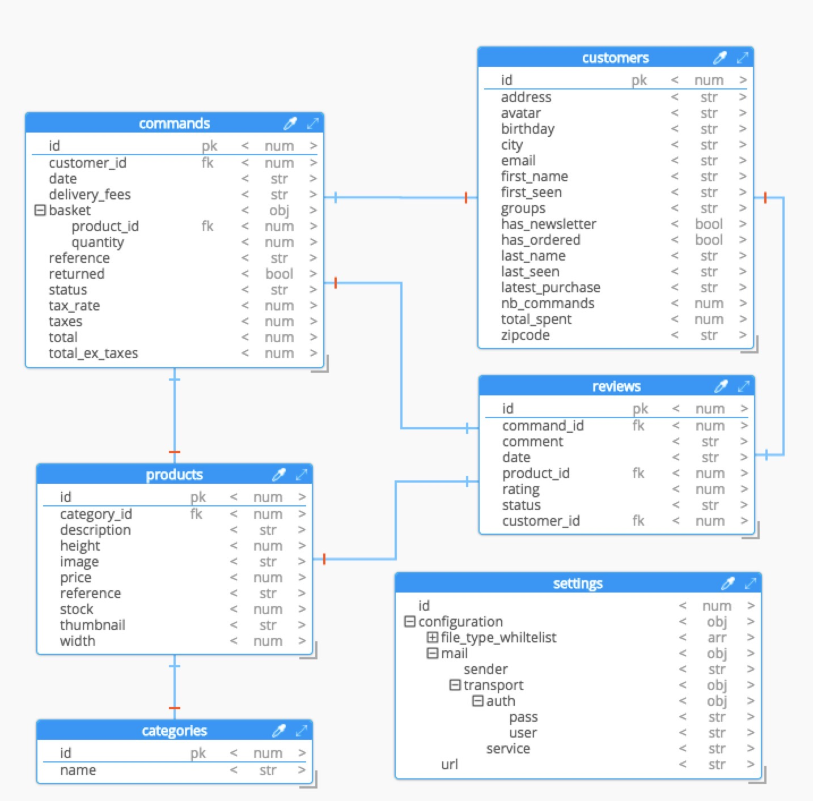

#### customers 的 Resource 组件
```jsx
 <Resource
        icon={CustomerIcon}
        list={CustomerList}
        create={CustomerCreate}
        edit={CustomerEdit}
        name="customers"
    />
```
#### 在 material-ui 导出一个 Icon
```jsx
export { default as CustomerIcon } from "@material-ui/icons/Person";
```

#### Customers List [UI界面分析](https://marmelab.com/react-admin-demo/#/customers)
1. 要展示的字段
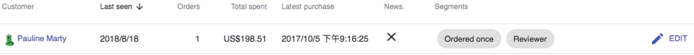

2. 通过 E-R 图，我知道这个 customer field 展示组件由三个数据字段（avatar，first_name，last_name）组成。并且是一个 a 链接，指向 Edit 视图。因此这个自定义组件可以设计成这样：
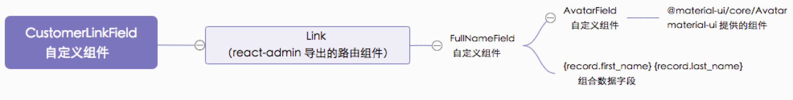
3. 自定义组件（FullNameField）中，有用到[recompose/pure](https://github.com/acdlite/recompose/blob/e1b5359fc611a2eb8df94cd6c39b709e16294156/src/packages/recompose/pure.js)（用它来做一个高阶处理，使用 shallowEqual() 方法在高阶组件 shouldComponentUpdate 中决定组件是否执行 render）。[Recompose](https://github.com/acdlite/recompose) 是一个用于创建函数式组件和高阶组件的 React 工具库。
4. 从 react-admin 导出 DateField 组件，用来展示 Last seen(last_seen)。并指明 type 是 date。
5. 从 react-admin 导出 NumberField 组件，用来展示 Orders(nb_commands)。
6. 使用自定义组件 ColoredNumberField 展示 Total spent(total_spent)。使用 material-ui 提供的 withStyles 方法修复官方 demo 中 ColoredNumberField 金额大于 500 不飘红的问题。
```jsx
    withStyles(fieldStyles)(
        ({ classes, ...props }: any) =>
            props.record[props.source] > 500 ? (
                <WrappedComponent {...props} className={classes.color} />
            ) : (
                <WrappedComponent {...props} />
            ));
```
7. 从 react-admin 导出 DateField 组件，用来展示 Latest purchase(last_purchase)。指定 showTime，用来显示时分秒。
8. 从 react-admin 导出 BooleanField 组件，用来展示 News.(has_newsletter)。
9. 加入自定义组件 SegmentsField。包裹 material-ui 的 Chip 组件。
10. 从 react-admin 导出 EditButton 组件，用来路由到编辑视图。
11. 利用 withStyles 为 list 注入className（这里主要是改变 Orders 的颜色）。
12. 在 List 视图中设置默认排序字段为 Last seen，并且为降序。
```jsx
<List {...props} sort={{ field: 'last_seen', order: 'DESC' }}>
...
</List>
```
13. 设置 List 的每页显示条数
```jsx
<List {...props} perPage={25}>
...
</List>
```
14. 添加 Filter 用来过滤数据。
```jsx
// 从 react-admin 导出，主要用来处理过滤相关的逻辑和 UI 展示（按钮或者是表单）
<Filter {...props}>
    {/* 
        从 react-admin 导出，用于输入（text，email，url，password）。
        "q"，利用 API 提供的全文功能进行搜索
        alwaysOn，表示这个过滤始终显示在界面上
        这个 pos.search 表示多语言的配置。查看 src/i18n/cn.ts
    */}
    <TextInput label="pos.search" source="q" alwaysOn />
    {/* 从 react-admin 导出，用于渲染一个标准的浏览器 Date Picker */}
    <DateInput source="last_seen_gte" />
    {/* 从 react-admin 导出，用于渲染一个下拉列表，允许你在 true，false，null 之间选择 */}
    <NullableBooleanInput source="has_ordered" />
    <NullableBooleanInput source="has_newsletter" defaultValue />
    <SegmentInput />
</Filter>
```
15. 自定义 SegmentsInput 过滤字段
```jsx
export const SegmentInput = compose(
    translate,
    withStyles(styles),
)(({ classes, translate: trans, ...rest }: any) => (
    <SelectInput
        {...rest}
        choices={segments.map((segment: any) => ({
            id: segment.id,
            name: trans(segment.name),
        }))}
        className={classes.input}
    />
));
```
16. 有的小伙伴可能不太理解 [recompose/compose](https://github.com/acdlite/recompose/blob/master/src/packages/recompose/compose.js)，但它又非常重要，我这里举个例子来让你秒懂这个工具函数：
```js
const compose = (...funcs) =>
  funcs.reduce((a, b) => (...args) => a(b(...args)), arg => arg)

/**
 * 
 * const props = {} // 初始对象
 * 
 * const fStart = props => props // 原始函数，对于对象，只是简单的返回
 * 
 * const fName = props => ({...props, name: 'Kirk'}) // 让 props 具有 name 
 * fName(props) --> { name: 'Kirk' }
 * 
 * const fAge = props => ({...props, age: 12}) // 让 props 具有 age 
 * fAge(props) --> { age: 12 }
 * 
 * const fSex = props => ({...props, sex: 'M'}) // 让 props 具有 sex
 * fSex(props) --> { sex: 'M' }
 * 
 * props --> {} 因为是解构，所以不会改变初始对象
 * 
 * const fCompose = props => fStart(fName(fAge(fSex(props)))) // 组合
 * fCompose(props) --> { sex: 'M', age: 12, name: 'Kirk' }
 * 
 * const fCompose2 = props => fStart(fSex(fAge(fName(props)))) // fStart( 这里面函数包函数顺序无关 )
 * fCompose2(props) --> { sex: 'M', age: 12, name: 'Kirk' }
 * 
 * 所以按照 reduce 函数的执行顺序，我们可以做
 * const fReduce = [ fName, fSex, fAge ].reduce( 
 *      (funcA, funcB) => props => funcA(funcB(props)) 
 *          第一个参数，每次执行返回一个函数(props => ehancer(props))，作为下一次的 funA, 直到结束。 
 *          最终的结果也就是返回一个函数(props => ehancer(props))
 *      , fStart // 第二个参数，需要增强的原始函数
 *  )
 * 
 * fReduce(props) --> { sex: 'M', age: 12, name: 'Kirk' }
 * 
 */
```

17. 列表响应式支持，从 react-admin 包中导出 Responsive 组件
```jsx
// 这个组件主要利用 @material-ui/core/withWidth 高阶组件传入的 width 属性来做适配
<Responsive xsmall={<Xsmall />} small={<Small />} medium={<Medium />} large={<Large />}>
...
</Responsive>
```


#### Customers 创建视图
1. 当 Resource 组件具有 create 属性后，在顶部会出现一个新建按钮：
```jsx
 <Resource list={CustomerList} create={CustomerCreate} edit={CustomerEdit} name="customers" />
 ...
 </Resource>
```
2. 通过从 react-admin 导出的 Create 视图组件，然后在里面配置一些基础的 Input 组件。几分钟之内就能搞定这个页面。
```jsx
<Create {...props}>
    <TabbedForm>
        <FormTab label="resources.customers.tabs.identity">
            <TextInput source="first_name" formClassName={classes.first_name} />
            <TextInput source="last_name" formClassName={classes.last_name} />
            <TextInput
                type="email"
                source="email"
                validation={{ email: true }}
                fullWidth={true}
                formClassName={classes.email}
            />
            <DateInput source="birthday" />
        </FormTab>
        <FormTab label="resources.customers.tabs.address">
            <LongTextInput source="address" formClassName={classes.address} />
            <TextInput source="zipcode" formClassName={classes.zipcode} />
            <TextInput source="city" formClassName={classes.city} />
        </FormTab>
    </TabbedForm>
</Create>
```
组件结构图
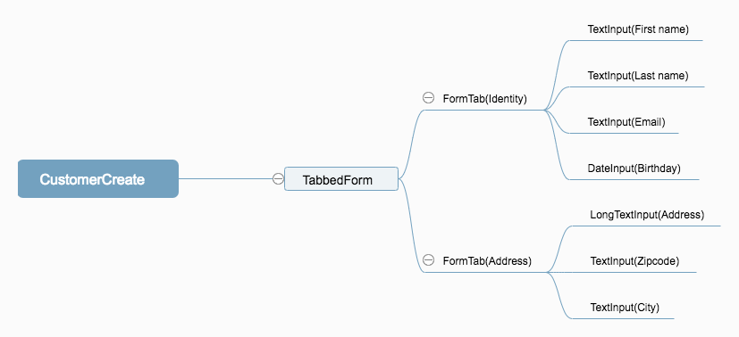

#### Customers 编辑视图
1. 通过从 react-admin 导出的 EditButton 轻松可以路由到 Edit 视图组件。EditButton 组件为您封装好了一切，这是因为它包含 从 react-router-dom 导出的 Link 组件。
```jsx
<Edit>
....
<Edit/>
```


#### Segments 内部组件
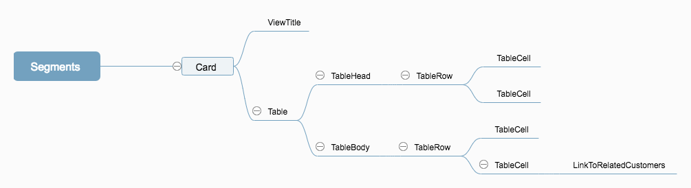

#### CommandList(Orders) 内部组件
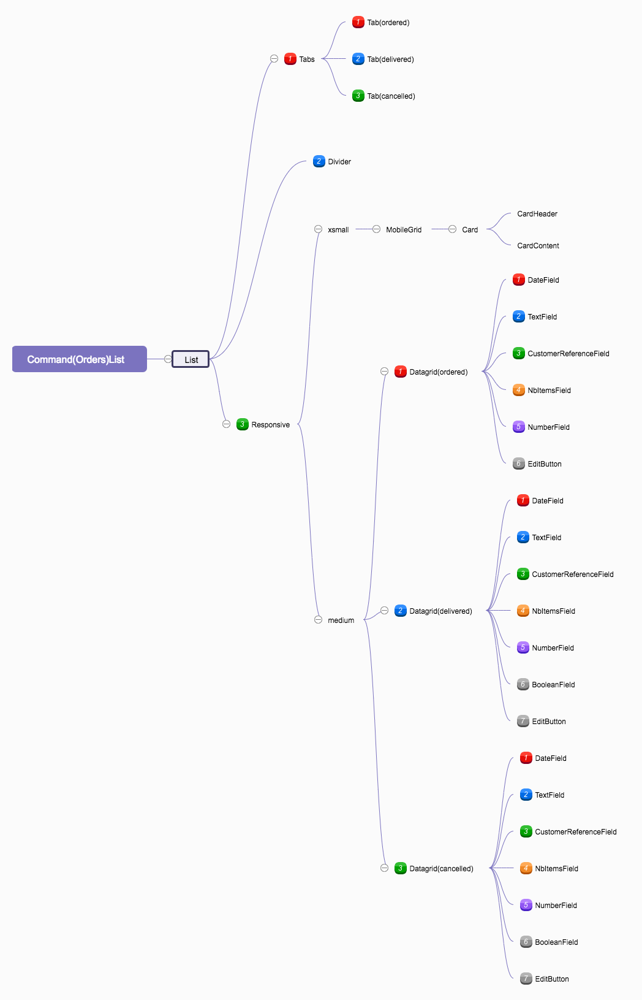

#### CommandEdit 内部组件
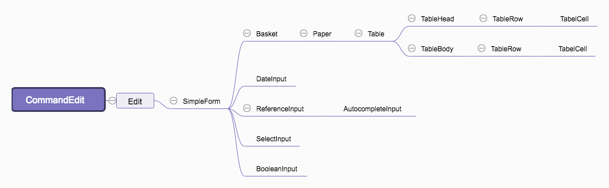

#### ProductList 内部组件
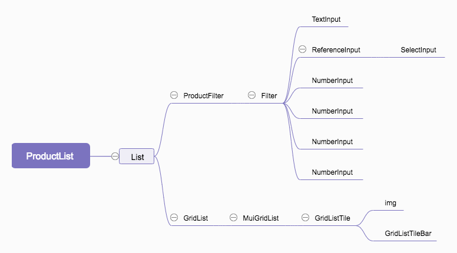

#### ProductCreate 内部组件
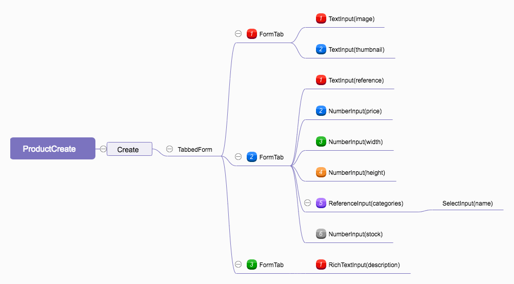

#### ProductEdit 内部组件
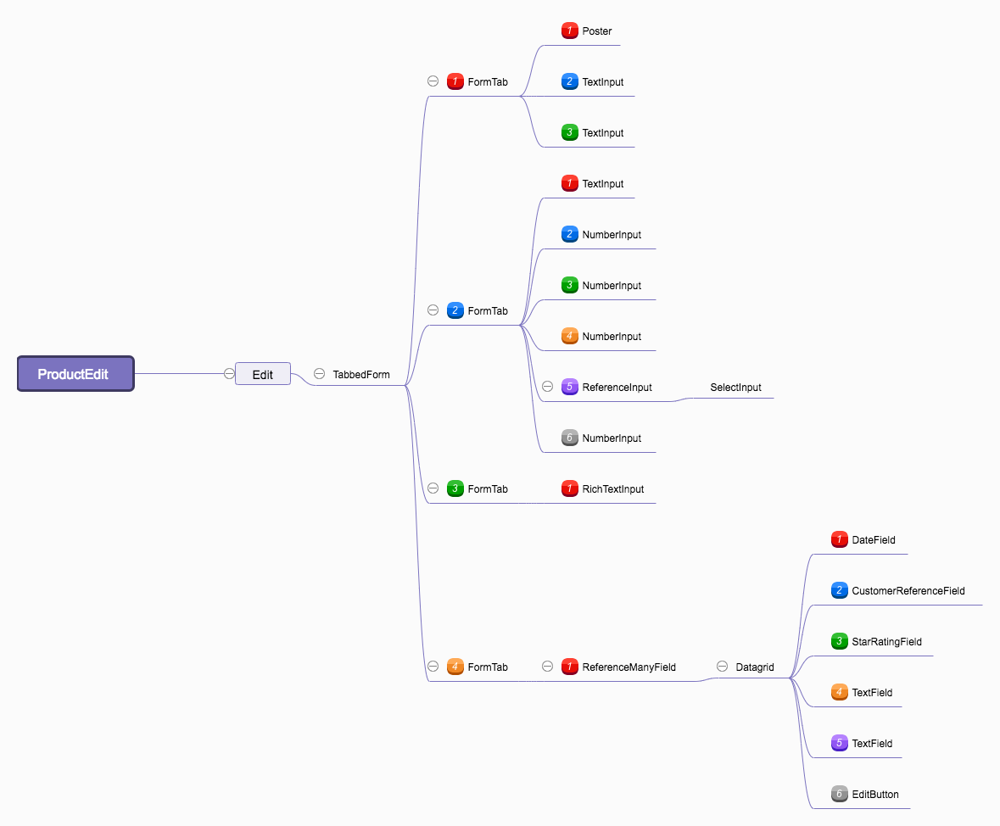

#### CategoryList 内部组件
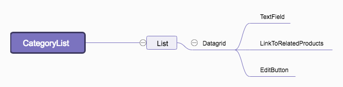

#### CategoryEdit 内部组件
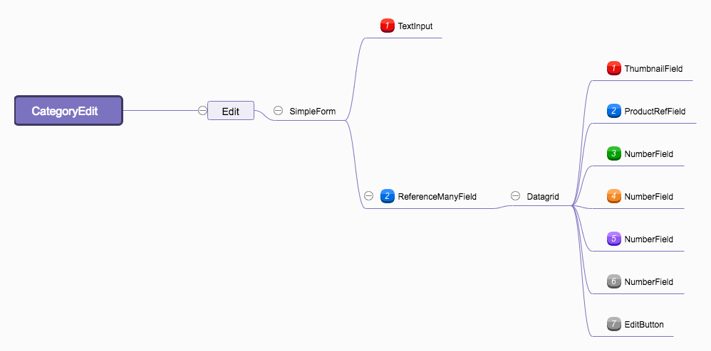

#### ReviewList 内部组件
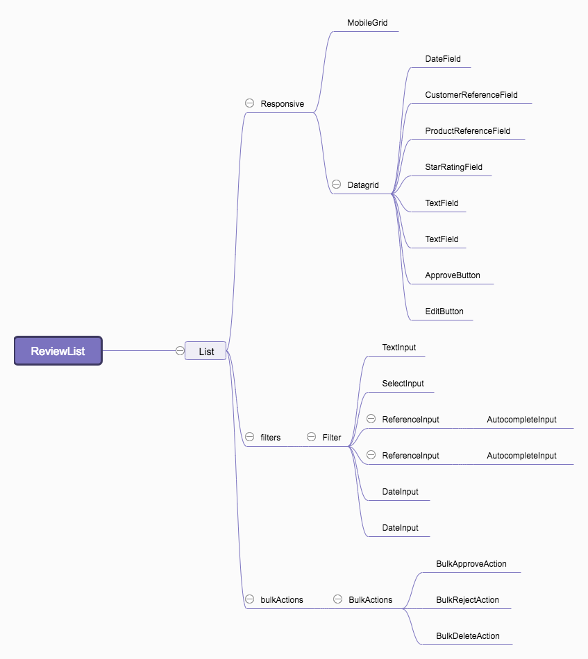

#### ReviewEdit 内部组件
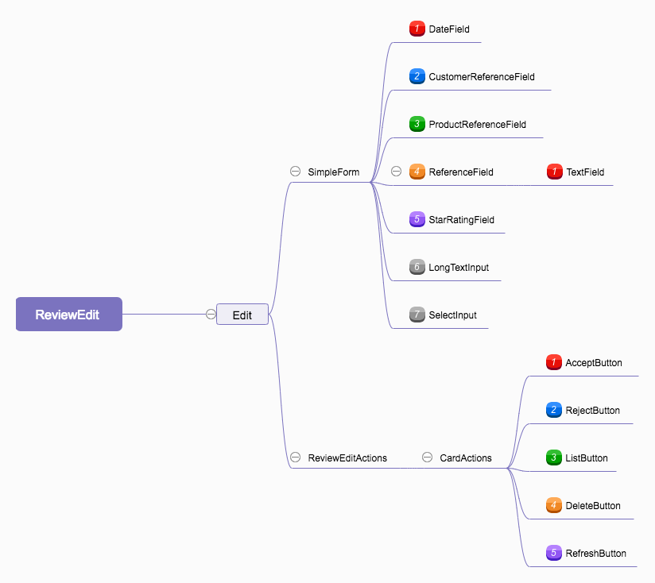

#### i18n（国际化）
对于一个 App 来说，一开始就做多语言是一件好的事情，这里我们对 App 做中英文的支撑：

1. 安装语言包：
```sh
npm install --save ra-language-chinese ra-language-english
```
2. src 下新增 i18n 文件夹，新增 en.ts 和 cn.ts


en.ts
```js
import english from "ra-language-english";

export const englishMessages = {
    ...english,
    pos: {},
};
```
cn.ts
```js
import chinese from "ra-language-chinese";

export const chineseMessages = {
    ...chinese,
    pos: {},
};
```
3. App.tsx 引入文件并配置：
```jsx
import { englishMessages } from "./i18n/en";
import { chineseMessages } from "./i18n/cn";

const messages = {
    cn: chineseMessages,
    en: englishMessages,
};

const i18nProvider = (locale: string) => messages[locale];

<Admin dataProvider={dataProvider} locale="cn" i18nProvider={i18nProvider}>
    <Resource list={CustomerList} name="customers" />
</Admin>
```
