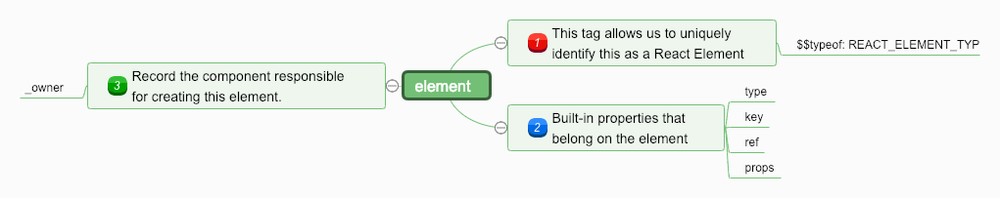

### 读 React 16.x 源码

[React 源码解析](https://react.jokcy.me/)

#### JSX到JavaScript的转换

[Babel-REPL](https://babeljs.io/repl)，在线互转

#### ReactElement

ReactElement.js

先记住这个对象：



#### ReactComponent

ReactBaseClasses.js

只是对组件进行了通用定义，平台无关。

[Componet](https://reactjs.org/docs/react-component.html)

#### ReactRef

ReactCreateRef.js

createRef & ref

三种方式：string & function & object

核心：更新到结束

#### forwardRef

forwardRef.js

```jsx
React.forwardRef((props, ref)=>(<div ref={ref}></div>))
```
场景：HOC & functional Component

#### context 

ReactContext.js

Context的两种方式：childContextType(快被废弃) & createContext

#### ConcurrentMode

渲染优先级

flushSync

#### Suspense & Lazy

#### hooks

funciton Component & useState & useEffects ...

应该是 redux 作者 Dan 亲自操刀写的

#### children

React.js & ReactChildren.js

```jsx
React.Children = { map, forEach, count, toArray, only }
// React.Children.map 功能强大，会展开嵌套的数组
```

#### others

MEMO & PureComponent

<> & React.Fragment

cloneElement

createFactory

...


#### 创建更新的方式
* ReactDOM.render || hydrate
* setState
* forceUpdate
* 步骤
  * 创建 ReactRoot
  * 创建 FiberRoot 和 RootFiber
  * 创建更新
-----
### 深入实践 [Redux Dynamic Modules](https://github.com/Microsoft/redux-dynamic-modules), 构建大型可伸缩的 React + Redux App
* 油管上视频：[Redux Dynamic Modules - Navneet Gupta & Alex B](https://www.youtube.com/watch?v=SktRbSZ-4Tk)
* 文字脱敏[Scaling Redux Apps](./docs/stories/scaling-redux-app.md)

### React-Admin 相关
* [官方文档](https://marmelab.com/react-admin/) | [中文文档](https://www.react-admin.com) | [Demo](https://o-o.ren/scaling-redux-apps/demo/#/customers)
* [简介](https://www.react-admin.com/docs/zh-CN/intro.html)
* [十分钟教程](https://www.react-admin.com/docs/zh-CN/tutorial.html)
* [数据提供程序](https://www.react-admin.com/docs/zh-CN/data-providers.html)
* [Admin 组件](https://www.react-admin.com/docs/zh-CN/admin-component.html)
* [Resource 组件](https://www.react-admin.com/docs/zh-CN/resource-component.html)
* [List 视图组件](https://www.react-admin.com/docs/zh-CN/list-view-component.html)
* [Show 视图组件](https://www.react-admin.com/docs/zh-CN/show-view-component.html)
* [Field 组件](https://www.react-admin.com/docs/zh-CN/field-components.html)
* [Create 和 Edit 视图组件](https://www.react-admin.com/docs/zh-CN/creat-edit-view-components.html)
* [Input 组件](https://www.react-admin.com/docs/zh-CN/input-components.html)
* [身份验证](https://www.react-admin.com/docs/zh-CN/authentication.html)
* [授权](https://www.react-admin.com/docs/zh-CN/authorization.html)
* [主题](https://www.react-admin.com/docs/zh-CN/theming.html)
* [编写 Action](https://www.react-admin.com/docs/zh-CN/actions.html)
* [i18n](https://www.react-admin.com/docs/zh-CN/translation.html)
* [在其它 App 中包含 Admin](https://www.react-admin.com/docs/zh-CN/custom-app.html)
* [引用](https://www.react-admin.com/docs/zh-CN/reference.html)
* [常见问题](https://www.react-admin.com/docs/zh-CN/faq.html)
* [生态](https://www.react-admin.com/docs/zh-CN/ecosystem.html)

### 核心组件及源码分析

扩展安装：[Redux DevTools Extension](https://github.com/zalmoxisus/redux-devtools-extension)

1. [调试 React-Admin 源码，看清框架的本质](./docs/stories/debug-react-admin.md)
2. [`localhost:8080` 背后的动作](./docs/stories/redux-devtools/npm-start.md)
3. [`localhost:8080/#/login` 背后的动作](./docs/stories/redux-devtools/route-login.md)
4. [React-Admin 架构分析：`Admin` 组件源码解析之 `dataProvider` 属性](./docs/stories/core-admin-data-provider.md)
5. [React-Admin 架构分析：Material-UI 定制](./docs/stories/material-ui-customization.md)
    * [React-Admin 架构分析：Material-UI 定制之 `Themes` 文档](./docs/stories/material-ui-customization-themes.md)
    * [React-Admin 架构分析：Material-UI 定制之 `Overrides` 文档](./docs/stories/material-ui-customization-overrides.md)
    * [React-Admin 架构分析：Material-UI 定制之 `CSS in JS` 文档](./docs/stories/material-ui-customization-css-in-js.md)
    * [React-Admin 架构分析：Material-UI 定制之 `Default Theme` 文档](./docs/stories/material-ui-customization-default-theme.md)
6. [React-Admin 架构分析：`Admin` 组件源码解析之 `theme` 属性](./docs/stories/core-admin-app-theme.md)
7. [React-Admin 架构分析：`Admin` 组件源码解析之 `appLayout` 属性](./docs/stories/core-admin-app-layout.md)
8. [react-admin 包分析](./docs/stories/react-admin-package.md)
9. [ra-core 包分析](./docs/stories/ra-core-package.md)
10. [Admin 组件源码解析](./docs/stories/Admin.md)（有干货但有些凌乱，留作纪念）
11. [CoreAdminRouter 组件源码分析](./docs/stories/CoreAdminRouter.md)（有干货但有些凌乱，留作纪念）
12. [最早的想法（留作纪念）](./docs/stories/old-readme.md)
13. [ImageInput 相关问题](https://github.com/Kirk-Wang/react-admin-app/issues/1)
14. [AOP & middleware(1秒懂^_^)](./docs/stories/aop-middleware.md)

脑图备份：
* [React源码大纲](./docs/images/react/react-1.png)
* [浅聊 Virtual DOM](./docs/images/react/virtual_dom.png)
* [ES相关基础](./docs/images/jsms/ES_basic.png)
* [JS-WEB-API](./docs/images/jsms/JS-WEB-API.png)
* [CSS-HTML](./docs/images/jsms/CSS-HTML.png)
* [前端性能](./docs/images/perf/perf_img.png)
* [缓存](./docs/images/perf/perf_cache.png)
* [本地存储](./docs/images/perf/perf_storage.png)
* [CDN](./docs/images/perf/perf_cdn.png)
* [页面渲染](./docs/images/perf/perf_pagerender.png)
* [浏览器运行机制浅析](./docs/images/perf/perf_explorer.png)
* [浅析DOM优化原理](./docs/images/perf/perf_dom.png)
* [Event Loop 与异步更新策略](./docs/images/perf/perf_eventloop.png)
* [回流与重绘](./docs/images/perf/perf_reflow_repaint.png)
* [首屏](./docs/images/perf/perf_homepage.png)
* [防抖与节流](./docs/images/perf/perf_th.png)
* [性能监测](./docs/images/perf/perf.png)
* [react 性能分析](https://react.css88.com/blog/2018/09/10/introducing-the-react-profiler.html#profiling-an-application)
* [前端性能优化清单](https://juejin.im/post/5a966bd16fb9a0635172a50a)
* [creeperyang/blog](https://github.com/creeperyang/blog/issues)
* [把前端监控做到极致](https://juejin.im/post/5a52f138f265da3e5b32a41b)
* [js-leakage-patterns](https://github.com/zhansingsong/js-leakage-patterns)
* [CS-Interview-Knowledge-Map](https://github.com/InterviewMap/CS-Interview-Knowledge-Map)

### redux-saga

* [Redux-Sage 中文文档](https://redux-saga-in-chinese.js.org/)
* [Redux-Saga 仓库实例精解](./docs/stories/saga/examples-saga.md) (废弃，没价值，大家自行看源码🤣)
* [坦克大战复刻版](https://zhuanlan.zhihu.com/p/35551654) 
* [SVG 图像入门教程](http://www.ruanyifeng.com/blog/2018/08/svg.html)
* [走进SVG](https://www.imooc.com/learn/143)
* [svg基础知识点](./docs/images/.png)
* [immutable入坑指南](http://www.aliued.com/?p=4175)
* [首屏场景组件 GameTitleScene 的分析](./docs/stories/battle-city/game-title-scene.md)
* [关卡选择场景组件 ChooseStageScene 的分析](./docs/stories/battle-city/choose-stage-scene.md)
* [游戏场景组件 GameScene 的分析](./docs/stories/battle-city/game-scene.md)
* [Iterator 和 for...of 循环](http://es6.ruanyifeng.com/#docs/iterator)
* [深入浅出 ES6（二）：迭代器和 for-of 循环](http://www.infoq.com/cn/articles/es6-in-depth-iterators-and-the-for-of-loop)
* [深入浅出 ES6（三）：生成器 Generators](http://www.infoq.com/cn/articles/es6-in-depth-generators)
* [redux-saga 实践总结](https://zhuanlan.zhihu.com/p/23012870)
* [浅析redux-saga实现原理](https://zhuanlan.zhihu.com/p/30098155)
* [从 Pub/Sub 浅聊 reudx-saga](./docs/stories/saga/pub-sub-saga.md)
* [Redux-Saga 漫谈](https://www.yuque.com/lovesueee/blog/redux-saga)
* 肥超大佬的 [little-saga](https://github.com/little-saga/little-saga)
* [构建你自己的 redux-saga](https://github.com/little-saga/little-saga/blob/master/docs/building-your-own-redux-saga.md)一文：
* [构建你自己的 redux-saga 总结](./docs/stories/saga/build-saga.md)
* [Git 配置](./docs/images/mac/git/gitconfig.png)
* [CSSINJS](http://cssinjs.org)
* [漫谈 CSS in JS](https://zhuanlan.zhihu.com/p/31622439)

### 优秀的 blog
* [Jony的博客，记录学习工作的点点滴滴](https://github.com/forthealllight/blog)
* [冴羽的博客](https://github.com/mqyqingfeng/Blog)
* [node-interview](https://github.com/ElemeFE/node-interview/tree/master/sections/zh-cn)
* [大话WEB开发](https://github.com/SFLAQiu/web-develop)
* [梁少峰的个人博客](https://github.com/youngwind/blog)

### 杂项
* [解决chrome提示"您的连接不是私密连接"问题](https://github.com/mrdulin/blog/issues/32)
```sh
openssl req -newkey rsa:2048 -x509 -nodes -keyout server.pem -new -out server.crt -subj /CN=dev.xx.com -reqexts SAN -extensions SAN -config <(cat /System/Library/OpenSSL/openssl.cnf <(printf '[SAN]\nsubjectAltName=DNS:dev.xx.com')) -sha256 -days 3650
```
* [Docker--Error message 'sudo: unable to resolve host <USER>'](https://askubuntu.com/questions/59458/error-message-sudo-unable-to-resolve-host-user)
* [如何绕过chrome的弹窗拦截机制](https://my.oschina.net/jsan/blog/1545859)
