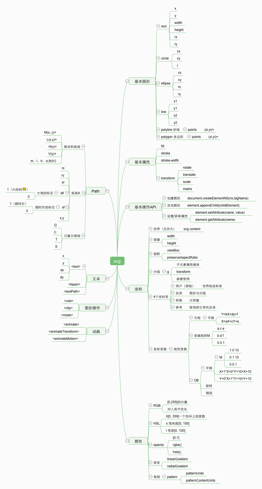

# React-Admin-App

## 文档

[官方文档](https://marmelab.com/react-admin/) | [中文文档](https://www.react-admin.com)

## 核心组件及源码分析

### [调试 React-Admin 源码，看清框架的本质](./docs/stories/debug-react-admin.md)

### 基于 Redux Devtools 来逐步分析 React-Admin（最新）

这是一个 `Redux` 应用程序，从 `Devtools` 去看它做了哪些事儿，应该是一个不错的选择。

项目，采用官方自带的示例，`example` 目录下的 `simple` 项目。怎么跑起来？[调试 React-Admin 源码，看清框架的本质](./docs/stories/debug-react-admin.md)

扩展安装：[Redux DevTools Extension](https://github.com/zalmoxisus/redux-devtools-extension)

1. [`localhost:8080` 背后的动作](./docs/stories/redux-devtools/npm-start.md)
2. [`localhost:8080/#/login` 背后的动作](./docs/stories/redux-devtools/route-login.md)

### 用好 `React-Admin`，其实就是用好它暴露出来的 `Admin` 组件。它的实现可以说就是整个 `react-admin` 项目架构的实现。接下来会逐一讲解它的每一个属性，以及 `Admin` 组件用它们做了什么❓
* [React-Admin 架构分析：`Admin` 组件源码解析之 `dataProvider` 属性](./docs/stories/core-admin-data-provider.md)
* [React-Admin 架构分析：Material-UI 定制](./docs/stories/material-ui-customization.md)
    * [React-Admin 架构分析：Material-UI 定制之 `Themes` 文档](./docs/stories/material-ui-customization-themes.md)
    * [React-Admin 架构分析：Material-UI 定制之 `Overrides` 文档](./docs/stories/material-ui-customization-overrides.md)
    * [React-Admin 架构分析：Material-UI 定制之 `CSS in JS` 文档](./docs/stories/material-ui-customization-css-in-js.md)
    * [React-Admin 架构分析：Material-UI 定制之 `Default Theme` 文档](./docs/stories/material-ui-customization-default-theme.md)
* [React-Admin 架构分析：`Admin` 组件源码解析之 `theme` 属性](./docs/stories/core-admin-app-theme.md)
* [React-Admin 架构分析：`Admin` 组件源码解析之 `appLayout` 属性](./docs/stories/core-admin-app-layout.md)

### `react-admin` 各 `package` 分析 (文章曲线不对，废弃)

* [react-admin 包分析](./docs/stories/react-admin-package.md)
* [ra-core 包分析](./docs/stories/ra-core-package.md)

### [Admin 组件源码解析](./docs/stories/Admin.md)（有干货但有些凌乱，留作纪念）
### [CoreAdminRouter 组件源码分析](./docs/stories/CoreAdminRouter.md)（有干货但有些凌乱，留作纪念）

### AOP & middleware(1秒懂^_^)

```jsx
const dispatch = action => action;

const a1 = next => action => {
	console.log('a1入栈切面');
	const result = next(action);
	console.log('a1出栈切面');
	return result;
}

const a2 = next => action => {
	console.log('a2入栈切面');
	const result = next(action);
	console.log('a2出栈切面');
	return result;
}

const a3 = next => action => {
	console.log('a3入栈切面');
	const result = next(action);
	console.log('a3出栈切面');
	return result;
}

const enhancer = [a1, a2, a3].reduce((a, b) => action => a(b(action)));

const finalDispatch = enhancer(dispatch);

finalDispatch({type: 'what', payload: 'aop'});

// a1入栈切面
// a2入栈切面
// a3入栈切面
// a3出栈切面
// a2出栈切面
// a1出栈切面
{type: "what", payload: "aop"}
```

### redux-saga

[Redux-Saga 仓库实例精解](./docs/stories/saga/examples-saga.md) (废弃，没价值，大家自行看源码🤣)

### [坦克大战复刻版](https://zhuanlan.zhihu.com/p/35551654) 源码分析：

必备知识：

[SVG 图像入门教程](http://www.ruanyifeng.com/blog/2018/08/svg.html)

[走进SVG](https://www.imooc.com/learn/143)

相关基础知识点：



[immutable入坑指南](http://www.aliued.com/?p=4175)

系列文章：

[首屏场景组件 GameTitleScene 的分析](./docs/stories/battle-city/game-title-scene.md)

[关卡选择场景组件 ChooseStageScene 的分析](./docs/stories/battle-city/choose-stage-scene.md)

[游戏场景组件 GameScene 的分析](./docs/stories/battle-city/game-scene.md)

预备知识：

[Iterator 和 for...of 循环](http://es6.ruanyifeng.com/#docs/iterator)

[深入浅出 ES6（二）：迭代器和 for-of 循环](http://www.infoq.com/cn/articles/es6-in-depth-iterators-and-the-for-of-loop)

[深入浅出 ES6（三）：生成器 Generators](http://www.infoq.com/cn/articles/es6-in-depth-generators)

**[官方文档](https://redux-saga-in-chinese.js.org/)扫盲**：

1. `Effects` 是一些简单 `Javascript` 对象，包含了要被 `middleware` 执行的指令。
2. `middleware` 检查每个被 `yield` 的 `Effect` 的类型，然后决定如何实现哪个 `Effect`。
3. 记住这是一个 `Generator` 函数，它不具备 从运行至完成 的行为（`run-to-completion behavior`）

相关好文：

[redux-saga 实践总结](https://zhuanlan.zhihu.com/p/23012870)

[浅析redux-saga实现原理](https://zhuanlan.zhihu.com/p/30098155)

总结：[从 Pub/Sub 浅聊 reudx-saga](./docs/stories/saga/pub-sub-saga.md)

[Redux-Saga 漫谈](https://www.yuque.com/lovesueee/blog/redux-saga)

### 脑子里必须清楚的 `redux` `redux-saga` 使用流程。（脑回路一下……）

### 生啃 `redux-saga` 源码：

操练地址：

### 肥超大佬的 [little-saga](https://github.com/little-saga/little-saga)

接下来 `All In Saga`：

**[构建你自己的 redux-saga](https://github.com/little-saga/little-saga/blob/master/docs/building-your-own-redux-saga.md)** 一文：

[总结](./docs/stories/saga/build-saga.md)

### 工程化

### Mac开发配置

### FAQ
[ImageInput 相关问题](https://github.com/Kirk-Wang/react-admin-app/issues/1)

### [CSSINJS](http://cssinjs.org)

传统的“关注点分离”（separation of concerns）原则中不推荐我们把 HTML、CSS、JS 混杂一起编写，但是在伴随着前端组件模式的大潮"关注点混合"慢慢成为主流。

[漫谈 CSS in JS](https://zhuanlan.zhihu.com/p/31622439)

### 读 NervJS 源码

先刷一篇官方使用文档，然后总结一下……

## 使用 React-Admin 实战中后台应用

[最早的想法（留作纪念）](./docs/stories/old-readme.md)

## 优秀的 blog

[Jony的博客，记录学习工作的点点滴滴](https://github.com/forthealllight/blog)

[冴羽的博客](https://github.com/mqyqingfeng/Blog)

[node-interview](https://github.com/ElemeFE/node-interview/tree/master/sections/zh-cn)

[大话WEB开发](https://github.com/SFLAQiu/web-develop)

[梁少峰的个人博客](https://github.com/youngwind/blog)

## 杂项
[解决chrome提示"您的连接不是私密连接"问题](https://github.com/mrdulin/blog/issues/32)
```sh
openssl req -newkey rsa:2048 -x509 -nodes -keyout server.pem -new -out server.crt -subj /CN=dev.xx.com -reqexts SAN -extensions SAN -config <(cat /System/Library/OpenSSL/openssl.cnf <(printf '[SAN]\nsubjectAltName=DNS:dev.xx.com')) -sha256 -days 3650
```

## 前端性能优化是什么❓为什么❓怎么做❓

## docker
[offical install](https://docs.docker.com/install/linux/docker-ce/ubuntu/)
[Error message 'sudo: unable to resolve host <USER>'](https://askubuntu.com/questions/59458/error-message-sudo-unable-to-resolve-host-user)
[Docker CE 镜像源站](https://yq.aliyun.com/articles/110806)