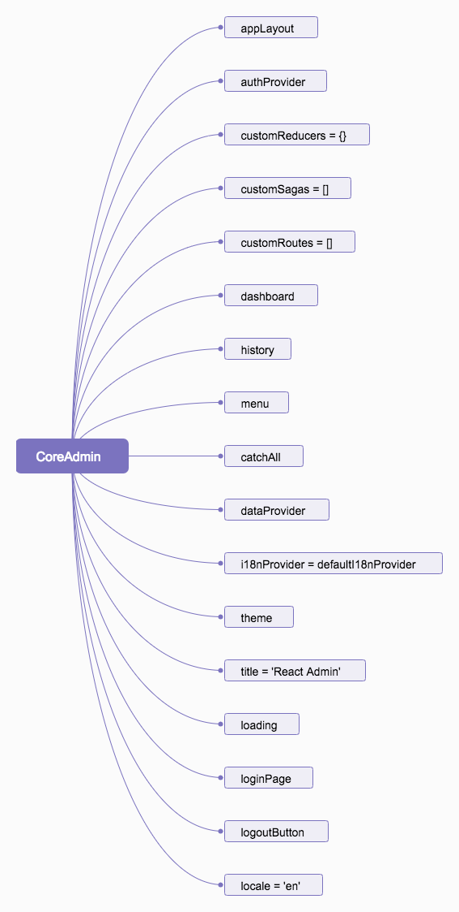
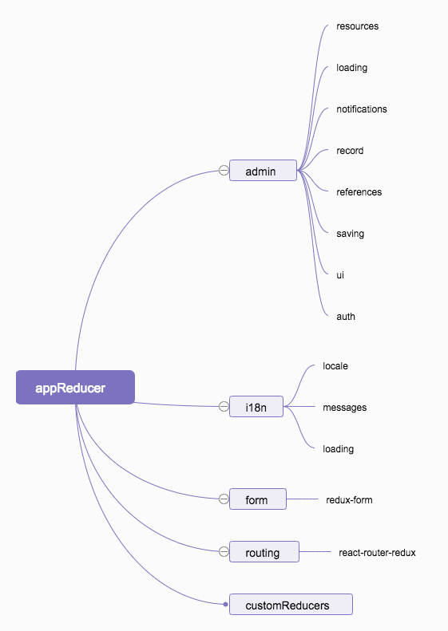
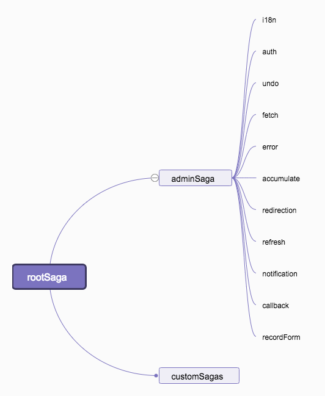

### Admin 组件源码分析
```jsx
import React, { createElement } from 'react';
import PropTypes from 'prop-types';
import { createStore, compose, applyMiddleware } from 'redux';
import { Provider } from 'react-redux';
import createHistory from 'history/createHashHistory';
import { Switch, Route } from 'react-router-dom';
import { ConnectedRouter, routerMiddleware } from 'react-router-redux';
import createSagaMiddleware from 'redux-saga';
import { all, fork } from 'redux-saga/effects';
import withContext from 'recompose/withContext';

import { USER_LOGOUT } from './actions/authActions';

import createAppReducer from './reducer';
import { adminSaga } from './sideEffect';
import { TranslationProvider, defaultI18nProvider } from './i18n';
import CoreAdminRouter from './CoreAdminRouter';

const CoreAdmin = ({
    appLayout,
    authProvider,
    children,
    customReducers = {},
    customSagas = [],
    customRoutes = [],
    dashboard,
    history,
    menu, // deprecated, use a custom layout instead
    catchAll,
    dataProvider,
    i18nProvider = defaultI18nProvider,
    theme,
    title = 'React Admin',
    loading,
    loginPage,
    logoutButton,
    initialState,
    locale = 'en',
}) => {
    const messages = i18nProvider(locale);
    const appReducer = createAppReducer(customReducers, locale, messages);

    const resettableAppReducer = (state, action) =>
        appReducer(action.type !== USER_LOGOUT ? state : undefined, action);
    const saga = function* rootSaga() {
        yield all(
            [
                adminSaga(dataProvider, authProvider, i18nProvider),
                ...customSagas,
            ].map(fork)
        );
    };
    const sagaMiddleware = createSagaMiddleware();
    const routerHistory = history || createHistory();
    const store = createStore(
        resettableAppReducer,
        initialState,
        compose(
            applyMiddleware(sagaMiddleware, routerMiddleware(routerHistory)),
            typeof window !== 'undefined' && window.devToolsExtension
                ? window.devToolsExtension()
                : f => f
        )
    );
    sagaMiddleware.run(saga);

    const logout = authProvider ? createElement(logoutButton) : null;

    return (
        <Provider store={store}>
            <TranslationProvider>
                <ConnectedRouter history={routerHistory}>
                    <Switch>
                        <Route
                            exact
                            path="/login"
                            render={props =>
                                createElement(loginPage, {
                                    ...props,
                                    title,
                                })
                            }
                        />
                        <Route
                            path="/"
                            render={props => (
                                <CoreAdminRouter
                                    appLayout={appLayout}
                                    catchAll={catchAll}
                                    customRoutes={customRoutes}
                                    dashboard={dashboard}
                                    loading={loading}
                                    loginPage={loginPage}
                                    logout={logout}
                                    menu={menu}
                                    theme={theme}
                                    title={title}
                                    {...props}
                                >
                                    {children}
                                </CoreAdminRouter>
                            )}
                        />
                    </Switch>
                </ConnectedRouter>
            </TranslationProvider>
        </Provider>
    );
};

const componentPropType = PropTypes.oneOfType([
    PropTypes.func,
    PropTypes.string,
]);

CoreAdmin.propTypes = {
    appLayout: componentPropType,
    authProvider: PropTypes.func,
    children: PropTypes.oneOfType([PropTypes.node, PropTypes.func]),
    catchAll: componentPropType,
    customSagas: PropTypes.array,
    customReducers: PropTypes.object,
    customRoutes: PropTypes.array,
    dashboard: componentPropType,
    dataProvider: PropTypes.func.isRequired,
    history: PropTypes.object,
    i18nProvider: PropTypes.func,
    initialState: PropTypes.object,
    loading: componentPropType,
    locale: PropTypes.string,
    loginPage: componentPropType,
    logoutButton: componentPropType,
    menu: componentPropType,
    theme: PropTypes.object,
    title: PropTypes.node,
};

export default withContext(
    {
        authProvider: PropTypes.func,
    },
    ({ authProvider }) => ({ authProvider })
)(CoreAdmin);
```

通过上面代码，我们知道这是一个函数式组件（Functional Components) ，他接受如下属性：
```jsx
const CoreAdmin = ({
    // 自定义布局
    appLayout,
    // 自定义身份验证策略
    authProvider,
    // 子组件
    children,
    // 自定义 Redux Reducer
    customReducers = {},
    // 自定义 Redux Saga
    customSagas = [],
    // 自定义路由
    customRoutes = [],
    // 仪表盘
    dashboard,
    // 历史记录
    history,
    // 目前已废弃，自定义菜单
    menu, // deprecated, use a custom layout instead
    // 可以用来自定义 Not Found
    catchAll,
    // 唯一必需的属性，它必须是一个返回一个promise的函数
    dataProvider,
    // 国际化，用来做多语言切换
    i18nProvider = defaultI18nProvider,
    // 自定义主题
    theme,
    // 自定义标题，默认是 React Admin
    title = 'React Admin',
    // 资源加载 loading
    loading,
    // 登录页
    loginPage,
    // 注销按钮
    logoutButton,
    // 初始 Redux State
    initialState,
    // 本地化，默认是英文
    locale = 'en',
}) => {
    ...
}
```



相关文档，可以查看 [Admin](https://marmelab.com/react-admin/Admin.html)

### 本地化处理
```js
const messages = i18nProvider(locale);
```
1. 分析下这个默认的 i18nProvider(defaultI18nProvider)：
```js
import defaultMessages from 'ra-language-english';

export default () => defaultMessages;
```
我们发现它是直接返回一个箭头函数，调用函数直接返回 react-admin 所支持的英文语言包 [ra-language-english](https://github.com/marmelab/react-admin/tree/master/packages/ra-language-english)。具体内容大家自行点开查看。

### 创建 App Reducer
```js
const appReducer = createAppReducer(customReducers, locale, messages);
```
它是一个如下函数：
```js
export default (customReducers, locale, messages) =>
    combineReducers({
        admin,
        i18n: i18nReducer(locale, messages),
        form: formReducer,
        routing: routerReducer,
        ...customReducers,
    });
```



在这里，我们首先来聊一下这个 combineReducers。它是由 Redux 提供的一个辅助函数。作用是把一个由多个不同 reducer 函数作为 value 的 object，合并成一个最终的 reducer 函数，然后就可以对这个 reducer 调用 createStore 方法。看一个 Redux 官方的测试用例，来秒懂一下：
```js
 it('returns a composite reducer that maps the state keys to given reducers', () => {
      const reducer = combineReducers({
        counter: (state = 0, action) =>
          action.type === 'increment' ? state + 1 : state,
        stack: (state = [], action) =>
          action.type === 'push' ? [...state, action.value] : state
      })

      const s1 = reducer({}, { type: 'increment' })
      expect(s1).toEqual({ counter: 1, stack: [] })
      const s2 = reducer(s1, { type: 'push', value: 'a' })
      expect(s2).toEqual({ counter: 1, stack: ['a'] })
    })
/**
 * 通俗点说，就是有一堆这样的函数 --> (state, action) => nextState
 * 把它们合并起来变成一个具有它们所有改变 state 能力的函数 --> (state, action) => nextState
 */
```
执行 reducer({}, { type: 'increment' })，实际上就是执行[这段代码](https://github.com/reduxjs/redux/blob/e63c36a4185d1a31d8b7abcba974016fc984b306/src/combineReducers.js#L145)：
```js
    // 一眼看出它是一个标准的 Redux Reducer ---> (state, action) => nextState
    return function combination(state = {}, action) {
        // ....省略一些错误处理代码

        // 状态有无改变标志位
        let hasChanged = false
        // 创建一个空的 state, 如果 hasChanged 为真，则返回它
        const nextState = {}
        // 遍历合并过的 reducer
        for (let i = 0; i < finalReducerKeys.length; i++) {
            // 拿到 reducer key
            const key = finalReducerKeys[i]
            // 得到这个 key 所对应的 reducer，key 与实际 reducer 的函数名不一定相同
            const reducer = finalReducers[key]
            // 得到这个 key 所对应的当前 state
            const previousStateForKey = state[key]
            // 通过 reducer 处理，得到当前 key 的下一次 state
            const nextStateForKey = reducer(previousStateForKey, action)
            // 错误处理
            if (typeof nextStateForKey === 'undefined') {
                const errorMessage = getUndefinedStateErrorMessage(key, action)
                throw new Error(errorMessage)
            }
            // 给当前 key 赋值 state
            nextState[key] = nextStateForKey
            // 判断是否有 reducer 改变了 state
            hasChanged = hasChanged || nextStateForKey !== previousStateForKey
        }
        // 有改变 state, 返回 nextState，没有就返回 state
        return hasChanged ? nextState : state
    }
```

### 处理注销动作时，所有状态 reset，这个操作比较风骚
```js
    const resettableAppReducer = (state, action) =>
        appReducer(action.type !== USER_LOGOUT ? state : undefined, action);
```
### Redux-Saga--->>[中文文档](https://redux-saga-in-chinese.js.org/)
```js
const saga = function* rootSaga() {
    yield all(
        [
            adminSaga(dataProvider, authProvider, i18nProvider),
            ...customSagas,
        ].map(fork)
    );
};
```

从这里入手我们将知道，整个 React-Admin 的所有 Saga，用它们来处理一切的副作用：


```js
const sagaMiddleware = createSagaMiddleware();
```

这个，就是创造一个 Redux 中间件函数。类似于这样的一个函数，当然里面的逻辑是比较复杂的：

```js
store => next => action => {}
```

通过它去劫持 action 并处理。

这里推荐一篇好文，[Redux-Saga 漫谈](https://www.yuque.com/lovesueee/blog/redux-saga)。附一张里面的图（清晰的描述了执行流程）：


### History
```js
import createHistory from 'history/createHashHistory';

const routerHistory = history || createHistory();
```

这里用的默认是 [createHashHistory](https://github.com/ReactTraining/history/blob/master/modules/createHashHistory.js)

### store

这里引用[ redux 中文文档](http://cn.redux.js.org/docs/api/createStore.html) 对它的解释（详情自行参考文档）：

#### `createStore(reducer, [preloadedState], enhancer)`

创建一个 Redux [store](Store.md) 来以存放应用中所有的 state。  
应用中应有且仅有一个 store。

##### 参数

1. `reducer` *(Function)*: 接收两个参数，分别是当前的 state 树和要处理的 action，返回新的 state 树。

2. [`preloadedState`] *(any)*: 初始时的 state。
在同构应用中，你可以决定是否把服务端传来的 state 水合（hydrate）后传给它，或者从之前保存的用户会话中恢复一个传给它。如果你使用 `combineReducers` 创建 `reducer`，它必须是一个普通对象，与传入的 keys 保持同样的结构。否则，你可以自由传入任何 `reducer` 可理解的内容。

3. `enhancer` *(Function)*: Store enhancer 是一个组合 store creator 的高阶函数，返回一个新的强化过的 store creator。这与 middleware 相似，它也允许你通过复合函数改变 store 接口。

```jsx
const store = createStore(
    resettableAppReducer,
    initialState,
    compose(
        applyMiddleware(sagaMiddleware, routerMiddleware(routerHistory)),
        typeof window !== 'undefined' && window.devToolsExtension
            ? window.devToolsExtension()
            : f => f
    )
);
```

我们现在看看这段代码就很清晰了，这里我们主要来解释一下这段代码：

```js
compose(
        applyMiddleware(sagaMiddleware, routerMiddleware(routerHistory)),
        typeof window !== 'undefined' && window.devToolsExtension
            ? window.devToolsExtension()
            : f => f
    )
/*
 * componse 我们知道它是将多个具有不同功能的函数通过 reduce 组合为一个函数，方便我们使用
 * 由于在 redux 中的参数 enhancer 必须长成这样（可以翻看源码得知）：
 * createStore => (...args) => { ... }
 * 所以执行 compose 一定返回这样式的函数。
 * 所以 applyMiddleware(sagaMiddleware, routerMiddleware(routerHistory)) , window.devToolsExtension() 应该也是返回上面的一样的函数
 * middleware 前面已经说了是这样子：store => next => action => {}
 */
```

在这里已经做了 devToolsExtension() 的处理，所以我们可以直接安装一个 Chrome 插件( [Redux DevTools](https://chrome.google.com/webstore/detail/redux-devtools/lmhkpmbekcpmknklioeibfkpmmfibljd) ) 来查看我们的每一次 dispatch。

### runSaga

启动 Saga，因为 sagas 是一些个 generator function，所以不会自己调用 `.next()`，也就是自动执行。所以需要一个函数来帮忙。

```js
sagaMiddleware.run(saga);
```

### logoutButton

有提供 authProvider，就会显示注销按钮。

```jsx
const logout = authProvider ? createElement(logoutButton) : null;
```


