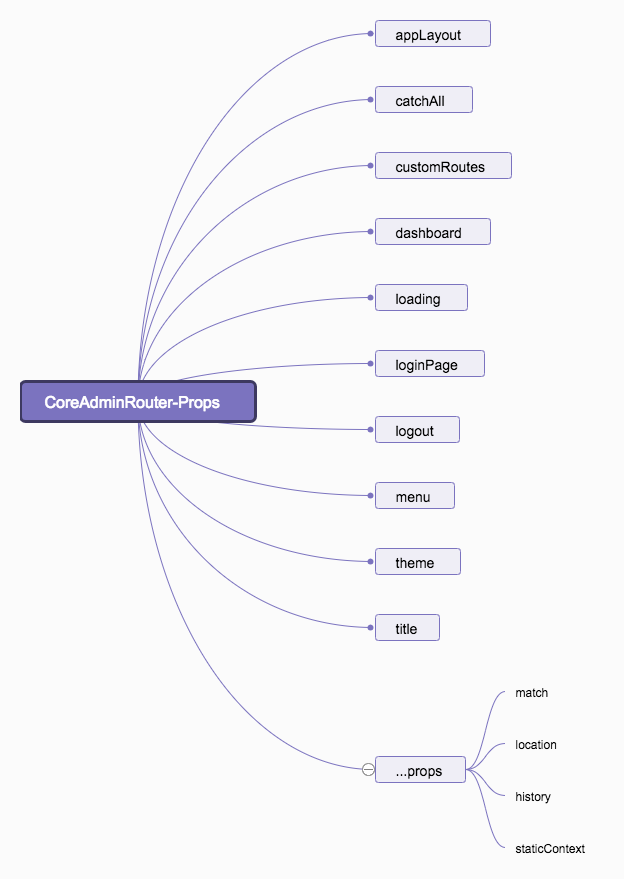

### CoreAdminRouter 组件源码分析

首先来看看它在 CoreAdmin 是如何被调用的：

```js
<Route
    path="/"
    render={props => (
        <CoreAdminRouter
            appLayout={appLayout}
            catchAll={catchAll}
            customRoutes={customRoutes}
            dashboard={dashboard}
            loading={loading}
            loginPage={loginPage}
            logout={logout}
            menu={menu}
            theme={theme}
            title={title}
            {...props}
        >
            {children}
        </CoreAdminRouter>
    )}
/>
```

发现它是被包在 Route 组件的 render 属性中的一个函数里面。使用 render 可以方便地进行内联渲染和包装，而无需进行上文解释的不必要的组件重装。

下面是 Route 组件的 render 函数，[code](https://github.com/ReactTraining/react-router/blob/master/packages/react-router/modules/Route.js#L111)：
```js
render() {
    const { match } = this.state;
    const { children, component, render } = this.props;
    const { history, route, staticContext } = this.context.router;
    const location = this.props.location || route.location;
    const props = { match, location, history, staticContext };
    if (component) return match ? React.createElement(component, props) : null;
    // CoreAdminRouter采用的就是这种方式的渲染
    if (render) return match ? render(props) : null;
    if (typeof children === "function") return children(props);
    if (children && !isEmptyChildren(children))
      return React.Children.only(children);
    return null;
}
```

#### CoreAdminRouter 被传进来了如下属性：



### 从测试用例说起，我们看看它主要干了什么？

```jsx
describe('<AdminRouter>', () => {
    const defaultProps = {
        authProvider: () => Promise.resolve(),
        customRoutes: [],
    };
    describe('With resources as regular children', () => {
        it('should render all resources with a registration context', () => {
            const wrapper = shallow(
                <CoreAdminRouter {...defaultProps}>
                    <Resource name="posts" />
                    <Resource name="comments" />
                </CoreAdminRouter>
            );

            const resources = wrapper.find('Connect(Resource)');
    
            assert.equal(resources.length, 2);
            assert.deepEqual(
                resources.map(resource => resource.prop('context')),
                ['registration', 'registration']
            );
        });
    });
});
```

上面测试用例，使用 Resource 组件作为常规的子级。是否应该渲染具有 registration context 的所有 Resource 组件。

这里，看一段 CoreAdminRouter 的源码，就很清晰了：

```jsx
{// 在 React Router Switch 之外渲染每个子级 Resource 组件
 // 因为我们需要它们所有而不仅仅是渲染的那一个
    Children.map(childrenToRender, child =>
        cloneElement(child, {
            key: child.props.name,
            // context 属性指示 Resource 组件不渲染任何的内容，只是简单将自身注册为已知的资源
            context: 'registration',
        })
)}
```

React.Children.map

React.Children.map(children, function[(thisArg)]) 

在包含在 children 里的每个子级上调用函数，调用的函数的 this 设置为 thisArg 。 如果 children 是一个嵌套的对象或数组，它将被遍历。如果 children 是 null 或 undefined ，返回 null 或 undefined 而不是一个空数组。

React.cloneElement(element,[props],[...children])

以 element 作为起点，克隆并返回一个新的React元素(React Element)。生成的元素将会拥有原始元素props与新props的浅合并。新的子级会替换现有的子级。来自原始元素的 key 和 ref 将会保留。也就是说这里克隆出来的 Resource 组件拥有 key 和 context 属性。

```jsx
const resources = wrapper.find('Connect(Resource)');
```

这句的意思，可以参看这个 issue，[shallow - Cannot see `connect`ed child component](https://github.com/airbnb/enzyme/issues/589)
