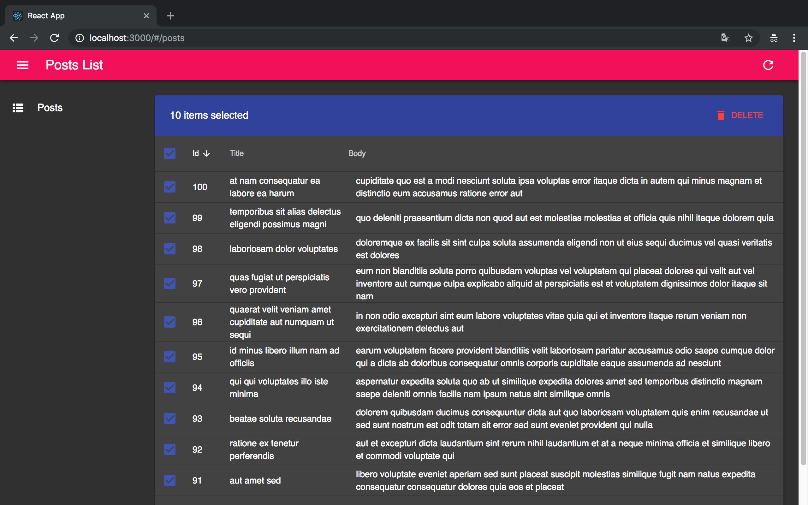

### React-Admin 架构分析：`Admin` 组件源码解析之 `theme` 属性

[示例项目-hello-react-admin](https://github.com/Kirk-Wang/hello-react-admin)

为什么需要 `theme`?

应用程序的颜色搭配，组件的风格高度自定义（你喜欢就好）。当然，优秀的框架会抽象出提供一套规范，引导你去合理的定制。

#### 使用一个预定义主题

[React-Admin](https://github.com/marmelab/react-admin) 的所有组件都是基于 [Material UI](https://material-ui.com/) 的。所以只要是它有的，我们就可以用。

1. 使用 `createMuiTheme` 快速构建一套开箱即用的 `Dark` 主题：

```js
import { createMuiTheme } from '@material-ui/core/styles';

const theme = createMuiTheme({
  palette: {
    type: 'dark', // Switching the dark mode on is a single property value change.
  },
});
```

 

#### 如何使用 `theme` 自定义 `Material-UI`？

[官方 Themes 文档](https://material-ui.com/customization/themes/)，截止目前是 Material-UI v3.1.0 版。

根据文档：如果我们要自定义主题，需要用到它提供的一个高阶组件 `MuiThemeProvider`。但这个是可选的，每个 `Material-UI` 自带一套默认的主题。


