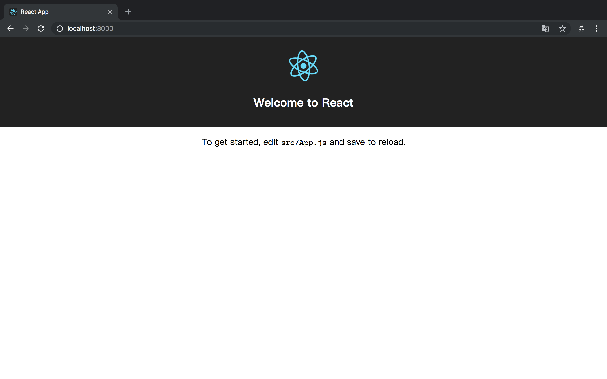
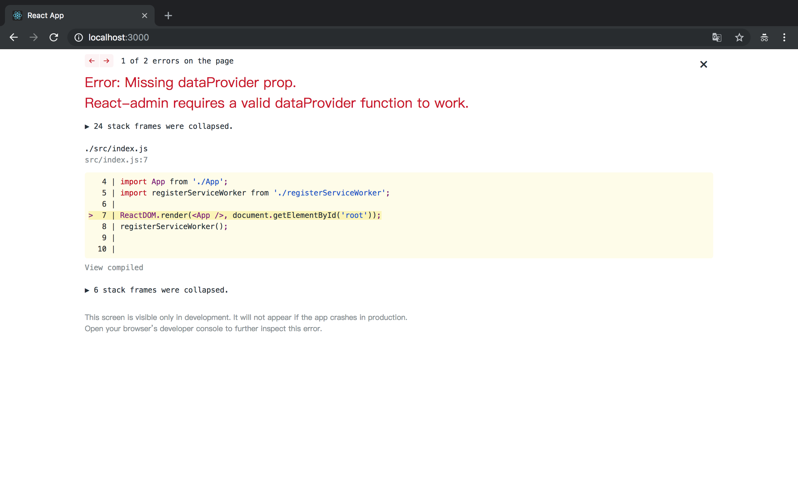
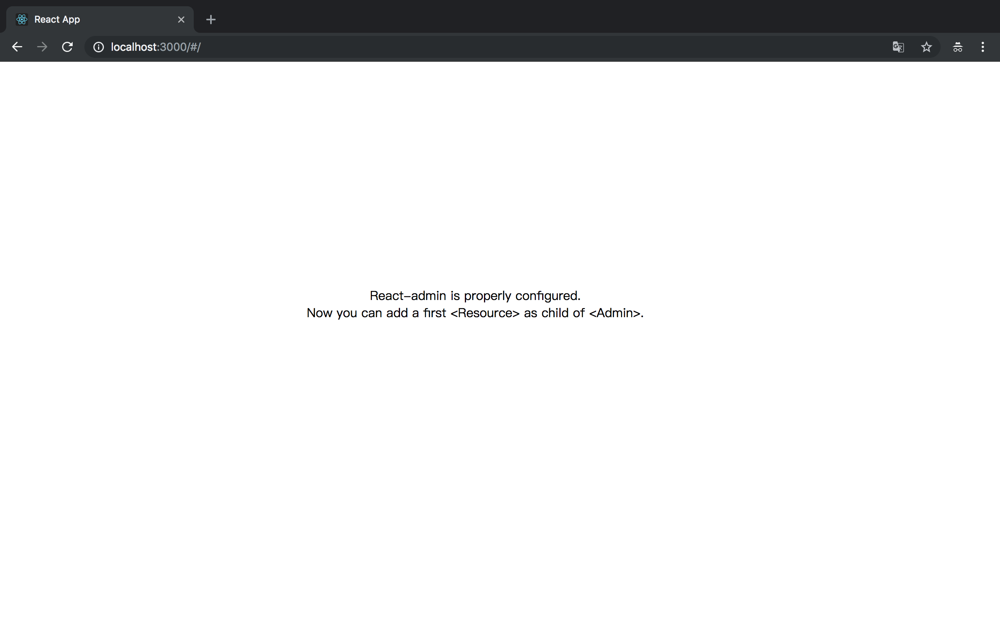
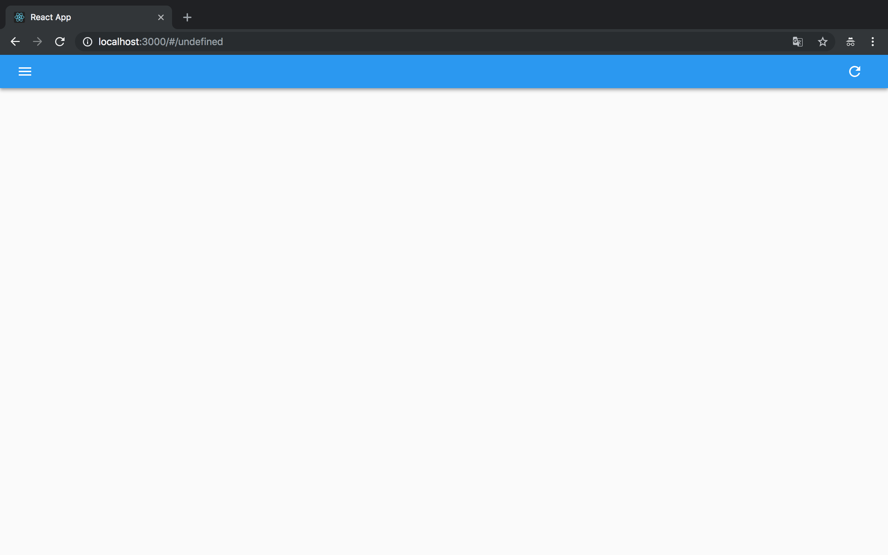
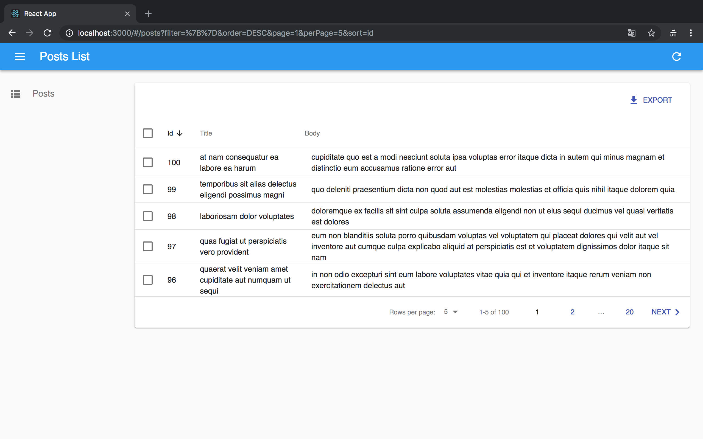

### React-Admin 架构分析：全面解析 Admin 组件功能及实现原理

用好 React-Admin，其实就是用好它暴露出来的 Admin 组件。它的实现可以说就是整个 react-admin 项目架构的实现。

接下来会逐一讲解它的每一个属性，以及 Admin 组件用它们做了什么❓（文章很长，请自备瓜子^_^）

#### 首先，我们需要把 Admin 组件跑起来：

1. 这里选用 [Create React App](https://github.com/facebook/create-react-app) 作为基础脚手架。OK，我们快速用它创建一个 App：

```sh
npx create-react-app hello-react-admin

cd hello-react-admin

yarn start // 默认你已经安装了 yarn 
```

然后脚手架会为你自动在浏览器（我这里是 google chrome ）中打开 [http://localhost:3000](http://localhost:3000)。如果没有，你也可以自己打开这个地址。你将看到如下界面：



#### 安装 React-Admin，引入 Admin 组件：

```sh
yarn add react-admin
```

进入 `src/App.js`，我们引入我们期待已久的 `<Admin>` ：

```jsx
import React from 'react';
import { Admin } from 'react-admin';

export default () => <Admin/>;
```

然后，我们运行起来，发现报了如下错：



它明确的告诉了我们，`<Admin>` 必须要一个 `dataProvider` 属性才能正常的工作。然后 dataProvider 还必须是一个函数：

看过[官方DataProviders文档](https://marmelab.com/react-admin/DataProviders.html)的同学都知道它是数据的来源。这里我们主要关注 `<Admin>` 是如何处理这个属性的。

我们按照 [官方教程](https://marmelab.com/react-admin/Tutorial.html) 的说明为 `<Admin>` 加上一个 `dataProvider` 属性：

```jsx
// in src/App.js
import React from 'react';
import { Admin } from 'react-admin';
import jsonServerProvider from 'ra-data-json-server';

const dataProvider = jsonServerProvider('http://jsonplaceholder.typicode.com');
const App = () => <Admin dataProvider={dataProvider} />;

export default App;
```

添加包并运行：

```sh
yarn add ra-data-json-server

yarn start
```

虽然没有报错，但我们看到如下提示，`<Admin>` 必须至少要一个 `<Resource>` 作为子组件。



这里我们按照教程文档给它加入 Resource 组件：

```jsx
<Admin dataProvider={dataProvider}>
    <Resource />
</Admin>
```

终于看到一条蓝色的 bar 了：



根据文档，我们知到 `<Resource>` 需要 `name` 和 `list` 属性才能显示出列表，我们给它加上（注意看文档）：

```jsx
import React from 'react';
import { Admin, Resource, List, Datagrid, TextField } from 'react-admin';
import jsonServerProvider from 'ra-data-json-server';

const dataProvider = jsonServerProvider('http://jsonplaceholder.typicode.com');

const PostList = (props) => (
  <List {...props}>
      <Datagrid>
          <TextField source="id" />
          <TextField source="title" />
          <TextField source="body" />
      </Datagrid>
  </List>
);

const App = () => (
  <Admin dataProvider={dataProvider}>
    <Resource name="posts" list={PostList} />
  </Admin>
);

export default App;
```

我重新进入 [http://localhost:3000](http://localhost:3000) ，发现会自动进入 [http://localhost:3000/#/posts](http://localhost:3000/#/posts) 这个路由，一个完整的列表页就展现了出来（仅仅只需要几行代码而已）：



接下来，我们就要分析为什么只需这几行代码，React-Admin 就能完成一个完整的信息列表展示（导出，排序，分页等）。Admin 组件到底帮我们干了什么（它里面的代码到底是咋写的）？