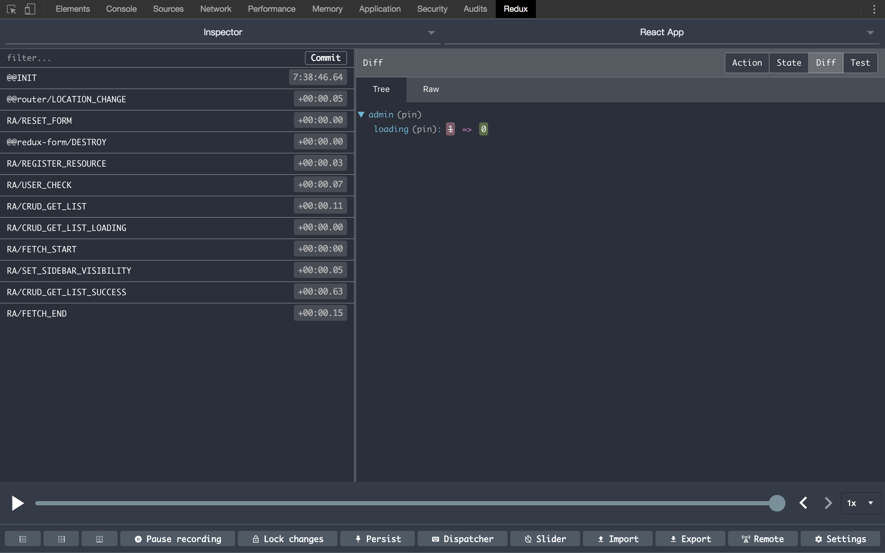

### React-Admin 架构分析：全面解析 Admin 组件功能及实现原理

用好 `React-Admin`，其实就是用好它暴露出来的 `Admin` 组件。它的实现可以说就是整个 `react-admin` 项目架构的实现。

接下来会逐一讲解它的每一个属性，以及 `Admin` 组件用它们做了什么❓（文章很长，请自备瓜子^_^）

#### 首先，我们需要把 `Admin` 组件跑起来：

1. 这里选用 [Create React App](https://github.com/facebook/create-react-app) 作为基础脚手架。OK，我们快速用它创建一个 App：

```sh
npx create-react-app hello-react-admin

cd hello-react-admin

yarn start // 默认你已经安装了 yarn 
```

然后脚手架会为你自动在浏览器（我这里是 google chrome ）中打开 [http://localhost:3000](http://localhost:3000)。如果没有，你也可以自己打开这个地址。你将看到如下界面：


#### 安装 React-Admin，引入 Admin 组件：

```sh
yarn add react-admin
```

进入 `src/App.js`，我们引入我们期待已久的 `<Admin>` ：

```jsx
import React from 'react';
import { Admin } from 'react-admin';

export default () => <Admin/>;
```

然后，我们运行起来，发现报了如下错：


它明确的告诉了我们，`<Admin>` 必须要一个 `dataProvider` 属性才能正常的工作。然后 dataProvider 还必须是一个函数：

看过[官方DataProviders文档](https://marmelab.com/react-admin/DataProviders.html)的同学都知道它是数据的来源。这里我们主要关注 `<Admin>` 是如何处理这个属性的。

我们按照 [官方教程](https://marmelab.com/react-admin/Tutorial.html) 的说明为 `<Admin>` 加上一个 `dataProvider` 属性：

```jsx
// in src/App.js
import React from 'react';
import { Admin } from 'react-admin';
import jsonServerProvider from 'ra-data-json-server';

const dataProvider = jsonServerProvider('http://jsonplaceholder.typicode.com');
const App = () => <Admin dataProvider={dataProvider} />;

export default App;
```

添加包并运行：

```sh
yarn add ra-data-json-server

yarn start
```

虽然没有报错，但我们看到如下提示，`<Admin>` 必须至少要一个 `<Resource>` 作为子组件。


这里我们按照教程文档给它加入 Resource 组件：

```jsx
<Admin dataProvider={dataProvider}>
    <Resource />
</Admin>
```

终于看到一条蓝色的 bar 了：


根据文档，我们知到 `<Resource>` 需要 `name` 和 `list` 属性才能显示出列表，我们给它加上（注意看文档）：

```jsx
import React from 'react';
import { Admin, Resource, List, Datagrid, TextField } from 'react-admin';
import jsonServerProvider from 'ra-data-json-server';

const dataProvider = jsonServerProvider('http://jsonplaceholder.typicode.com');

const PostList = (props) => (
  <List {...props}>
      <Datagrid>
          <TextField source="id" />
          <TextField source="title" />
          <TextField source="body" />
      </Datagrid>
  </List>
);

const App = () => (
  <Admin dataProvider={dataProvider}>
    <Resource name="posts" list={PostList} />
  </Admin>
);

export default App;
```

我重新进入 [http://localhost:3000](http://localhost:3000) ，发现会自动进入 [http://localhost:3000/#/posts](http://localhost:3000/#/posts) 这个路由，一个完整的列表页就展现了出来（仅仅只需要几行代码而已）：


接下来，我们就要分析为什么只需这几行代码，`React-Admin` 就能完成一个完整的信息列表展示（导出，排序，分页等）。`Admin` 组件到底帮我们干了什么（它里面的代码到底是咋写的）？

OK，让我们进入下一小节。


#### `Admin` 组件是如何处理 `dataProvider` 属性的？

`React-Admin` 暴露出来的 `Admin` 组件其实是在这个项目的 `ra-core` 包中，里面的 `CoreAdmin.js` 的 `CoreAdmin` 组件才是它的真身。

1. 首先，`CoreAdmin` 组件会在它的构造函数中对这个 `dataProvider` 属性做一个必要的检测（发现如果 `props` 里面没有 `dataProvider` 的话就直接 throw 一个 Error）：

```js
// packages/ra-core/src/CoreAdmin.js
if (!props.dataProvider) {
    throw new Error(`Missing dataProvider prop.
React-admin requires a valid dataProvider function to work.`);
    }
```

也就是我们在上面看到的错误。有意思的是在这个文件中，它并没有对 `dataProvider` 做其它的一些处理，而是将它传递到了 `createAdminStore.js` 暴露出的函数中进行处理，然后又将它传递到 `sideEffects` 文件中暴露的 `adminSaga` 中进行处理。然后它又将 `dataProvider` 传递进专门负责 `fetch` 的 `Saga` 中。到这里我们又似乎明白了，所谓的数据提供者肯定和 `AJAX` 请求是息息相关的。

这里我看看 `dataProvider` 被传递的流程：

```js
// step1: packages/ra-core/src/CoreAdmin.js
<Provider
      store={createAdminStore({
          ...this.props, // 这个 props 里面就有 dataProvider
          history: this.history,
      })}
  >
      {this.renderCore()}
</Provider>

// step2: packages/ra-core/src/createAdminStore.js
const saga = function* rootSaga() {
    yield all(
        [
            adminSaga(dataProvider, authProvider, i18nProvider),
            ...customSagas,
        ].map(fork)
    );
};

// step3: packages/ra-core/src/sideEffect/index.js
export adminSaga from './admin';
...
// other export

// step4: packages/ra-core/src/sideEffect/admin.js
export default (dataProvider, authProvider, i18nProvider) =>
    function* admin() {
        yield all([
            ...
            fetch(dataProvider)(),
            ...
        ]);
    };

// step5: packages/ra-core/src/sideEffect/fetch.js
const fetch = dataProvider => {
    return function* watchFetch() {
        // 终于看到 takeEvery 了
        yield takeEvery(takeFetchAction, handleFetch, dataProvider);
    };
};

export function* handleFetch(dataProvider, action) {
 ...
  let response = yield call(
        dataProvider,
        restType,
        meta.resource,
        payload
    );
...
}

```

小伙伴们，看到这里，应该也就理解 `dataProvider` 的作用了吧。

#### 快速理解下 [Redux-Saga](https://github.com/redux-saga/redux-saga)，大家可以阅读 [Redux-Saga 漫谈](https://www.yuque.com/lovesueee/blog/redux-saga)

1. 它是什么？

在这里，你可以理解为它就是 `Redux` 的一个中间件。主要是为了更优雅地 管理 `Redux` 应用程序中的 副作用（`Side Effects`）。

2. 什么是 `Side Effects`?

Side Effects 主要指的就是：异步网络请求、本地读取 localStorage/Cookie 等外界操作。

3. 这里 `takeEvery` 是什么意思？

```js
export const takeFetchAction = action => action.meta && action.meta.fetch;
const fetch = dataProvider => {
    return function* watchFetch() {
        yield takeEvery(takeFetchAction, handleFetch, dataProvider);
    };
};
```

这里我们可以理解为，当我们 `dispatch` 一个 `action` 对象时，如果里面有 `meta` 属性并且里面包含 `fetch` 属性，那么就执行 `handleFetch` 方法，并把`dataProvider` 和这个符合要求的 `action` 给传进去进行下一步处理。

4. 放一张 [Redux-Saga 漫谈](https://www.yuque.com/lovesueee/blog/redux-saga) 里面的图，非常清晰的解释了当 `dispatch` 一个 `action` 后，`Redux-Saga` 都干了那些事儿：


#### 我们看看 React-Admin 是如何触发这个 `fetchSaga` 的？

1. 首先，我们来找找 `dispatch` 这个关键字。我们并没见到 `dispatch` 满天飞的情况。这要感谢 `react-redux`：

这里是上面的 List 组件里面的代码：

```js
// packages/ra-ui-materialui/src/list/List.js
const List = props => (
    <ListController {...props}>
        {controllerProps => <ListView {...props} {...controllerProps} />}
    </ListController>
);
```

这里我们重点关注下 `<ListController>`，它是 `RA/CRUD_GET_LIST` `action` 的发起者。

我们来看看这个 `action`：

```js
export const CRUD_GET_LIST = 'RA/CRUD_GET_LIST';

export const crudGetList = (resource, pagination, sort, filter) => ({
    type: CRUD_GET_LIST,
    payload: { pagination, sort, filter },
    meta: {
        resource,
        fetch: GET_LIST,
        onFailure: {
            notification: {
                body: 'ra.notification.http_error',
                level: 'warning',
            },
        },
    },
});
```

O__O "…，发现这更像是一个 `action creater`。

2. `Action Creator` 就是一个创建 action 的函数。不要混淆 action 和 action creator 这两个概念。Action 是一个信息的负载，而 action creator 是一个创建 action 的工厂。调用 `action creator` 只会生产 `action`，但不分发。你需要调用 `store` 的 `dispatch` 函数才会引起变化。

```js
type ActionCreator = (...args: any) => Action | AsyncAction
```

3. `bindActionCreators` 就是把一个 `value` 为不同 `action creator` 的对象，转成拥有同名 `key` 的对象。同时使用 `dispatch` 对每个 `action creator` 进行包装，以便可以直接调用它们。

这里我直接放一段 `bindActionCreator` 的代码，大家就秒懂了：

```js
// node_modules/redux/src/bindActionCreators.js

function bindActionCreator(actionCreator, dispatch) {
  return (...args) => dispatch(actionCreator(...args))
}
```

4. 在 `ListController` 组件中，调用 `connect` 时，在 `mapDispatchTopProps` 参数上传入一个对象，在这个函数内部就会为每一个值为 `action creator` 的做 `bindActionCreator` 的操作。

5. `ListController` 是如何调用的：

```js
export class ListController extends Component {
    ...
    componentDidMount() {
        this.updateData();
    }

    updateData(query) {
        ...
        this.props.crudGetList(
            this.props.resource,
            pagination,
            { field: sort, order },
            { ...filter, ...permanentFilter }
        );
        ...
    }
}
export default compose(
    connect(
        mapStateToProps,
        {
            crudGetList: crudGetListAction,
        }
    ),
    ...
)(ListController);
```

通过 `connect` 组件，我们的 `action creator` (crudGetList)，变成了如下样子：

```js
(...args) => dispatch(crudGetList(...args))
```

所以我们在调用的时候，就直接触发这个 `fetchSaga`，分发了如下一些个与 `fetch` 相关的 `action`：

```js
RA/CRUD_GET_LIST
RA/CRUD_GET_LIST_LOADING
RA/FETCH_START
RA/CRUD_GET_LIST_SUCCESS
RA/FETCH_END
```

