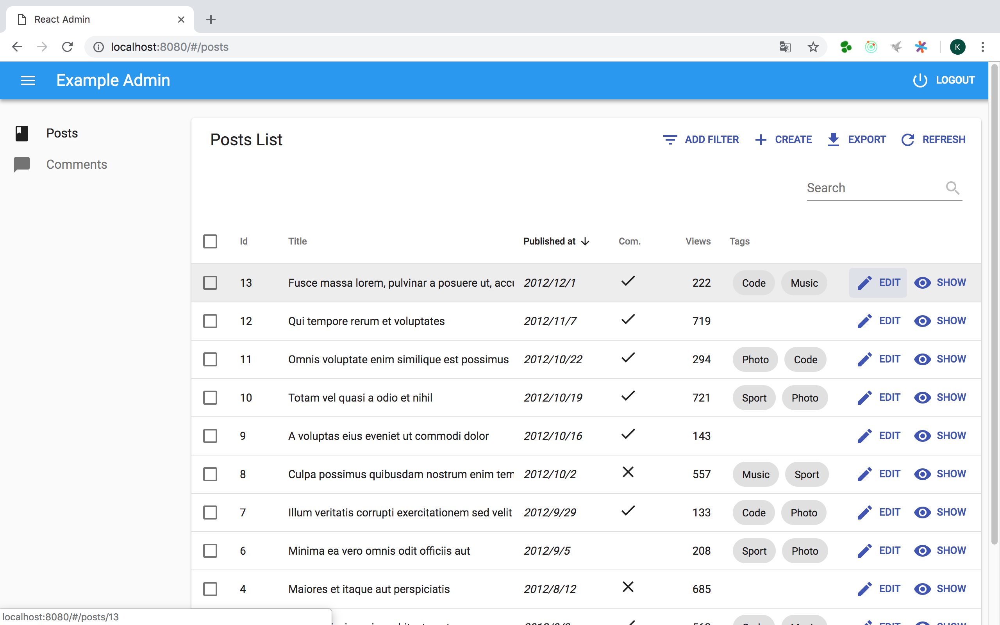
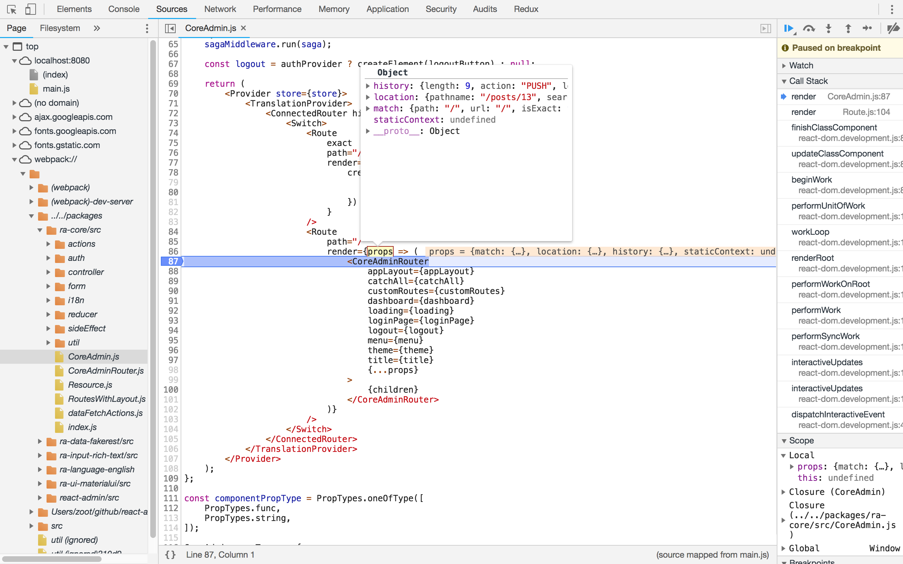
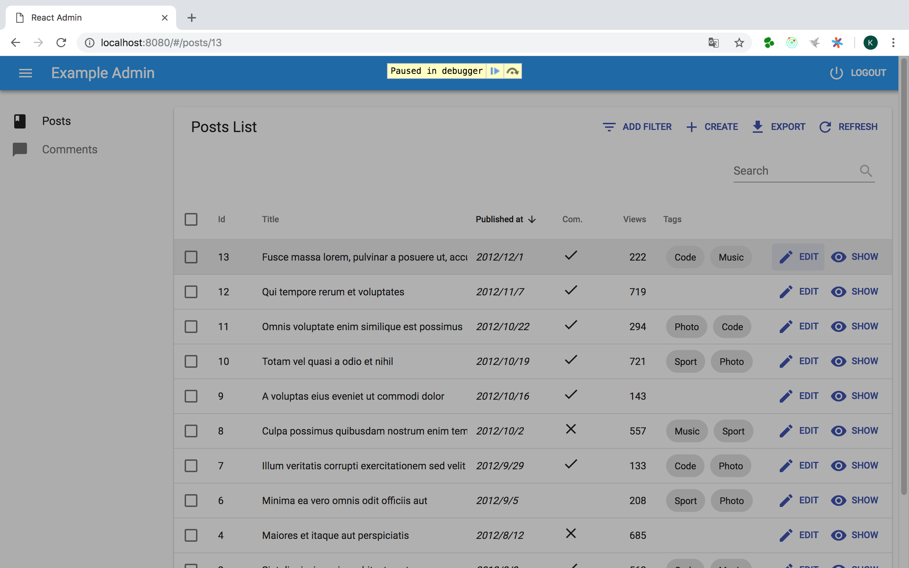
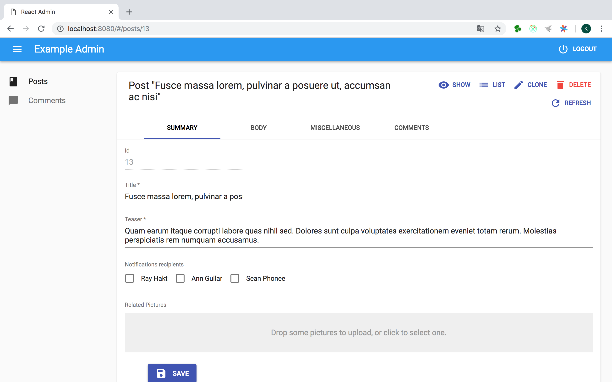
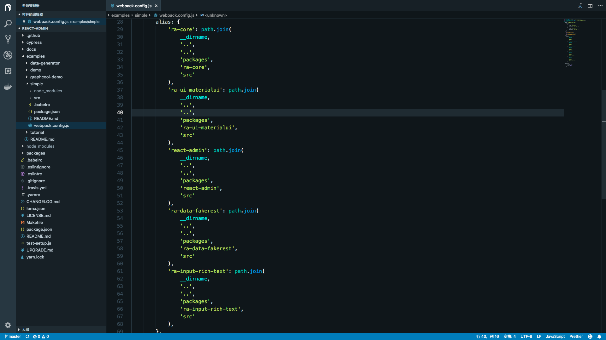

### 一步一步调试 React-Admin 源码

可能有的小伙伴不太清楚在现有项目中如何调试 react-admin 源码，我这里稍稍说一下：（大神请飘过^_^）

```sh
git clone https://github.com/marmelab/react-admin.git

cd react-admin

yarn

cd examples/simple

yarn start

```

OK，现在打开 Chrome，进入 http://localhost:8080

F12，我们找到其中的 ra-core 包的源码，下个断点，刷新页面，妥妥的：

1. 单击 Edit



2. 进入断点



3. 继续执行



4. 进入编辑视图



---

这里能调试进 src ，主要是因为 webpack.config.js 设置了 alias ，包指向的都是 src 而不是编译后的 lib。


