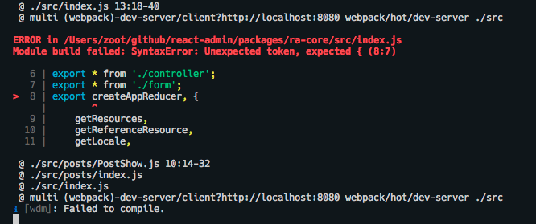
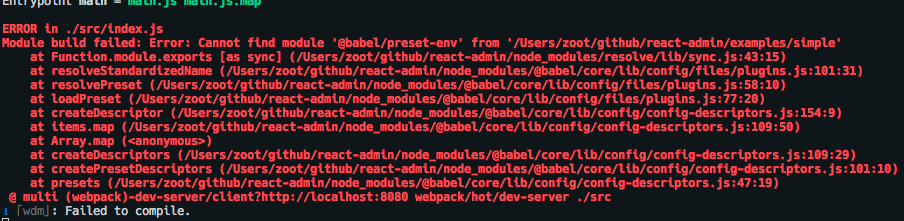
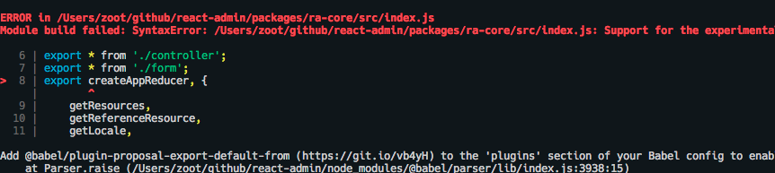
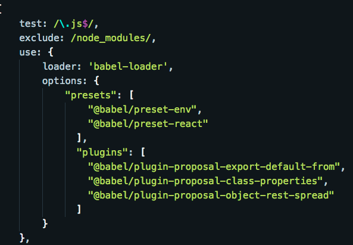
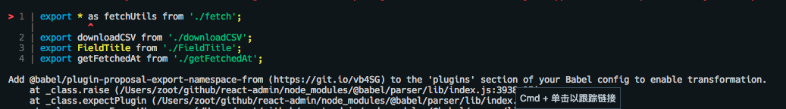
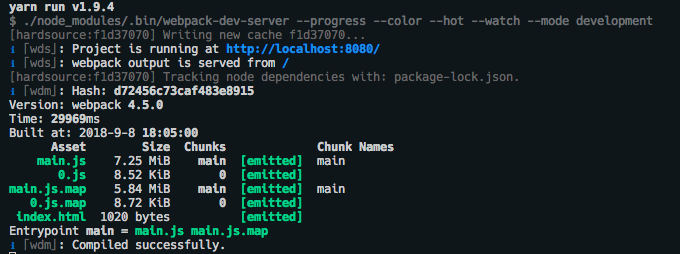

### 调试 React-Admin 源码，看清框架的本质

[Github](https://github.com/Kirk-Wang/react-admin-app/blob/master/docs/components/debug-react-admin.md)

无论如何，要想彻底用好一个框架，除了看文档，最重要的还是要看它的源码。

这里我记录下我对它的一个调试过程：

1. 拉取仓库并安装

```sh
git clone https://github.com/marmelab/react-admin.git

yarn
```

2. 通过探索，发现 example 下 simple 项目就是专门用来调试用的，我们直接进入：

```sh
cd examples/simple

yarn start
```

额，发现报错了：



[React-Admin](https://github.com/marmelab/react-admin.git) 这个框架，基本每天都更新，所以有报错是很正常的。

3. 在这里，我们首先升级下这个项目到 babel7（因为报错更清晰，方便解决错误）：

```sh
npx babel-upgrade --write --install
```

4. 再次启动：

```sh
yarn start
```

还是报错：



但错误很清晰，一眼就发现 @babel/preset-env 没有安装。我们安装并启动：

```sh
yarn add @babel/preset-env -D

yarn start
```

继续报错，继续根据错误提示，安装包并把它添加到 .babelrc，然后启动：



```sh
yarn add @babel/plugin-proposal-export-default-from -D

yarn start
```

额，这里还是报上面的错……我这里直接移动 .babelrc 配置到 webpack.config.js 的 babel-loader 的 options 选项中：



这下没有报之前的错了，但报了另外一个错了，我们根据提示解决一下：



```sh
yarn add @babel/plugin-proposal-export-namespace-from -D

yarn start
```

添加这个插件到 babel-loader 中：

```js
...
use: { 
    loader: 'babel-loader',
    options: {
        "presets": [
            "@babel/preset-env",
            "@babel/preset-react"
          ],
          "plugins": [
            "@babel/plugin-proposal-export-default-from",
            "@babel/plugin-proposal-class-properties",
            "@babel/plugin-proposal-object-rest-spread",
            "@babel/plugin-proposal-export-namespace-from"
          ]
    }
}
...
```

然后，`yarn start`，终于运行成功了：




OK，现在打开 Chrome，进入 [http://localhost:8080](http://localhost:8080)

F12，我们找到其中的 ra-core 包的源码，下个断点，刷新页面，妥妥的：

a. 单击 Edit


b. 进入断点


c. 继续执行


d. 进入编辑视图


---

这里能调试进 src ，主要是因为 webpack.config.js 设置了 alias ，包指向的都是 src 而不是编译后的 lib。


