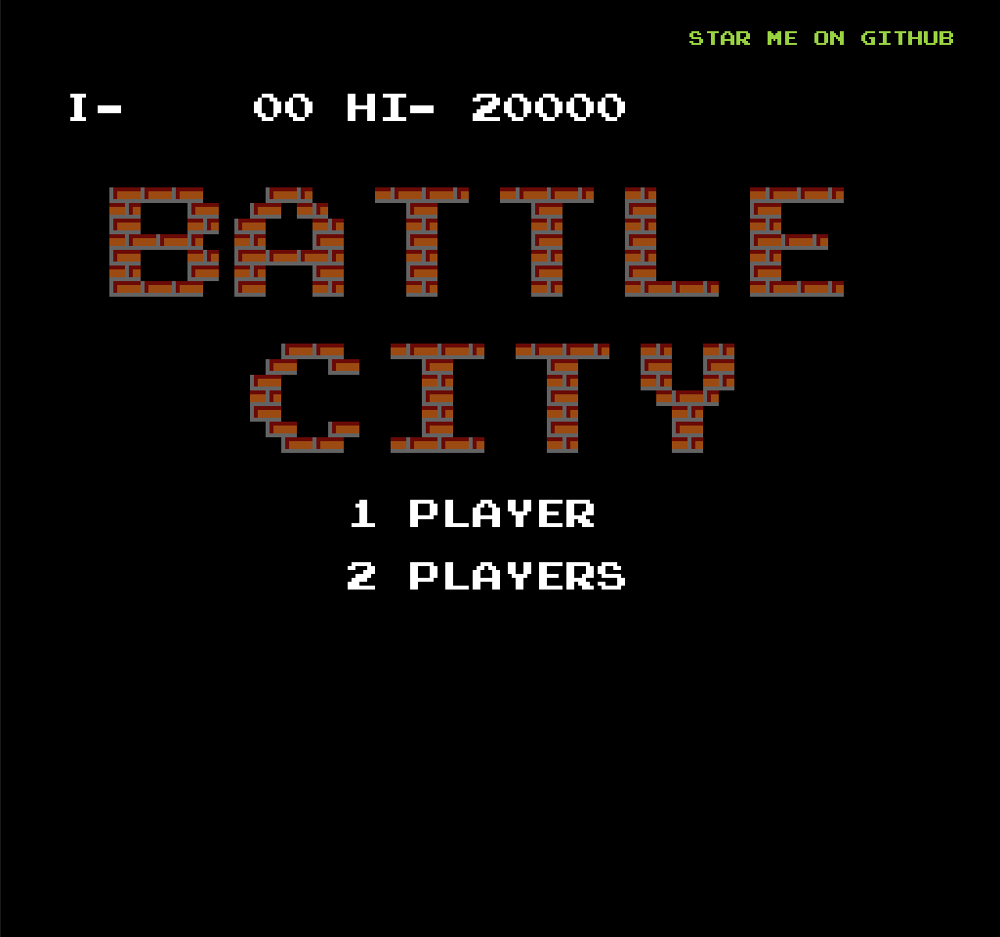

# 首屏场景组件 GameTitleScene 的分析

### 路由

```typescript
<Route component={GameTitleScene} />
```

### UI


### 组成 GameTitleScene 组件的相关子组件


### Screen 组件

1. 他是一个 `svg` 元素。

2. 设置属性用的默认常量，位于当前`BLOCK_SIZE = 16`组件的 `../utils/constants`。

- `SCREEN_HEIGHT`-->`16 * BLOCK_SIZE(16)`-->(256)
- `SCREEN_WIDTH`-->`15 * BLOCK_SIZE(16)`-->(240)
- `ZOOM_LEVEL`-->`2`

3. 渲染视窗设置：

- `width={SCREEN_WIDTH * ZOOM_LEVEL}`：256 \* 2 = 512;
- `height={SCREEN_HEIGHT * ZOOM_LEVEL}`：240 \* 2 = 480;

4. 视野设置（我们能看到的）：

- viewBox={`0 0 ${SCREEN_WIDTH} ${SCREEN_HEIGHT}`}：`0 0 256, 240`

### GameTitleSceneContent 组件，`SVG` 标签的内容

1. 绘制一块黑色的低（矩形）

```typescript
// BLOCK_SIZE(16) as B，当前视野中 256 * 240
<rect fill="#000000" width={16 * B} height={15 * B} />
```


2. 绘制 `'star me on github'` 按钮

```typescript
<g transform="scale(0.5)">
  <TextButton
    textFill="#96d332"
    x={22 * B}
    y={B}
    content="star me on github"
    onClick={() => window.open("https://github.com/shinima/battle-city")}
  />
</g>
```


转到 `TextButton` 组件。

3. 绘制文字 `'\u2160-    00 HI- 20000'`


4. 使用 `pattern-brickwall` 笔刷绘制文字 `battle city`。


5. 绘制 `1 player` 按钮


6. 绘制 `2 players` 按钮



7. 绘制 `stage list` 按钮


8. 绘制 `gallery` 按钮


9. 绘制一个坦克


10. 绘制文字 `'\u00a9 1980 1985 NAMCO LTD.'`


11. 绘制文字 `ALL RIGHTS RESERVED`


### TextButton 组件

基于 `g` 标签与 `Text` 组件封装的一个可点击，可显示像素文字的按钮。

### Text 组件

采用 `g` 和 `path` 标签封装了 0 到 9 ，a 到 z，+，-，:，.，?，Ⅰ，Ⅱ，←，↑，→，
↓，©等游戏中用到的字符。

### BrickWall 组件

主要是用它来绘制红砖墙。

### Tank 组件

主要是用它来绘制游戏中各种各样的坦克


