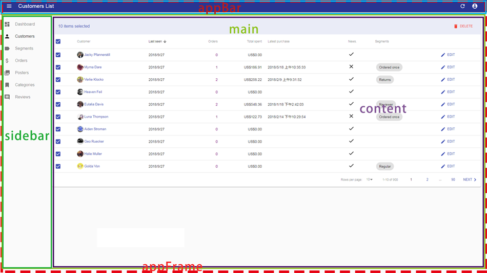

# React-Admin 架构分析：`Admin` 组件源码解析之 `appLayout` 属性

[示例项目-hello-react-admin](https://github.com/Kirk-Wang/hello-react-admin)

为什么需要 `appLayout`?

在一个应用程序界面中，你总会看到一些始终存在的公共部分，如：(菜单栏，导航栏或者工具栏)。`appLayout` 规范了整个应用程序的界面，哪些是公共的，哪些是可变的。

### 默认 Layout 组件

在 `react-admin` 包中，我们发现 react-admin 默认的 layout 位于 `ra-ui-materialui` 包中。

当前可以在 `packages/ra-ui-materialui/src/layout/Layout.js` 目录下找到源码。

我们来看下它组件🌲：

1. 这个文件最终导出的默认组件是 `LayoutWithTheme`，它渲染了如下组件：

```jsx
<MuiThemeProvider theme={this.theme}>
    <EnhancedLayout {...rest} />
</MuiThemeProvider>
```

`MuiThemeProvider` 是 `material-ui` 提供的上层组件，它被用来在上下文中提供一个 `theme` 的主题对象。

方便所有的 `material-ui` 组件统一定制相同的风格。这个 `theme` 对象具体都有哪些 key，大家可以参看 [Default Theme](https://material-ui.com/customization/default-theme/)。

关于的 `material-ui` 定制的一些细节，大家可以参看 [Material-UI 定制文档](https://github.com/Kirk-Wang/react-admin-app) 。

2. `EnhancedLayout`，一个由 `connect`，`withRouter`，`withStyles` 高阶组件增强过的 `Layout` 组件。

```js
const EnhancedLayout = compose(
    connect(
        mapStateToProps,
        {} // Avoid connect passing dispatch in props 这是 react-redux 的一个处理机制，大家可以翻看源码
    ),
    withRouter,
    withStyles(styles)
)(Layout);
```

`connect` HOC：`react-redux` 提供的高阶组件。主要功能是注入 `redux state` 到组件中的 `props` 上，并在 `shouldComponentUpdate` 等钩子上做了相关的优化。 这里只有一个 `open`：

```jsx
const mapStateToProps = state => ({
    open: state.admin.ui.sidebarOpen,
});
```

`withRouter` HOC：`react-router` 提供的高阶组件。主要功能是当路由渲染时， `withRouter` 会将已经更新的 `match` ， `location` 和 `history` 属性传递给被包裹的组件。

`withStyles` HOC：`material-ui` 提供的高阶组件。主要功能是用它来重写 `material-ui` 各个组件提供的 `CSS API`，改变默认的风格。这里作用是让组件拥有一个 `classes` 属性，它的 `key` 可以被用作组件（Layout）内元素的 `className` 值。从而制定你想要的界面布局。

3. 快速洞悉 `flexbox` 布局。可以参看有酒的[30 分钟学会 Flex 布局](https://zhuanlan.zhihu.com/p/25303493)


4. 👀一下它界面结构



4. React 错误处理

什么是错误处理? [两分钟学会 React 16 componentDidCatch 生命周期方法](https://www.zcfy.cc/article/2-minutes-to-learn-react-16s-componentdidcatch-lifecycle-method)

“错误处理指的是React组件中能捕获子组件树中的任何Javascript异常，打印出来，并且展示出备用UI的生命周期方法 从而避免了组件树崩溃。它能在整个渲染及构建dom树的过程中捕获异常” -Dan Abramov

React 16 将提供一个内置函数 `componentDidCatch`，如果 `render()` 函数抛出错误，则会触发该函数。

```jsx
componentDidCatch(errorMessage, errorInfo) {
    this.setState({ hasError: true, errorMessage, errorInfo });
}
```

5. appBar

```jsx
{createElement(appBar, { title, open, logout })}
```

[react-headroom](https://github.com/KyleAMathews/react-headroom)

React Headroom 是在滚动时显示/隐藏头部的 React 组件。一个小问题，照样要做到极致。

MuiAppBar
