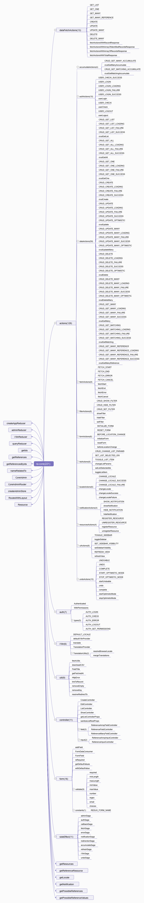
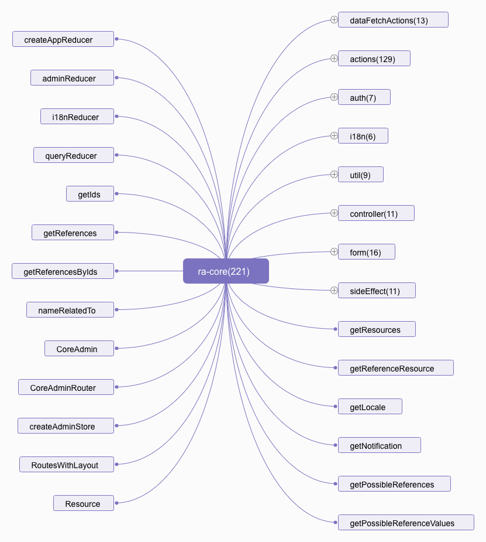
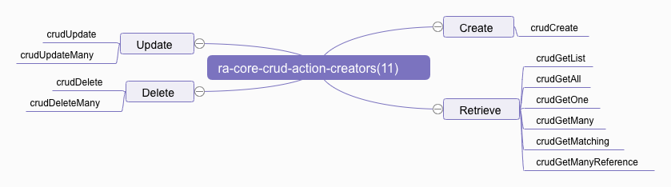

# ra-core 包分析

这个包是整个 React-Admin 的核心逻辑

```jsx
import * as Core from 'ra-core';

// console.log(Object.keys(Core).length)
// 221
```

```jsx
{
  AUTH_CHECK: "AUTH_CHECK"
  AUTH_ERROR: "AUTH_ERROR"
  AUTH_GET_PERMISSIONS: "AUTH_GET_PERMISSIONS"
  AUTH_LOGIN: "AUTH_LOGIN"
  AUTH_LOGOUT: "AUTH_LOGOUT"
  Authenticated: ƒ Connect(props, context)
  BEFORE_LOCATION_CHANGE: "RA/BEFORE_LOCATION_CHANGE"
  CHANGE_LOCALE: "RA/CHANGE_LOCALE"
  CHANGE_LOCALE_FAILURE: "RA/CHANGE_LOCALE_FAILURE"
  CHANGE_LOCALE_SUCCESS: "RA/CHANGE_LOCALE_SUCCESS"
  COMPLETE: "RA/COMPLETE"
  CREATE: "CREATE"
  CRUD_CHANGE_LIST_PARAMS: "RA/CRUD_CHANGE_LIST_PARAMS"
  CRUD_CREATE: "RA/CRUD_CREATE"
  CRUD_CREATE_FAILURE: "RA/CRUD_CREATE_FAILURE"
  CRUD_CREATE_LOADING: "RA/CRUD_CREATE_LOADING"
  CRUD_CREATE_SUCCESS: "RA/CRUD_CREATE_SUCCESS"
  CRUD_DELETE: "RA/CRUD_DELETE"
  CRUD_DELETE_FAILURE: "RA/CRUD_DELETE_FAILURE"
  CRUD_DELETE_LOADING: "RA/CRUD_DELETE_LOADING"
  CRUD_DELETE_MANY: "RA/CRUD_DELETE_MANY"
  CRUD_DELETE_MANY_FAILURE: "RA/CRUD_DELETE_MANY_FAILURE"
  CRUD_DELETE_MANY_LOADING: "RA/CRUD_DELETE_MANY_LOADING"
  CRUD_DELETE_MANY_OPTIMISTIC: "RA/CRUD_DELETE_MANY_OPTIMISTIC"
  CRUD_DELETE_MANY_SUCCESS: "RA/CRUD_DELETE_MANY_SUCCESS"
  CRUD_DELETE_OPTIMISTIC: "RA/CRUD_DELETE_OPTIMISTIC"
  CRUD_DELETE_SUCCESS: "RA/CRUD_DELETE_SUCCESS"
  CRUD_GET_ALL: "RA/CRUD_GET_ALL"
  CRUD_GET_ALL_FAILURE: "RA/CRUD_GET_ALL_FAILURE"
  CRUD_GET_ALL_LOADING: "RA/CRUD_GET_ALL_LOADING"
  CRUD_GET_ALL_SUCCESS: "RA/CRUD_GET_ALL_SUCCESS"
  CRUD_GET_LIST: "RA/CRUD_GET_LIST"
  CRUD_GET_LIST_FAILURE: "RA/CRUD_GET_LIST_FAILURE"
  CRUD_GET_LIST_LOADING: "RA/CRUD_GET_LIST_LOADING"
  CRUD_GET_LIST_SUCCESS: "RA/CRUD_GET_LIST_SUCCESS"
  CRUD_GET_MANY: "RA/CRUD_GET_MANY"
  CRUD_GET_MANY_ACCUMULATE: "RA/CRUD_GET_MANY_ACCUMULATE"
  CRUD_GET_MANY_FAILURE: "RA/CRUD_GET_MANY_FAILURE"
  CRUD_GET_MANY_LOADING: "RA/CRUD_GET_MANY_LOADING"
  CRUD_GET_MANY_REFERENCE: "RA/CRUD_GET_MANY_REFERENCE"
  CRUD_GET_MANY_REFERENCE_FAILURE: "RA/CRUD_GET_MANY_REFERENCE_FAILURE"
  CRUD_GET_MANY_REFERENCE_LOADING: "RA/CRUD_GET_MANY_REFERENCE_LOADING"
  CRUD_GET_MANY_REFERENCE_SUCCESS: "RA/CRUD_GET_MANY_REFERENCE_SUCCESS"
  CRUD_GET_MANY_SUCCESS: "RA/CRUD_GET_MANY_SUCCESS"
  CRUD_GET_MATCHING: "RA/CRUD_GET_MATCHING"
  CRUD_GET_MATCHING_ACCUMULATE: "RA/CRUD_GET_MATCHING_ACCUMULATE"
  CRUD_GET_MATCHING_FAILURE: "RA/CRUD_GET_MATCHING_FAILURE"
  CRUD_GET_MATCHING_LOADING: "RA/CRUD_GET_MATCHING_LOADING"
  CRUD_GET_MATCHING_SUCCESS: "RA/CRUD_GET_MATCHING_SUCCESS"
  CRUD_GET_ONE: "RA/CRUD_GET_ONE"
  CRUD_GET_ONE_FAILURE: "RA/CRUD_GET_ONE_FAILURE"
  CRUD_GET_ONE_LOADING: "RA/CRUD_GET_ONE_LOADING"
  CRUD_GET_ONE_SUCCESS: "RA/CRUD_GET_ONE_SUCCESS"
  CRUD_HIDE_FILTER: "RA/CRUD_HIDE_FILTER"
  CRUD_SET_FILTER: "RA/CRUD_SET_FILTER"
  CRUD_SHOW_FILTER: "RA/CRUD_SHOW_FILTER"
  CRUD_UPDATE: "RA/CRUD_UPDATE"
  CRUD_UPDATE_FAILURE: "RA/CRUD_UPDATE_FAILURE"
  CRUD_UPDATE_LOADING: "RA/CRUD_UPDATE_LOADING"
  CRUD_UPDATE_MANY: "RA/CRUD_UPDATE_MANY"
  CRUD_UPDATE_MANY_FAILURE: "RA/CRUD_UPDATE_MANY_FAILURE"
  CRUD_UPDATE_MANY_LOADING: "RA/CRUD_UPDATE_MANY_LOADING"
  CRUD_UPDATE_MANY_OPTIMISTIC: "RA/CRUD_UPDATE_MANY_OPTIMISTIC"
  CRUD_UPDATE_MANY_SUCCESS: "RA/CRUD_UPDATE_MANY_SUCCESS"
  CRUD_UPDATE_OPTIMISTIC: "RA/CRUD_UPDATE_OPTIMISTIC"
  CRUD_UPDATE_SUCCESS: "RA/CRUD_UPDATE_SUCCESS"
  CoreAdmin: ƒ WithContext()
  CoreAdminRouter: ƒ GetContext(ownerProps, context)
  CreateController: ƒ Connect(props, context)
  DEFAULT_LOCALE: "en"
  DELETE: "DELETE"
  DELETE_MANY: "DELETE_MANY"
  EditController: ƒ Connect(props, context)
  FETCH_CANCEL: "RA/FETCH_CANCEL"
  FETCH_END: "RA/FETCH_END"
  FETCH_ERROR: "RA/FETCH_ERROR"
  FETCH_START: "RA/FETCH_START"
  FieldTitle: ƒ TranslatedComponent()
  FormDataConsumer: ƒ Connect(props, context)
  FormField: ƒ Connect(props, context)
  GET_LIST: "GET_LIST"
  GET_MANY: "GET_MANY"
  GET_MANY_REFERENCE: "GET_MANY_REFERENCE"
  GET_ONE: "GET_ONE"
  HIDE_NOTIFICATION: "RA/HIDE_NOTIFICATION"
  HttpError: ƒ HttpError(message, status)
  INITIALIZE_FORM: "RA/INITIALIZE_FORM"
  ListController: ƒ Connect(props, context)
  REDUX_FORM_NAME: "record-form"
  REFRESH_VIEW: "RA/REFRESH_VIEW"
  REGISTER_RESOURCE: "RA/REGISTER_RESOURCE"
  RESET_FORM: "RA/RESET_FORM"
  ReferenceArrayFieldController: ƒ Connect(props, context)
  ReferenceArrayInputController: ƒ TranslatedComponent()
  ReferenceFieldController: ƒ Connect(props, context)
  ReferenceInputController: ƒ TranslatedComponent()
  ReferenceManyFieldController: ƒ Connect(props, context)
  Resource: ƒ Connect(props, context)
  RoutesWithLayout: ƒ RoutesWithLayout(_ref)
  SET_LIST_SELECTED_IDS: "RA/SET_LIST_SELECTED_IDS"
  SET_SIDEBAR_VISIBILITY: "RA/SET_SIDEBAR_VISIBILITY"
  SHOW_NOTIFICATION: "RA/SHOW_NOTIFICATION"
  START_OPTIMISTIC_MODE: "RA/START_OPTIMISTIC_MODE"
  STOP_OPTIMISTIC_MODE: "RA/STOP_OPTIMISTIC_MODE"
  ShowController: ƒ Connect(props, context)
  TOGGLE_LIST_ITEM: "RA/TOGGLE_LIST_ITEM"
  TOGGLE_SIDEBAR: "RA/TOGGLE_SIDEBAR"
  TranslationProvider: ƒ Connect(props, context)
  UNDO: "RA/UNDO"
  UNDOABLE: "RA/UNDOABLE"
  UNREGISTER_RESOURCE: "RA/UNREGISTER_RESOURCE"
  UPDATE: "UPDATE"
  UPDATE_MANY: "UPDATE_MANY"
  USER_CHECK: "RA/USER_CHECK"
  USER_CHECK_SUCCESS: "RA/USER_CHECK_SUCCESS"
  USER_LOGIN: "RA/USER_LOGIN"
  USER_LOGIN_FAILURE: "RA/USER_LOGIN_FAILURE"
  USER_LOGIN_LOADING: "RA/USER_LOGIN_LOADING"
  USER_LOGIN_SUCCESS: "RA/USER_LOGIN_SUCCESS"
  USER_LOGOUT: "RA/USER_LOGOUT"
  WithPermissions: ƒ GetContext(ownerProps, context)
  accumulateSaga: ƒ _callee()
  addField: ƒ (BaseComponent)
  adminReducer: ƒ combination()
  adminSaga: ƒ (dataProvider, authProvider, i18nProvider)
  authSaga: ƒ (authProvider)
  beforeLocationChange: ƒ beforeLocationChange(_ref)
  callbackSaga: ƒ _callee()
  changeListParams: ƒ changeListParams(resource, params)
  changeLocale: ƒ changeLocale(locale)
  changeLocaleFailure: ƒ changeLocaleFailure(locale, error)
  changeLocaleSuccess: ƒ changeLocaleSuccess(locale, messages)
  choices: ƒ ()
  complete: ƒ complete()
  createAdminStore: ƒ (_ref)
  createAppReducer: ƒ (customReducers, locale, messages)
  crudCreate: ƒ crudCreate(resource, data, basePath)
  crudDelete: ƒ crudDelete(resource, id, previousData, basePath)
  crudDeleteMany: ƒ crudDeleteMany(resource, ids, basePath)
  crudGetAll: ƒ crudGetAll(resource, sort, filter, maxResults, callback)
  crudGetList: ƒ crudGetList(resource, pagination, sort, filter)
  crudGetMany: ƒ crudGetMany(resource, ids)
  crudGetManyAccumulate: ƒ crudGetManyAccumulate(resource, ids)
  crudGetManyReference: ƒ crudGetManyReference(reference, target, id, relatedTo, pagination, sort, filter, source)
  crudGetMatching: ƒ crudGetMatching(reference, relatedTo, pagination, sort, filter)
  crudGetMatchingAccumulate: ƒ crudGetMatchingAccumulate(reference, relatedTo, pagination, sort, filter)
  crudGetOne: ƒ crudGetOne(resource, id, basePath)
  crudUpdate: ƒ crudUpdate(resource, id, data, previousData, basePath)
  crudUpdateMany: ƒ crudUpdateMany(resource, ids, data, basePath)
  defaultI18nProvider: ƒ ()
  downloadCSV: ƒ (csv, filename)
  email: ƒ ()
  errorSaga: ƒ _callee()
  fetchActionsWithArrayOfIdentifiedRecordsResponse: Array(3)
  fetchActionsWithArrayOfRecordsResponse: Array(5)
  fetchActionsWithRecordResponse: Array(4)
  fetchActionsWithTotalResponse: Array(2)
  fetchCancel: ƒ fetchCancel()
  fetchEnd: ƒ fetchEnd()
  fetchError: ƒ fetchError()
  fetchSaga: ƒ fetch(dataProvider)
  fetchStart: ƒ fetchStart()
  fetchUtils: Object
  getDefaultValues: ƒ ()
  getFetchedAt: ƒ ()
  getIds: ƒ getIds(state, relatedTo)
  getListControllerProps: ƒ getListControllerProps(props)
  getLocale: ƒ getLocale(state)
  getNotification: ƒ getNotification(state)
  getPossibleReferenceValues: ƒ getPossibleReferenceValues(state, props)
  getPossibleReferences: ƒ getPossibleReferences(referenceState, possibleValues)
  getReferenceResource: ƒ getReferenceResource(state, props)
  getReferences: ƒ getReferences(state, reference, relatedTo)
  getReferencesByIds: ƒ getReferencesByIds(state, reference, ids)
  getResources: ƒ getResources(state)
  hideFilter: ƒ hideFilter(resource, field)
  hideNotification: ƒ hideNotification()
  i18nReducer: ƒ (initialLocale, defaultMessages)
  i18nSaga: ƒ (i18nProvider)
  initializeForm: ƒ initializeForm(initialValues)
  isRequired: ƒ isRequired(validate)
  linkToRecord: ƒ (basePath, id)
  maxLength: ƒ ()
  maxValue: ƒ ()
  mergeTranslations: ƒ mergeTranslations()
  minLength: ƒ ()
  minValue: ƒ ()
  nameRelatedTo: ƒ nameRelatedTo(reference, id, resource, target)
  notificationSaga: ƒ _callee()
  number: ƒ ()
  queryReducer: ƒ (previousState, _ref)
  redirectionSaga: ƒ _callee()
  refreshSaga: ƒ _callee()
  refreshView: ƒ refreshView()
  regex: ƒ ()
  registerResource: ƒ registerResource(resource)
  removeEmpty: ƒ removeEmpty(object)
  removeKey: ƒ deepRemoveKey(target, path)
  required: ƒ ()
  resetForm: ƒ resetForm()
  resolveBrowserLocale: ƒ resolveBrowserLocale()
  resolveRedirectTo: ƒ (redirectTo, basePath, id, data)
  sanitizeListRestProps: ƒ sanitizeListRestProps(props)
  setFilter: ƒ setFilter(resource, field, value)
  setListSelectedIds: ƒ setListSelectedIds(resource, ids)
  setSidebarVisibility: ƒ setSidebarVisibility(isOpen)
  showFilter: ƒ showFilter(resource, field)
  showNotification: ƒ showNotification(message)
  startOptimisticMode: ƒ startOptimisticMode()
  startUndoable: ƒ startUndoable(action)
  stopOptimisticMode: ƒ stopOptimisticMode()
  toggleListItem: ƒ toggleListItem(resource, id)
  toggleSidebar: ƒ toggleSidebar()
  translate: ƒ translate(BaseComponent)
  undo: ƒ undo()
  undoSaga: ƒ watchUndoable()
  unregisterResource: ƒ unregisterResource(resourceName)
  userCheck: ƒ userCheck(payload, pathName, routeParams)
  userLogin: ƒ userLogin(payload, pathName)
  userLogout: ƒ userLogout(redirectTo)
  withDefaultValue: ƒ (DecoratedComponent)
}
```





`ra-core` 是整个 `React-Admin` 底层逻辑，对 `CRUD` 操作的高度封装。

`ra-core` 是一个基于 `Redux` 状态管理的程序。所以他对 `CRUD` 操作抽象出了一系列公共的 `Action` 和 `ActionCreators`。从而可以高度复用。

`ra-core` 针对 `CRUD` 抽象出来的 `ActionCreators`：（[源码](https://github.com/marmelab/react-admin/blob/master/packages/ra-core/src/actions/dataActions.js)）




关于 `Redux` 相关的文档，如果大家不熟悉的话，可以参看[Redux 中文文档](https://cn.redux.js.org/)

### 针对 `C`(Create) 的设计

#### crudCreate

这个 `Action Creator` 主要是根据必要的参数返回一个通用的 `action` 对象。

```js
export const crudCreate = (resource, data, basePath, redirectTo = 'edit') => ({
    type: CRUD_CREATE,
    payload: { data },
    meta: {
        resource,
        fetch: CREATE,
        onSuccess: {
            notification: {
                body: 'ra.notification.created',
                level: 'info',
                messageArgs: {
                    smart_count: 1,
                },
            },
            redirectTo,
            basePath,
        },
        onFailure: {
            notification: {
                body: 'ra.notification.http_error',
                level: 'warning',
            },
        },
    },
});
```

那它是如何被调用的呢？

```js
// 位于 CreateController.js
save = (record, redirect) => {
    // 此处的 `crudCreate` 已经由 `react-redux` 的 `connect` 组件
    // 做了 `bindActionCreators` 的处理，所以会直接 `dispatch`
    this.props.crudCreate(
        this.props.resource, // 'posts'
        record, // { data: { title: "hello, world" } }
        /**
         * const basePath = match.url; -->> 位于 Resource.js
         * 
         * match ->> 一个 match 对象中包涵了有关如何匹配 URL 的信息(react-router 注入进 CreateController的)
        */
        this.props.basePath,
        // 创建完跳转到的路由，默认是编辑(edit)视图
        redirect
    );
};
```

当这个 `action` 对象被 `dispatch` 出去后，由于 `meta` 里面包含 `fetch`，所以这个 `action` 会被 `fetchSaga` 监听到。

所以，接下来它会执行 `handleFetch` 这个 `Side Effect`。

```js
// sideEffect/fetch.js
export function* handleFetch(dataProvider, action) {
    ...
}
```

在这个函数里面，它根据传进来的 `dataProvider` 和 `action` 主要做了以下几件事儿：

1. 首先判断 `optimistic` mode，是就是直接 `return`。

2. 然后并行分发两个 `action`，`${type}_LOADING`(这里是`'RA/CRUD_CREATE_LOADING'`) 和 `FETCH_START`。`'RA/CRUD_CREATE_LOADING'` 好像没什么用，`FETCH_START` 会触发 `loading` reducer。
```js
export default (previousState = 0, { type }) => {
    switch (type) {
        case FETCH_START:
        case USER_LOGIN_LOADING:
            return previousState + 1;
        case FETCH_END:
        case FETCH_ERROR:
        case FETCH_CANCEL:
        case USER_LOGIN_SUCCESS:
        case USER_LOGIN_FAILURE:
            return Math.max(previousState - 1, 0);
        default:
            return previousState;
    }
};
```

3. 根据 `restType`(`'RA/CRUD_CREATE'`)，`meta.resource`，`payload` 调用 `dataProvider` 发送数据请求，来获取后端的 `CRUD` 响应结果。
```js
// 这里就是执行你提供的 dataProvider，它是一个类似于 ra-data-simple-rest 的函数
import {
    fetchUtils,
    GET_LIST,
    GET_ONE,
    GET_MANY,
    GET_MANY_REFERENCE,
    CREATE,
    UPDATE,
    UPDATE_MANY,
    DELETE,
    DELETE_MANY,
} from 'react-admin';
export default (apiUrl, httpClient = fetchUtils.fetchJson) => {}

return (type, resource, params) => {
    if (type === UPDATE_MANY) {
        ...
    }
    ...
}
```

4. 如果成功分发 `${type}_SUCCESS`(这里是`'RA/CRUD_CREATE_SUCCESS'`) 和 `'RA/FETCH_END'` 这两个 `action`。一般我们创建成功后，会有弹窗提示，跳转等，那么这些副作用该如何管理呢？
```js
yield put({
    type: `${type}_SUCCESS`,
    payload: response,
    requestPayload: payload,
    meta: {
        ...meta,
        ...onSuccess,
        fetchResponse: restType,
        fetchStatus: FETCH_END,
    },
});

// 弹窗提示副作用管理，sideEffects/notification.js
yield takeEvery(
    action => action.meta && action.meta.notification,
    handleNotification
);

// 跳转副作用管理，sideEffects/redirection.js
yield takeEvery(
    action => action.meta && typeof action.meta.redirectTo !== 'undefined',
    handleRedirection
);

yield put({ type: FETCH_END }); // 触发 loading reducer
```

5. 如果失败分发 `${type}_FAILURE`(这里是`'RA/CRUD_CREATE_FAILURE'`) 和 `'RA/FETCH_ERROR'` 这两个 `action`。这里同样会触发弹窗提示副作用。

6. 最后是 `finally` 部分做了任务被取消时的处理。这里主要是是使用一个特殊的 `effect`（cancelled） 来做判断，当前 `task` 是不是已经在外部被 `cancel` 掉了。是不是需要执行一些指定的逻辑。这里是分发一个 `RA/FETCH_CANCEL` 的 `action`，表明当前 `fetch` 已被取消。

7. 以上就是一次 `crudCreate` 所要经历的一些过程。


### 针对 `R`(Retrieve) 的设计

#### crudGetOne

**功能：**

通过 `id` 查询单条资源。

**应用场景：**

显示一篇文章，编辑一条数据等。

**[dataProvider](https://marmelab.com/react-admin/DataProviders.html) 调用方式：**

```jsx
dataProvider(GET_ONE, 'posts', { id: 123 })
.then(response => console.log(response));
// {
//     data: { id: 123, title: "hello, world" }
// }
```

**相关源码：**

```js
export const CRUD_GET_ONE = 'RA/CRUD_GET_ONE';
export const CRUD_GET_ONE_LOADING = 'RA/CRUD_GET_ONE_LOADING';
export const CRUD_GET_ONE_FAILURE = 'RA/CRUD_GET_ONE_FAILURE';
export const CRUD_GET_ONE_SUCCESS = 'RA/CRUD_GET_ONE_SUCCESS';

export const crudGetOne = (resource, id, basePath, refresh = true) => ({
    type: CRUD_GET_ONE,
    payload: { id }, // "13"
    meta: {
        resource, // "posts"
        fetch: GET_ONE,
        basePath, // "/posts"
        onFailure: {
            notification: {
                body: 'ra.notification.item_doesnt_exist',
                level: 'warning',
            },
            redirectTo: 'list',
            refresh,
        },
    },
});
```

这个 `ActionCreator` 会在 `EditController` 和 `ShowController` 中进行调用。

```js
this.props.crudGetOne(resource, id, this.props.basePath);
```

**meta 分析：**
```js
meta: {
    resource, // "posts"
    fetch: GET_ONE,
    basePath, // "/posts"
    onFailure: {
        notification: {
            body: 'ra.notification.item_doesnt_exist',
            level: 'warning',
        },
        redirectTo: 'list',
        refresh,
    },
},
```

1. 当这个 `action` 被分发出去的时候，`meta` 数据中包含 `fetch`，所以这个 `action` 会被 `redux-saga` 中间件给监听到。从而进入 `fetchSaga` 的处理，也就是前面的 `handleFetch` 函数的调用。

2. 分发 `FETCH_START`，调用 `loading` reducer。

3. `dataProvider` 的调用，请求服务端借口。

4. 


