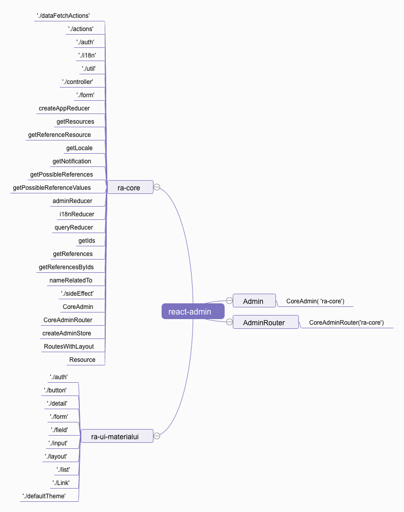

# react-admin 包分析

```jsx
import * as RA from 'react-admin';

// console.log(Object.keys(RA).length)
// 333
```

看一下 RA 包含的值（总共 333 项）：

```jsx

{
  AUTH_CHECK: "AUTH_CHECK"
  AUTH_ERROR: "AUTH_ERROR"
  AUTH_GET_PERMISSIONS: "AUTH_GET_PERMISSIONS"
  AUTH_LOGIN: "AUTH_LOGIN"
  AUTH_LOGOUT: "AUTH_LOGOUT"
  Admin: ƒ WithContext()
  AdminRouter: ƒ GetContext(ownerProps, context)
  AppBar: ƒ Connect(props, context)
  AppBarMobile: ƒ Connect(props, context)
  ArrayField: ƒ ShouldUpdate()
  ArrayInput: ƒ Connect(props, context)
  Authenticated: ƒ Connect(props, context)
  AutocompleteArrayInput: ƒ WithFormField(props)
  AutocompleteInput: ƒ WithFormField(props)
  BEFORE_LOCATION_CHANGE: "RA/BEFORE_LOCATION_CHANGE"
  BooleanField: ƒ ShouldUpdate()
  BooleanInput: ƒ WithFormField(props)
  BulkActions: ƒ WithStyles(props, context)
  BulkActionsToolbar: ƒ TranslatedComponent()
  BulkDeleteAction: ƒ Connect(props, context)
  BulkDeleteButton: ƒ Connect(props, context)
  Button: ƒ WithStyles(props, context)
  CHANGE_LOCALE: "RA/CHANGE_LOCALE"
  CHANGE_LOCALE_FAILURE: "RA/CHANGE_LOCALE_FAILURE"
  CHANGE_LOCALE_SUCCESS: "RA/CHANGE_LOCALE_SUCCESS"
  COMPLETE: "RA/COMPLETE"
  CREATE: "CREATE"
  CRUD_CHANGE_LIST_PARAMS: "RA/CRUD_CHANGE_LIST_PARAMS"
  CRUD_CREATE: "RA/CRUD_CREATE"
  CRUD_CREATE_FAILURE: "RA/CRUD_CREATE_FAILURE"
  CRUD_CREATE_LOADING: "RA/CRUD_CREATE_LOADING"
  CRUD_CREATE_SUCCESS: "RA/CRUD_CREATE_SUCCESS"
  CRUD_DELETE: "RA/CRUD_DELETE"
  CRUD_DELETE_FAILURE: "RA/CRUD_DELETE_FAILURE"
  CRUD_DELETE_LOADING: "RA/CRUD_DELETE_LOADING"
  CRUD_DELETE_MANY: "RA/CRUD_DELETE_MANY"
  CRUD_DELETE_MANY_FAILURE: "RA/CRUD_DELETE_MANY_FAILURE"
  CRUD_DELETE_MANY_LOADING: "RA/CRUD_DELETE_MANY_LOADING"
  CRUD_DELETE_MANY_OPTIMISTIC: "RA/CRUD_DELETE_MANY_OPTIMISTIC"
  CRUD_DELETE_MANY_SUCCESS: "RA/CRUD_DELETE_MANY_SUCCESS"
  CRUD_DELETE_OPTIMISTIC: "RA/CRUD_DELETE_OPTIMISTIC"
  CRUD_DELETE_SUCCESS: "RA/CRUD_DELETE_SUCCESS"
  CRUD_GET_ALL: "RA/CRUD_GET_ALL"
  CRUD_GET_ALL_FAILURE: "RA/CRUD_GET_ALL_FAILURE"
  CRUD_GET_ALL_LOADING: "RA/CRUD_GET_ALL_LOADING"
  CRUD_GET_ALL_SUCCESS: "RA/CRUD_GET_ALL_SUCCESS"
  CRUD_GET_LIST: "RA/CRUD_GET_LIST"
  CRUD_GET_LIST_FAILURE: "RA/CRUD_GET_LIST_FAILURE"
  CRUD_GET_LIST_LOADING: "RA/CRUD_GET_LIST_LOADING"
  CRUD_GET_LIST_SUCCESS: "RA/CRUD_GET_LIST_SUCCESS"
  CRUD_GET_MANY: "RA/CRUD_GET_MANY"
  CRUD_GET_MANY_ACCUMULATE: "RA/CRUD_GET_MANY_ACCUMULATE"
  CRUD_GET_MANY_FAILURE: "RA/CRUD_GET_MANY_FAILURE"
  CRUD_GET_MANY_LOADING: "RA/CRUD_GET_MANY_LOADING"
  CRUD_GET_MANY_REFERENCE: "RA/CRUD_GET_MANY_REFERENCE"
  CRUD_GET_MANY_REFERENCE_FAILURE: "RA/CRUD_GET_MANY_REFERENCE_FAILURE"
  CRUD_GET_MANY_REFERENCE_LOADING: "RA/CRUD_GET_MANY_REFERENCE_LOADING"
  CRUD_GET_MANY_REFERENCE_SUCCESS: "RA/CRUD_GET_MANY_REFERENCE_SUCCESS"
  CRUD_GET_MANY_SUCCESS: "RA/CRUD_GET_MANY_SUCCESS"
  CRUD_GET_MATCHING: "RA/CRUD_GET_MATCHING"
  CRUD_GET_MATCHING_ACCUMULATE: "RA/CRUD_GET_MATCHING_ACCUMULATE"
  CRUD_GET_MATCHING_FAILURE: "RA/CRUD_GET_MATCHING_FAILURE"
  CRUD_GET_MATCHING_LOADING: "RA/CRUD_GET_MATCHING_LOADING"
  CRUD_GET_MATCHING_SUCCESS: "RA/CRUD_GET_MATCHING_SUCCESS"
  CRUD_GET_ONE: "RA/CRUD_GET_ONE"
  CRUD_GET_ONE_FAILURE: "RA/CRUD_GET_ONE_FAILURE"
  CRUD_GET_ONE_LOADING: "RA/CRUD_GET_ONE_LOADING"
  CRUD_GET_ONE_SUCCESS: "RA/CRUD_GET_ONE_SUCCESS"
  CRUD_HIDE_FILTER: "RA/CRUD_HIDE_FILTER"
  CRUD_SET_FILTER: "RA/CRUD_SET_FILTER"
  CRUD_SHOW_FILTER: "RA/CRUD_SHOW_FILTER"
  CRUD_UPDATE: "RA/CRUD_UPDATE"
  CRUD_UPDATE_FAILURE: "RA/CRUD_UPDATE_FAILURE"
  CRUD_UPDATE_LOADING: "RA/CRUD_UPDATE_LOADING"
  CRUD_UPDATE_MANY: "RA/CRUD_UPDATE_MANY"
  CRUD_UPDATE_MANY_FAILURE: "RA/CRUD_UPDATE_MANY_FAILURE"
  CRUD_UPDATE_MANY_LOADING: "RA/CRUD_UPDATE_MANY_LOADING"
  CRUD_UPDATE_MANY_OPTIMISTIC: "RA/CRUD_UPDATE_MANY_OPTIMISTIC"
  CRUD_UPDATE_MANY_SUCCESS: "RA/CRUD_UPDATE_MANY_SUCCESS"
  CRUD_UPDATE_OPTIMISTIC: "RA/CRUD_UPDATE_OPTIMISTIC"
  CRUD_UPDATE_SUCCESS: "RA/CRUD_UPDATE_SUCCESS"
  CardActions: ƒ WithStyles(props, context)
  CardContentInner: ƒ WithStyles(props, context)
  CheckboxGroupInput: ƒ WithFormField(props)
  ChipField: ƒ WithStyles(props, context)
  CloneButton: ƒ ShouldUpdate()
  Confirm: ƒ WithStyles(props, context)
  CoreAdmin: ƒ WithContext()
  CoreAdminRouter: ƒ GetContext(ownerProps, context)
  Create: ƒ Create(props)
  CreateActions: ƒ CreateActions(_ref2)
  CreateButton: ƒ TranslatedComponent()
  CreateController: ƒ Connect(props, context)
  CreateView: ƒ CreateView(_ref2)
  DEFAULT_LOCALE: "en"
  DELETE: "DELETE"
  DELETE_MANY: "DELETE_MANY"
  DashboardMenuItem: ƒ TranslatedComponent()
  Datagrid: ƒ WithStyles(props, context)
  DateField: ƒ ShouldUpdate()
  DateInput: ƒ WithFormField(props)
  DeleteButton: ƒ Connect(props, context)
  DisabledInput: ƒ WithFormField(props)
  Edit: ƒ Edit(props)
  EditActions: ƒ EditActions(_ref2)
  EditButton: ƒ ShouldUpdate()
  EditController: ƒ Connect(props, context)
  EditView: ƒ EditView(_ref2)
  EmailField: ƒ ShouldUpdate()
  Error: ƒ WithStyles(props, context)
  ExportButton: ƒ Connect(props, context)
  FETCH_CANCEL: "RA/FETCH_CANCEL"
  FETCH_END: "RA/FETCH_END"
  FETCH_ERROR: "RA/FETCH_ERROR"
  FETCH_START: "RA/FETCH_START"
  FieldTitle: ƒ TranslatedComponent()
  FileField: ƒ WithStyles(props, context)
  FileInput: ƒ WithFormField(props)
  Filter: ƒ WithStyles(props, context)
  FilterButton: ƒ TranslatedComponent()
  FilterForm: ƒ WithStyles(props, context)
  FormDataConsumer: ƒ Connect(props, context)
  FormField: ƒ Connect(props, context)
  FormInput: ƒ WithStyles(props, context)
  FormTab: ƒ TranslatedComponent()
  FunctionField: ƒ ShouldUpdate()
  GET_LIST: "GET_LIST"
  GET_MANY: "GET_MANY"
  GET_MANY_REFERENCE: "GET_MANY_REFERENCE"
  GET_ONE: "GET_ONE"
  HIDE_NOTIFICATION: "RA/HIDE_NOTIFICATION"
  Header: ƒ WithStyles(props, context)
  Headroom: ƒ HeadroomCustom(_ref)
  HttpError: ƒ HttpError(message, status)
  INITIALIZE_FORM: "RA/INITIALIZE_FORM"
  ImageField: ƒ WithStyles(props, context)
  ImageInput: ƒ WithFormField(props)
  Labeled: ƒ WithStyles(props, context)
  Layout: ƒ LayoutWithTheme(props)
  LinearProgress: ƒ WithStyles(props, context)
  Link: ƒ WithStyles(props, context)
  List: ƒ WithStyles(props, context)
  ListActions: ƒ ShouldUpdate()
  ListButton: ƒ ListButton(_ref)
  ListController: ƒ Connect(props, context)
  ListToolbar: ƒ WithStyles(props, context)
  Loading: ƒ WithStyles(props, context)
  LoadingIndicator: ƒ Connect(props, context)
  Login: ƒ WithStyles(props, context)
  LoginForm: ƒ WithStyles(props, context)
  Logout: ƒ TranslatedComponent()
  LongTextInput: ƒ WithFormField(props)
  Menu: ƒ TranslatedComponent()
  MenuItemLink: ƒ WithStyles(props, context)
  NotFound: ƒ WithStyles(props, context)
  Notification: ƒ TranslatedComponent()
  NullableBooleanInput: ƒ WithFormField(props)
  NumberField: ƒ ShouldUpdate()
  NumberInput: ƒ WithFormField(props)
  Pagination: ƒ ShouldUpdate()
  PaginationLimit: ƒ ShouldUpdate()
  REDUX_FORM_NAME: "record-form"
  REFRESH_VIEW: "RA/REFRESH_VIEW"
  REGISTER_RESOURCE: "RA/REGISTER_RESOURCE"
  RESET_FORM: "RA/RESET_FORM"
  RadioButtonGroupInput: ƒ WithFormField(props)
  RecordTitle: ƒ RecordTitle(_ref)
  ReferenceArrayField: ƒ WithStyles(props, context)
  ReferenceArrayFieldController: ƒ Connect(props, context)
  ReferenceArrayInput: ƒ WithFormField(props)
  ReferenceArrayInputController: ƒ TranslatedComponent()
  ReferenceField: ƒ WithStyles(props, context)
  ReferenceFieldController: ƒ Connect(props, context)
  ReferenceInput: ƒ WithFormField(props)
  ReferenceInputController: ƒ TranslatedComponent()
  ReferenceManyField: ƒ WithStyles(props, context)
  ReferenceManyFieldController: ƒ Connect(props, context)
  RefreshButton: ƒ Connect(props, context)
  RefreshIconButton: ƒ Connect(props, context)
  ResettableTextField: ƒ TranslatedComponent()
  Resource: ƒ Connect(props, context)
  Responsive: ƒ WithTheme(props, context)
  RichTextField: ƒ ShouldUpdate()
  RoutesWithLayout: ƒ RoutesWithLayout(_ref)
  SET_LIST_SELECTED_IDS: "RA/SET_LIST_SELECTED_IDS"
  SET_SIDEBAR_VISIBILITY: "RA/SET_SIDEBAR_VISIBILITY"
  SHOW_NOTIFICATION: "RA/SHOW_NOTIFICATION"
  START_OPTIMISTIC_MODE: "RA/START_OPTIMISTIC_MODE"
  STOP_OPTIMISTIC_MODE: "RA/STOP_OPTIMISTIC_MODE"
  SaveButton: ƒ TranslatedComponent()
  SearchInput: ƒ TranslatedComponent()
  SelectArrayInput: ƒ WithFormField(props)
  SelectField: ƒ ShouldUpdate()
  SelectInput: ƒ WithFormField(props)
  Show: ƒ Show(props)
  ShowActions: ƒ ShowActions(_ref2)
  ShowButton: ƒ ShouldUpdate()
  ShowController: ƒ Connect(props, context)
  ShowView: ƒ ShowView(_ref2)
  Sidebar: ƒ Connect(props, context)
  SimpleForm: ƒ Connect(props, context)
  SimpleFormIterator: ƒ TranslatedComponent()
  SimpleList: ƒ WithStyles(props, context)
  SimpleShowLayout: ƒ SimpleShowLayout(_ref2)
  SingleFieldList: ƒ WithStyles(props, context)
  TOGGLE_LIST_ITEM: "RA/TOGGLE_LIST_ITEM"
  TOGGLE_SIDEBAR: "RA/TOGGLE_SIDEBAR"
  Tab: ƒ TranslatedComponent()
  TabbedForm: ƒ C(props)
  TabbedShowLayout: ƒ C(props)
  TextField: ƒ ShouldUpdate()
  TextInput: ƒ WithFormField(props)
  Title: ƒ TranslatedComponent()
  TitleForRecord: ƒ TitleForRecord(_ref)
  Toolbar: ƒ WithTheme(props, context)
  TranslationProvider: ƒ Connect(props, context)
  UNDO: "RA/UNDO"
  UNDOABLE: "RA/UNDOABLE"
  UNREGISTER_RESOURCE: "RA/UNREGISTER_RESOURCE"
  UPDATE: "UPDATE"
  UPDATE_MANY: "UPDATE_MANY"
  USER_CHECK: "RA/USER_CHECK"
  USER_CHECK_SUCCESS: "RA/USER_CHECK_SUCCESS"
  USER_LOGIN: "RA/USER_LOGIN"
  USER_LOGIN_FAILURE: "RA/USER_LOGIN_FAILURE"
  USER_LOGIN_LOADING: "RA/USER_LOGIN_LOADING"
  USER_LOGIN_SUCCESS: "RA/USER_LOGIN_SUCCESS"
  USER_LOGOUT: "RA/USER_LOGOUT"
  UrlField: ƒ ShouldUpdate()
  UserMenu: ƒ TranslatedComponent()
  ViewTitle: ƒ ViewTitle(_ref)
  WithPermissions: ƒ GetContext(ownerProps, context)
  accumulateSaga: ƒ _callee()
  addField: ƒ (BaseComponent)
  adminReducer: ƒ combination()
  adminSaga: ƒ (dataProvider, authProvider, i18nProvider)
  authSaga: ƒ (authProvider)
  beforeLocationChange: ƒ beforeLocationChange(_ref)
  callbackSaga: ƒ _callee()
  changeListParams: ƒ changeListParams(resource, params)
  changeLocale: ƒ changeLocale(locale)
  changeLocaleFailure: ƒ changeLocaleFailure(locale, error)
  changeLocaleSuccess: ƒ changeLocaleSuccess(locale, messages)
  choices: ƒ ()
  complete: ƒ complete()
  createAdminStore: ƒ (_ref)
  createAppReducer: ƒ (customReducers, locale, messages)
  crudCreate: ƒ crudCreate(resource, data, basePath)
  crudDelete: ƒ crudDelete(resource, id, previousData, basePath)
  crudDeleteMany: ƒ crudDeleteMany(resource, ids, basePath)
  crudGetAll: ƒ crudGetAll(resource, sort, filter, maxResults, callback)
  crudGetList: ƒ crudGetList(resource, pagination, sort, filter)
  crudGetMany: ƒ crudGetMany(resource, ids)
  crudGetManyAccumulate: ƒ crudGetManyAccumulate(resource, ids)
  crudGetManyReference: ƒ crudGetManyReference(reference, target, id, relatedTo, pagination, sort, filter, source)
  crudGetMatching: ƒ crudGetMatching(reference, relatedTo, pagination, sort, filter)
  crudGetMatchingAccumulate: ƒ crudGetMatchingAccumulate(reference, relatedTo, pagination, sort, filter)
  crudGetOne: ƒ crudGetOne(resource, id, basePath)
  crudUpdate: ƒ crudUpdate(resource, id, data, previousData, basePath)
  crudUpdateMany: ƒ crudUpdateMany(resource, ids, data, basePath)
  defaultI18nProvider: ƒ ()
  defaultTheme: Object
  downloadCSV: ƒ (csv, filename)
  email: ƒ ()
  errorSaga: ƒ _callee()
  fetchActionsWithArrayOfIdentifiedRecordsResponse: Array(3)
  fetchActionsWithArrayOfRecordsResponse: Array(5)
  fetchActionsWithRecordResponse: Array(4)
  fetchActionsWithTotalResponse: Array(2)
  fetchCancel: ƒ fetchCancel()
  fetchEnd: ƒ fetchEnd()
  fetchError: ƒ fetchError()
  fetchSaga: ƒ fetch(dataProvider)
  fetchStart: ƒ fetchStart()
  fetchUtils: Object
  getDefaultValues: ƒ ()
  getFetchedAt: ƒ ()
  getIds: ƒ getIds(state, relatedTo)
  getListControllerProps: ƒ getListControllerProps(props)
  getLocale: ƒ getLocale(state)
  getNotification: ƒ getNotification(state)
  getPossibleReferenceValues: ƒ getPossibleReferenceValues(state, props)
  getPossibleReferences: ƒ getPossibleReferences(referenceState, possibleValues)
  getReferenceResource: ƒ getReferenceResource(state, props)
  getReferences: ƒ getReferences(state, reference, relatedTo)
  getReferencesByIds: ƒ getReferencesByIds(state, reference, ids)
  getResources: ƒ getResources(state)
  hideFilter: ƒ hideFilter(resource, field)
  hideNotification: ƒ hideNotification()
  i18nReducer: ƒ (initialLocale, defaultMessages)
  i18nSaga: ƒ (i18nProvider)
  initializeForm: ƒ initializeForm(initialValues)
  isRequired: ƒ isRequired(validate)
  linkToRecord: ƒ (basePath, id)
  maxLength: ƒ ()
  maxValue: ƒ ()
  mergeTranslations: ƒ mergeTranslations()
  minLength: ƒ ()
  minValue: ƒ ()
  nameRelatedTo: ƒ nameRelatedTo(reference, id, resource, target)
  notificationSaga: ƒ _callee()
  number: ƒ ()
  queryReducer: ƒ (previousState, _ref)
  redirectionSaga: ƒ _callee()
  refreshSaga: ƒ _callee()
  refreshView: ƒ refreshView()
  regex: ƒ ()
  registerResource: ƒ registerResource(resource)
  removeEmpty: ƒ removeEmpty(object)
  removeKey: ƒ deepRemoveKey(target, path)
  required: ƒ ()
  resetForm: ƒ resetForm()
  resolveBrowserLocale: ƒ resolveBrowserLocale()
  resolveRedirectTo: ƒ (redirectTo, basePath, id, data)
  sanitizeListRestProps: ƒ sanitizeListRestProps(props)
  setFilter: ƒ setFilter(resource, field, value)
  setListSelectedIds: ƒ setListSelectedIds(resource, ids)
  setSidebarVisibility: ƒ setSidebarVisibility(isOpen)
  showFilter: ƒ showFilter(resource, field)
  showNotification: ƒ showNotification(message)
  startOptimisticMode: ƒ startOptimisticMode()
  startUndoable: ƒ startUndoable(action)
  stopOptimisticMode: ƒ stopOptimisticMode()
  toggleListItem: ƒ toggleListItem(resource, id)
  toggleSidebar: ƒ toggleSidebar()
  translate: ƒ translate(BaseComponent)
  undo: ƒ undo()
  undoSaga: ƒ watchUndoable()
  unregisterResource: ƒ unregisterResource(resourceName)
  userCheck: ƒ userCheck(payload, pathName, routeParams)
  userLogin: ƒ userLogin(payload, pathName)
  userLogout: ƒ userLogout(redirectTo)
  withDefaultValue: ƒ (DecoratedComponent)
}
```



通过分析，我们知道，这个包只是一个对 `ra-core` 与 `ra-ui-materialui` 包的封装。
