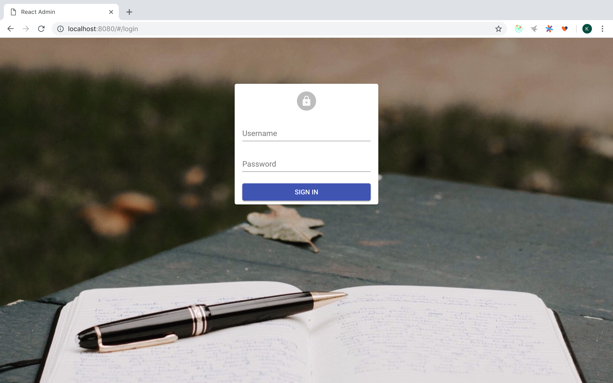
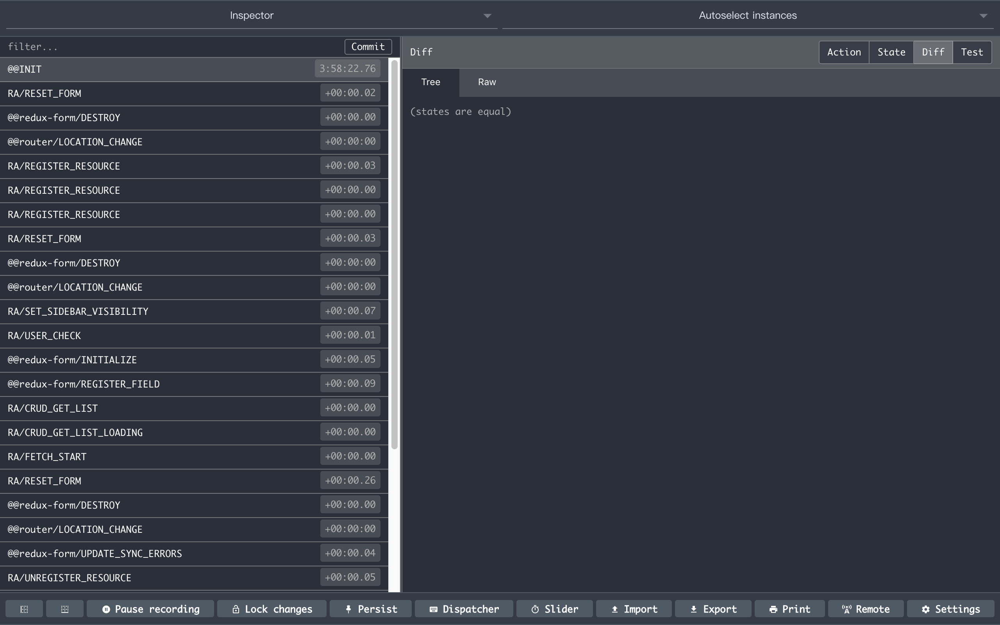

# 探索进入 `http://localhost:8080` 后 `React-Admin` 所触发的动作

项目，采用官方自带的示例，`example` 目录下的 `simple` 项目。怎么跑起来？[调试 React-Admin 源码，看清框架的本质](../debug-react-admin.md)

扩展安装：[Redux DevTools Extension](https://github.com/zalmoxisus/redux-devtools-extension)


1. 打开 `Redux DevTools`


2. 输入 [http://localhost:8080](http://localhost:8080/)，并回车。


3. 发现 `url` 跳转到了 [http://localhost:8080/#/login](http://localhost:8080/)



4. 看一眼 `Redux DevTools`，发现执行了一堆的 `action`。



5. 我们理一下这些 `action`。


**`@@INIT`**

这个是当你 `createStore` 的时候，`redux` 内部的一次 `dispatch`

```js
 dispatch({ type: ActionTypes.INIT })
```

**RA/RESET_FORM，@@redux-form/DESTROY, @@router/LOCATION_CHANGE**

为什么要在路由改变的时候分发 `RA/RESET_FORM，@@redux-form/DESTROY`？

原因是避免 `redux-form` 不必要的表单数据 state 的混乱。它处理已经作为 `redux` 中间件（`formMiddleware`）进行了封装。所以每次路由（`@@router/LOCATION_CHANGE` 被 `dispatch`）改变的时候都会做这件事儿。

**RA/REGISTER_RESOURCE(3)**

这里其实就是 `resource` 组件的渲染，这是 `react-admin` 的机制。不管有没有权限，首先就会做这件事情。这是在 `CoreAdminRouter`。

**RA/RESET_FORM，@@redux-form/DESTROY, @@router/LOCATION_CHANGE**

默认 `resource` 都是有布局的， 所以在 `CoreAdminRouter` 中会用到 `RoutesWithLayout` 组件。

又是一次跳转，在没有 `dashboard` 的情况下，`react-admin` 默认会转到第一个 `resouce`。
```js
firstChild ? (
                <Route
                    exact
                    path="/"
                    render={() => <Redirect to={`/${firstChild.props.name}`} />}
                />
            )
```

**RA/SET_SIDEBAR_VISIBILITY**

同时，这个 `action` 的触发，是由默认 `appLayout` 组件的 `SideBar` 组件触发的。
```js
// 位于 ra-ui-materialui 包中
componentWillMount() {
    const { width, setSidebarVisibility } = this.props;
    if (width !== 'xs' && width !== 'sm') {
        setSidebarVisibility(true);
    }
}
```
**RA/USER_CHECK**

不同于之前的注册，这里 `Resource` 组件作为一个标准的组件进行渲染。

由于在它的 `render` 里面用了 `WithPermissions` 组件，所以会触发这个检查动作。

**@@redux-form/INITIALIZE，@@redux-form/REGISTER_FIELD**

这是由列表页的过滤表单 `FilterForm` 组件触发的，**RA/USER_CHECK** 是异步的，在它没有 `resolve` 之前，它并不会阻止 `resource` 的渲染。也就是说如果**RA/USER_CHECK**一直阻塞到哪里的话，那么你会直接看到资源列表，并且你永远没法跳转到登录页。

**RA/CRUD_GET_LIST，RA/CRUD_GET_LIST_LOADING，RA/FETCH_START**

并发一连串 `action`，没啥好说的，在 `ListController` 里面发起的 `crudGetList`。

**RA/RESET_FORM，@@redux-form/DESTROY, @@router/LOCATION_CHANGE**

再一次跳转，进入 `/login`。

**@@redux-form/UPDATE_SYNC_ERRORS**

这个是我们，在登录页面，用 `reduxForm` 高阶组件初始化表单时候，因为我们传入了 `validate` 函数，所以它会在内部分发一次。

```js
reduxForm({
    form: 'signIn',
    validate: (values, props) => {
        const errors = {};
        const { translate } = props;
        if (!values.username)
            errors.username = translate('ra.validation.required');
        if (!values.password)
            errors.password = translate('ra.validation.required');
        return errors;
    },
})
```

**RA/UNREGISTER_RESOURCE(3)**

因为转到登录页了，所以这里就理所当然的被卸载了，这个动作的触发在 `Resource` 组件的 `componentWillUnmount` 的函数中。

```js
componentWillUnmount() {
    const { context, name, unregisterResource } = this.props;
    if (context === 'registration') {
        unregisterResource(name);
    }
}
```

**@@redux-form/UNREGISTER_FIELD**

同样，`redux-form` 对 `filterForm` 的表单字段的卸载。

**@@redux-form/REGISTER_FIELD(2)**

同样，`redux-form` 对 `signIn` 的表单字段的注册。

**@@redux-form/UPDATE_SYNC_ERRORS**

注册完后，同步一下。

**RA/CRUD_GET_LIST_SUCCESS，RA/FETCH_END** 

这个 `action`，因为之前并没有 `cancel` 掉 `RA/CRUD_GET_LIST` 这个。这个的副作用还是会执行。