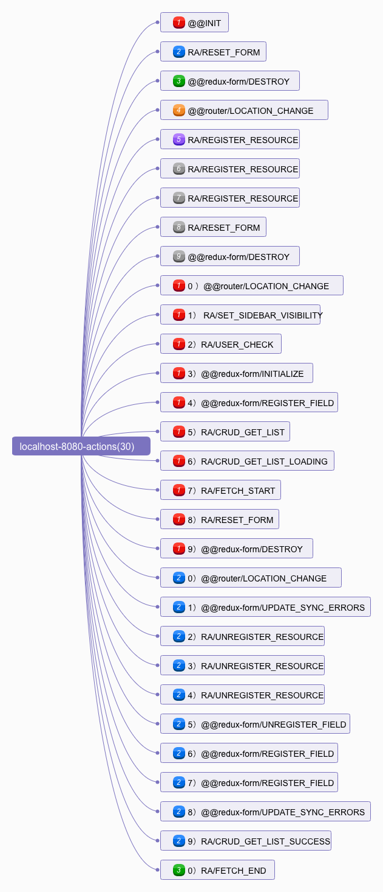

# 基于 Redux Devtools 来逐步分析 React-Admin（从 `npm start` 启动项目开始说起）

项目，采用官方自带的示例，`example` 目录下的 `simple` 项目。怎么跑起来？[调试 React-Admin 源码，看清框架的本质](../debug-react-admin.md)

扩展安装：[Redux DevTools Extension](https://github.com/zalmoxisus/redux-devtools-extension)


1. 打开 `Redux DevTools`


2. 输入 [http://localhost:8080](http://localhost:8080/)，并回车。


3. 发现 `url` 跳转到了 [http://localhost:8080/#/login](http://localhost:8080/)


4. 看一眼 `Redux DevTools`，发现执行了一堆的 `action`。


5. 我们理一下这些 `action`。



**`@@INIT`**

这个是当你 `createStore` 的时候，`redux` 内部的一次 `dispatch`

```js
 dispatch({ type: ActionTypes.INIT })
```

**RA/RESET_FORM，@@redux-form/DESTROY, @@router/LOCATION_CHANGE**

为什么要在路由改变的时候分发 `RA/RESET_FORM，@@redux-form/DESTROY`？

原因是避免 `redux-form` 不必要的表单数据 state 的混乱。它处理已经作为 `redux` 中间件（`formMiddleware`）进行了封装。所以每次路由（`@@router/LOCATION_CHANGE` 被 `dispatch`）改变的时候都会做这件事儿。

**RA/REGISTER_RESOURCE(3)**

这里其实就是 `resource` 组件的渲染，这是 `react-admin` 的机制。不管有没有权限，首先就会做这件事情。这是在 `CoreAdminRouter`。


