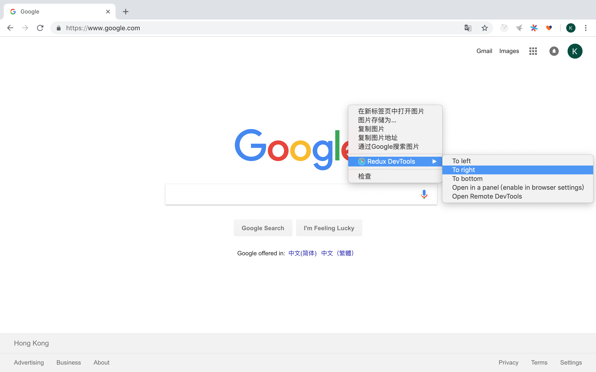
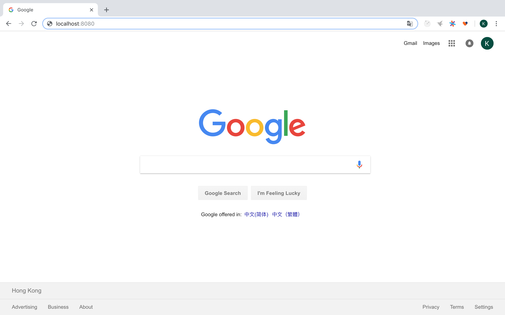

# 基于 Redux Devtools 来逐步分析 React-Admin（从 `npm start` 启动项目开始说起）

项目，采用官方自带的示例，`example` 目录下的 `simple` 项目。怎么跑起来？[调试 React-Admin 源码，看清框架的本质](../debug-react-admin.md)

扩展安装：[Redux DevTools Extension](https://github.com/zalmoxisus/redux-devtools-extension)

1. 打开 `Redux DevTools`

2. 输入 [http://localhost:8080](http://localhost:8080/)，并回车。

3. 发现 `url` 跳转到了 [http://localhost:8080/#/login](http://localhost:8080/)

4. 看一眼 `Redux DevTools`，发现执行了一堆的 `action`。

5. 我们理一下这些 `action`。

