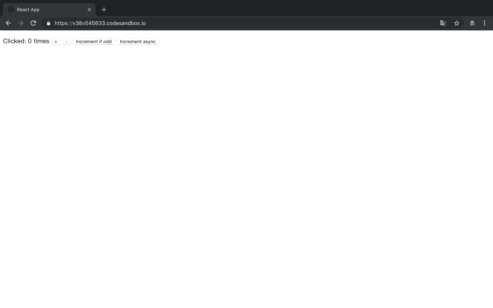

# Redux-Saga 仓库实例精解

### [官方示例源码](https://github.com/redux-saga/redux-saga/tree/master/examples)

既然我们要用好一个库，那么首先就是把它官方的例子给强撸一遍^_^。

目前官方包含了 6 个例子。这里，我把它移到[codesandbox.io](https://codesandbox.io/)，方便大家随时编辑运行。

### 示例 **Counter**：

界面：

功能：

1. `+`，`state` 增 1。
2. `-`，`state` 减 1。
3. `Increment if odd`，当前 `state` 是奇数，则增 1。
4. `Increment async`，`state` 延时 1 秒后增 1。

这里

