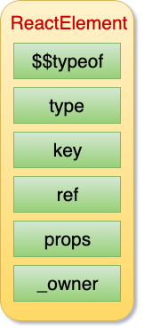
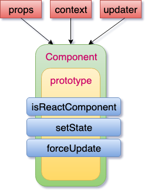
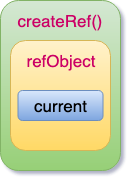
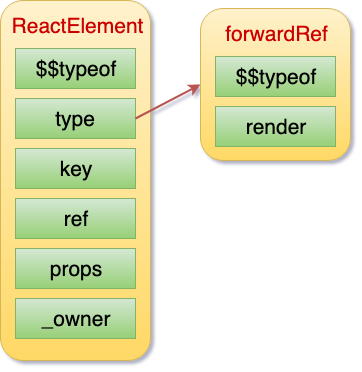
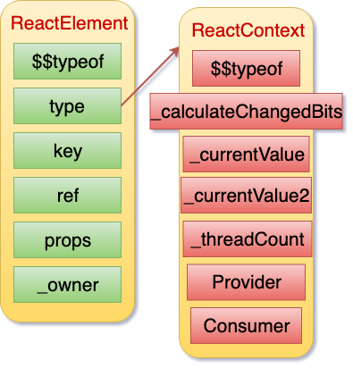
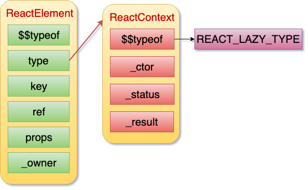

### React 源码学习

[refs]
* [blog.atulr.com](https://blog.atulr.com/)

[React 源码解析](https://react.jokcy.me/)
* 足够的耐心
* 思考再思考

通读源码不是目的

* 外在
  * 提高开发能力
  * 解决问题能力
  * 提升自身价值
* 内在
  * 提升学习能力
  * 提升思考能力
  * 提升设计能力

## React API 一揽

### 快速过一遍 React API 
* createElement
* Ref
* createContext
* Component
* JSX => JS
* Suspense
* ConcurrentMode
* Hooks

### React中的更新创建
* ReactDOM.render
* FiberRoot
* Fiber
* Update
* UpdateQueue
* expirationTime

### Fiber Scheduler
* scheduleWork
* requestWork
* batchedUpdates
* react scheduler
* performWork
* renderRoot
* performUnitOfWork

### 开始更新
beginWork以及优化
各类组件的更新过程
调和子节点的过程
*React 当中有十几种不同的组件*

### 完成各个节点的更新
* completeUnitOfWork 虚拟DOM对比
* completeWork 错误捕获处理
* unwindWork 完成整一棵树更新

### 提交更新
* commitRoot整体流程   开发时的帮助方法
* 提交快照             提交DOM插入
* 提交DOM更新          提交DOM删除
* 提交所有声明周期

### 各种功能的实现过程
* context的实现过程
* ref的实现过程
* hydrate的实现过程
* React的事件体系

### Suspense
* 更新优先级的概念      更新挂起的概念
* Suspense组件更新     timeout处理
* retry重新尝试渲染    lazy组件更新

### Hooks
* 核心原理        useState
* useEffect      useContext
* 其他Hooks API

Fiber、Update、Scheduler 核心

### JSX 到 JavaScript 的转换

[REPL](https://babeljs.io/repl)

**规范：自定义定义组件要大写**

### ReactElement

**ReactElement.js**

手册：[ReactElement](https://react.jokcy.me/book/api/react-element.html)

### React Component

**ReactBaseClasses.js**

**组件的定义，平台无关性**

### createRef & ref

**获取节点的实例**

ref 使用的三种方式
* string ref
* function
* createRef

**ReactCreateRef.js**

### forwardRef
**forwardRef.js**

**针对 functional components**

### Context
两种方式
* childContextType
  * Parent
    * getChildContext
    * childContextTypes
  * child 
    * contextTypes
    * this.context.xx
* createContext
  * Provider
  * Consumer

**旧的 Context 对组件更新性能有影响**

**ReactContext.js**

### ConcurrentMode
REACT_CONCURRENT_MODE_TYPE

**让整个渲染过程能够进行多任务调度**

**ConcurrentMode 下面组件所有的更新都是低优先级更新**

**flushSync 来提高优先级**

### Suspense & Lazy

Suspense: REACT_SUSPENSE_TYPE

Lazy

**ReactLazy.js**

### Hooks
* useCallback
* useContext
* useEffect
* useImperativeHandle
* useDebugValue
* useLayoutEffect
* useMemo
* useReducer
* useRef
* useState
* useResponder

### ReactChildren
**对象池的应用**

* forEach
* map
* count
* toArray
* only

### Others
* MEMO 
  * for function
  * VS. PureComponent
* Fragment
  * VS. DIV
* StrictMode
  * 如：过时 API 的提醒
  * development tool
* cloneElement
* createFactory
  * 对 createElement 的封装

## React 中的更新

### ReactDOM.render

**创建更新的方式**
* ReactDOM.render || hydrate
* setState
* forceUpdate

ReactDOM.render 需要做哪些事情呢？
* 创建 ReactRoot
* 创建 FiberRoot 和 RootFiber
* 创建更新

